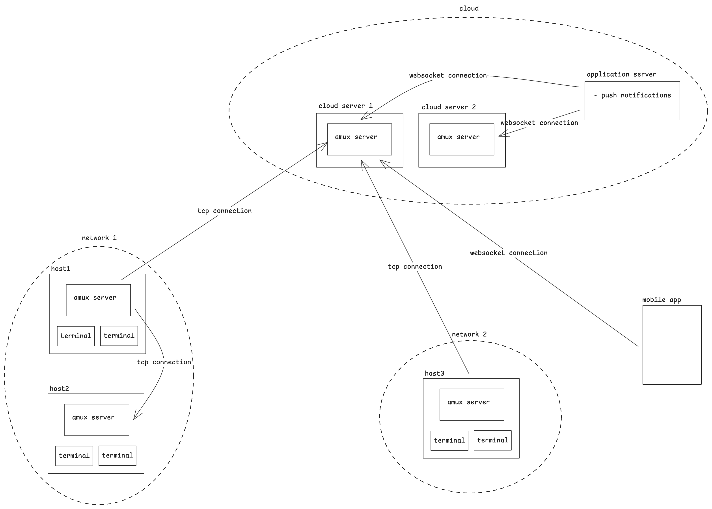

# amux Cloud Architecture

This document describes the cloud deployment architecture for amux. For internal server design, see [ARCHITECTURE.md](ARCHITECTURE.md).

## Overall Architecture



amux is a federated network of servers that enable remote access to AI agent sessions. While the initial implementation targets Claude, the system is designed to support any terminal-based AI agent (Codex, OpenCode, AMP, etc.).

---

## Cloud Design

- Cloud runs a pool of vanilla amux servers using `amux serve --cloud`
- Cloud servers are **stateless** and run with TLS + JWT token validation
- A separate **application server** handles:
  - User login/authentication (OAuth 2.0)
  - The `/api/connect` endpoint (returns server host, port, JWT token)
  - JWKS key publishing for JWT verification
  - Push notifications
- Server allocation is a **hash of user information modulo number of servers** (ensures consistent routing without state)
- Allocation responses include an **expiry time**; when expired, clients must re-authenticate and may be directed to a different server
- `enforce_tls_in_cloud_mode` config option allows cloud servers behind a reverse proxy (e.g. nginx) to skip TLS setup while still validating JWT tokens

---

## Authentication

### OAuth 2.0 Device Flow

amux uses the OAuth 2.0 Device Authorization Grant (RFC 8628) for initial authentication. This allows CLI users to authenticate via a browser without needing the browser on the same machine.

**Initial setup (`amux init`):**

```
1. User runs `amux init`
2. amux requests device code from cloud
   POST {cloud_url}/connect/deviceauthorization
3. Cloud returns: verification_uri, user_code, device_code
4. User visits verification_uri and enters user_code
5. amux polls for token completion
   POST {cloud_url}/connect/token (device_code grant)
6. Cloud returns: access_token + refresh_token
7. amux stores refresh_token in persistent state
```

### JWT Token Lifecycle

After initial OAuth setup, cloud connections use JWT tokens:

```
1. Local server loads refresh_token from state
2. Exchange refresh_token for access_token
   POST {cloud_url}/connect/token (refresh_token grant)
3. Call GET {cloud_url}/api/connect with access_token
   Returns: { host, port, token (JWT), expires_at }
4. Connect via TLS to host:port
5. Send handshake `Connect { link_name, token: JWT, version: PROTOCOL_VERSION }`
6. Cloud server validates protocol version and JWT via JWKS
   - Checks version matches PROTOCOL_VERSION (rejects with VersionMismatch if not)
   - Fetches keys from {cloud_url}/.well-known/openid-configuration/jwks
   - Caches keys for 1 hour
   - Validates signature, audience ("amux_token"), expiry
   - Verifies host/port in claims match the receiving server
7. Cloud server responds with handshake `ConnectResult { error: None }`
```

### Token Refresh

Tokens are refreshed automatically before expiry (5 minutes before `expires_at`):

1. The `connection_loop` has a third `select!` branch on a refresh deadline
2. When triggered: exchange refresh_token for new access_token
3. Call `/api/connect` for new JWT
4. If same host/port: send in-band `DirectMessage::Reauth { token }`
5. If host/port changed: return `CloudError::HostChanged`, requiring full reconnection

The refresh token itself may be rotated by the OAuth server; if a new refresh token is returned, it is persisted to state.

### JWT Claims

```rust
struct ConnectionClaims {
    sub: String,   // User ID
    host: String,  // Expected server hostname
    port: u16,     // Expected server port
}
```

The `host` and `port` claims bind the token to a specific cloud server, preventing token replay across servers.

See `src/jwt.rs`, `src/oauth.rs`, `src/cloud.rs`.

---

## Connection Protocol

### Local Server → Cloud

When a local server starts with cloud mode enabled:

```
1. Load state (refresh_token, use_cloud_mode)
2. Exchange refresh_token for access_token (OAuth)
3. Call /api/connect → { host, port, token, expires_at }
4. TLS connect to host:port (rustls, webpki root certs)
5. Send handshake `Connect { link_name: "{hostname}-{rand}", token: JWT, version: PROTOCOL_VERSION }`
6. Cloud validates protocol version, JWT (JWKS), checks link_name uniqueness
7. Cloud responds with handshake `ConnectResult { error: None }`
8. Enter connection_loop with token refresh enabled
```

On authentication failure (`InvalidCredentials`), the user is prompted to re-run `amux init`.

On connection failure, the server uses exponential backoff before retrying.

On `HostChanged` during token refresh, the connection is dropped and re-established from scratch.

### Client → Cloud

Rich clients (mobile, web) connect via WebSocket to the cloud server:

```
1. WebSocket upgrade to ws://cloud:9002/
2. Send handshake `Connect { link_name, token: null, version: PROTOCOL_VERSION }`
3. Cloud responds with handshake `ConnectResult`
4. Enter connection_loop (MessagePack binary frames over WebSocket)
```

Note: WebSocket cloud authentication is not yet implemented (tracked as future work). Currently WebSocket connections bypass token validation.

### Terminal → Local Server

Terminal clients connect via Unix socket:

```
1. Connect to the Unix socket (per-user runtime dir)
2. Send handshake `Connect { link_name: "term-{rand}", token: null, version: PROTOCOL_VERSION }`
3. Server checks link_name uniqueness, inserts route
4. Server responds with handshake `ConnectResult { error: None }`
5. Enter connection_loop (MessagePack over length-prefixed frames)
```

No token validation for Unix socket connections (local trust).

---

## Transport Layers

| Client Type | Transport | Serialization | Framing |
|-------------|-----------|---------------|---------|
| Terminal clients | Unix socket | MessagePack (rmp-serde, named format) | Length-prefixed (4-byte BE) |
| amux server → amux server | TCP with TLS + `TCP_NODELAY` | MessagePack (rmp-serde, named format) | Length-prefixed (4-byte BE) |
| Rich clients (mobile, web) | WebSocket | MessagePack (rmp-serde, named format) | WebSocket native (binary frames) |

All transports use the same `Transport` trait and session `Message` enum after handshake. Handshake uses raw frame I/O (`read_frame`/`write_frame`) with standalone `Connect`/`ConnectResult` types, then transitions to `read_message`/`write_message`.

---

## Session Identity

Agent sessions are identified by:

```
agent_id: Uuid           // Globally unique
alias: Option<String>    // Human-readable name (optional, via --name flag)
```

Connections are identified by link names:

```
link_name: String        // e.g. "term-abc1", "myhost-xyz2"
```

Routes are stacks of link names representing multi-hop paths:

```
Route: VecDeque<String>  // Serializes as "AB.BC.CD" (dot-separated)
```

---

## Session Propagation

Agents are propagated to connected peers via `AnnounceAgent`/`WithdrawAgent` direct messages. `list` returns both local and remote agents. Remote agents include their route for multi-hop routing.

Hosts are propagated via `AnnounceHost`/`WithdrawHost`. When a peer connection is lost, `WithdrawHost` propagates through the network and each server bulk-removes agents reachable via the withdrawn host.

Idle peer links also run symmetric application heartbeats: after 60 seconds
with no inbound traffic, a peer sends `Heartbeat` and expects inbound traffic
within 10 seconds. If not, the connection is closed and the existing
`WithdrawHost` propagation handles cleanup.

Routing uses the per-user routes table: `HashMap<String, mpsc::Sender<Message>>`. When a client wants to reach an agent on a remote server, the route is resolved from the agent registry (e.g. `"cloud-server.local-host"`) and the message is forwarded hop-by-hop using the stack-based routing algorithm described in [ARCHITECTURE.md](ARCHITECTURE.md).

---

## State Management

Persistent state is stored at `~/.local/state/amux/state.yaml` (configurable via `state_path` in config). Uses file locking (shared for reads, exclusive for writes) to prevent corruption from concurrent access.

```rust
struct State {
    cloud: CloudState,
    claude: ClaudeState,
}

struct CloudState {
    use_cloud_mode: Option<bool>,      // None = not configured, Some(true/false)
    refresh_token: Option<String>,     // OAuth refresh token
}

struct ClaudeState {
    is_plugin_installed: Option<String>, // Version of amux plugin in Claude
}
```

`State::update()` provides atomic load-modify-save with an exclusive lock held throughout, preventing TOCTOU races.

See `src/state.rs`.

---

## CLI Commands for Cloud

### `amux init`

First-time setup. Asks whether to enable cloud mode, then runs OAuth device flow if yes:

```
$ amux init
amux can connect your local machine to the cloud...
Do you want to enable cloud mode?
  1. Yes (recommended)
  2. No (local only)
Choice [1]:

Starting authentication...
To authenticate, visit:
  https://amux.sh/device
And enter code: ABCD-1234
Waiting for authentication...
Authentication successful!
```

Use `amux init --reset` to clear existing state and re-configure.

### `amux serve --cloud`

Starts the server in cloud mode:
- Loads TLS certificate and key from `AMUX_TLS_CERT` and `AMUX_TLS_KEY` environment variables (unless `enforce_tls_in_cloud_mode` is false)
- Creates `JwtValidator` pointing at `{cloud_url}/.well-known/openid-configuration/jwks`
- All TCP connections require valid JWT tokens
- Unix socket still works without tokens (for local CLI commands like `amux debug`)

### `amux debug`

Shows internal server state including cloud connection status:

```yaml
is_cloud_server: false
use_cloud_mode: true
agent_count: 1
route_count: 2
routes:
  - term-abc1
  - myhost-xyz2
config:
  host_name: my-laptop
  cloud_url: https://amux.sh
  socket_path: $TMPDIR/amux/amux.sock  # macOS (per-user)
  tcp_port: 9001
  websocket_port: 9002
```

---

## Design Notes

### Why This Is Simpler Than It Looks

The architecture avoids distributed systems complexity through deliberate constraints:

**Star topology through cloud:**
- Local servers connect TO cloud, not to each other (initially)
- Cloud server's routing table is simply link-name → channel mappings
- No server-to-server gossip, no mesh, no complex propagation protocols

**Clients are the source of truth:**
- Cloud servers are stateless routers, not databases
- Agent ownership lives on the local server running the agent
- On reconnect, the local server re-establishes its cloud connection and re-advertises

**Hash routing contains blast radius:**
- All of a user's traffic (local servers, terminals, mobile) routes to the same cloud server
- A user's "world" is self-contained on one cloud server
- No cross-cloud routing needed for single-user access

**Failure handling is straightforward:**
1. Cloud server dies
2. Application server health-checks, stops routing to it
3. Clients reconnect (token expiry or connection drop)
4. Application server directs them to healthy server
5. Clients re-establish connections
6. Done - no complex recovery

**Deferred complexity:**
- WebSocket cloud authentication
- Cross-user collaboration (user A accessing user B's agents)
- Server-to-server LAN connections without cloud
- Local network discovery

---
