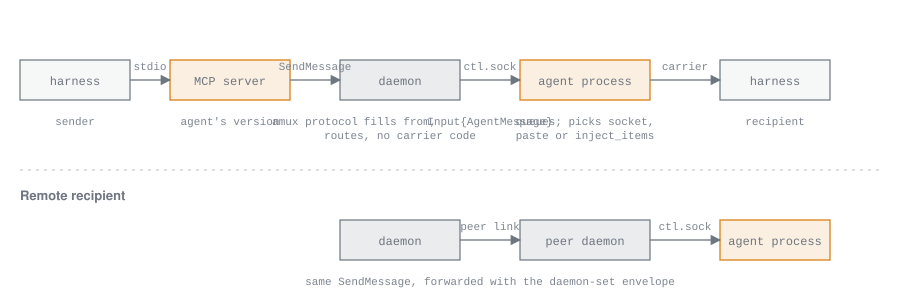

# Agent tools and messaging

*For developers changing the tools amux gives agents, how agents message each other, or how parent and child agents behave.*

Every agent, of every kind, gets the same seven tools from amux's MCP tool
server. With them an agent can list the fleet and its hosts, message another
agent, start a child of any kind on any paired host, interrupt its own
children, say what it is working on, and show a person a file it made. The
daemon sets every message's sender and every child's parent from who called,
and it has no kind-specific code for any of it: the recipient's own agent
process decides how a message reaches its provider.

The tool server is [`crates/agent/src/tools.rs`](../crates/agent/src/tools.rs).
The daemon's side is `ClientApi` in
[`crates/node/src/grpc.rs`](../crates/node/src/grpc.rs), the message lane in
[`crates/node/src/relay.rs`](../crates/node/src/relay.rs) and the parent
outbox in [`crates/node/src/outbox.rs`](../crates/node/src/outbox.rs). The
per-kind carriers are in the interpreters (`crates/interpret`) and in
`crates/agent/src/provider.rs`.

## The tool server

The harness starts the tool server itself, as `amux mcp <dir>` run from the
install path, so the server is always the agent's own version for the life of
its session. The agent process registers it when it launches the provider:
Claude gets it through `--mcp-config` as a server named `amux`, with
`mcp__amux__*` allowed in its settings so the tools run without a permission
prompt; Codex gets it through `--config mcp_servers.amux.command=…` and
`mcp_servers.amux.args=…`. It speaks MCP as newline-delimited JSON-RPC on
stdin and stdout.

Its identity is its agent's directory. The daemon listens on
`<dir>/tools.sock` for that agent alone, and the tool server finds the socket
by its own directory, so the daemon knows which agent is calling from the
connection it arrived on. No environment variable or token carries an id, and
nothing in a request can claim one. The socket serves the ordinary
`ClientService` with a few calls refused; [the protocol](PROTOCOL.md)
describes what the tools socket allows.

Five tools are fleet tools and dial the daemon; two never reach it. The tool
server never writes the journal: the agent process is its one writer, and the
interpreter reads amux's own tool calls from the provider's record like any
other fact.

A fleet call that cannot connect redials with backoff (50 ms doubling to
500 ms) for up to five seconds, which covers the daemon restarting for an
update. With no daemon after that, the call answers `amux daemon isn't
running`. Reads (`agents`, `hosts`, and resolving a name) also redial when the
connection drops under them. A call the daemon acts on (`send`, `spawn`,
`stop`) is made at most once: if the daemon goes away after the call went
out, the tool answers that the daemon went away before confirming, that it
may have taken the call, and that the call was not made again.

## The seven tools

| Tool | Arguments | Answer | Reaches |
| --- | --- | --- | --- |
| `agents` | none | `{"agents": [...]}`, one row per agent | `SubscribeInventory`, read to `CaughtUp` |
| `hosts` | none | `{"hosts": [...]}`, the trusted hosts | the same inventory |
| `send` | `to`, `text`, `context?` | `{"id": "<envelope id>"}` once the recipient has the message | `ResolveAgent`, then `SendMessage` |
| `spawn` | `kind`, `prompt`, `name?`, `cwd?`, `host?` | `{"name", "id"}` of the child | `CreateAgent` |
| `stop` | `name` | `{}` | `ResolveAgent`, then `SendInput` with an interrupt |
| `status` | `working_on`: a string, or null | `ok` | nothing |
| `attach` | `path`, `name?` | the attachment element | nothing |

A refusal comes back as the tool's error text, in words a model can act on:
`no agent named <name>`, `<name> names several agents: <name> (<id>), …`,
`rejected: exited`, `<host> cannot be reached`, or the daemon's own message.

### agents

Every agent in the fleet, own and replicated from paired hosts. Each row has
`name` (the id in hex when the agent has no name), `id`, `kind` (`claude_pty`,
`claude_sdk` or `codex`), `host` (the host's name), `live`, and `phase`
(`starting`, `idle`, `working` or `needs_you`); and, when they apply,
`working_on`, `exit_cause`, `parent` (the parent's name), and `you: true` on
the caller's own row. Both read-only tools are marked with MCP's
`readOnlyHint`.

### hosts

The hosts this profile trusts, one row each with `name` and `presence`
(`online` or `offline`), and `this_host: true` on the caller's host. Discovery
candidates are left out: a model spawns only on hosts a person has paired.
Agents and hosts are separate tools so each answers one question.

### send

Sends `text` to the agent named `to`, with an optional `context`, a thread
label the recipient sees with the message. The name is resolved by exact
match across the fleet, own and replica rows alike; an unknown or ambiguous
name is refused before anything is sent. The answer is the envelope id, once
the recipient's provider has the message; [delivery](#delivery) describes
what that means. When a message reaches an agent from another agent, the
tool's description tells it to reply with `send` to that agent's name.

### spawn

Starts a child agent of `kind` with `prompt` as its first input. `name` names
it. `host` is a trusted host's name, as a person would say it; the daemon
resolves it, and omitted it means the caller's own host. `cwd` is a path on
the host the child runs on: omitted on the caller's host it is the caller's
own working directory, and omitted on another host that host picks, which is
the home directory of the user its daemon runs as. The caller becomes the
child's parent; the request cannot name any other parent.
[Families](#families) describes what a child is.

### stop

Interrupts the turn one of the caller's own direct children is running. The
daemon checks the lineage and refuses any other agent with
`PERMISSION_DENIED`. The interrupt is the kind's own `Interrupt` input, so the
turn is cancelled the provider's way. The child's history stays and its
process is not stopped by the call; a child then exits by its own one-shot
rule once nothing is left for it. A child that has already finished has
nothing to interrupt and answers that it did not stop.

### status

Declares what the agent is working on, so people and other agents can find
the right collaborator; `null` clears it. The tool server only checks the
argument's type and answers `ok`. The call is a provider fact: the interpreter
sees the `amux` server's `status` call in the provider's record and sets
`working_on` in its next snapshot, and the daemon copies it onto the agent's
inventory row at commit. Nothing else clears it: an idle agent's last
declared work is exactly what another agent may want to know. An agent that
never calls it shows the first line of its first prompt.

### attach

Attaches a file from the agent's host to the agent's reply. The tool server
reads the file (a relative path is taken from the agent's working directory),
hashes it, writes it into `<dir>/blobs/<sha256>`, and returns the canonical
`<amux-attachment>` element naming it, with `name` as the name viewers see
(the file's own name when omitted) and a mime type from the file's extension.
PNG, JPEG, GIF, WebP and SVG are images; everything else is a file. No daemon
call is made, so it works while the daemon is away. The model is told to put
the element in its reply exactly as returned; when the reply completes, the
interpreter makes the element an attachment on the reply's item, which both
clients draw as the image or file. [Attachments](ATTACHMENTS.md) describes
blobs and the element syntax.

## What the interpreter makes of the calls

The interpreters recognise two of amux's own tools by server and tool name
(`interpret::is_status_tool`, `interpret::is_send_tool`):

- `status` becomes `working_on` in the snapshot, as above.
- `send` is drawn as an agent-message item on the sender's side, on the tool
  call's own key: the text sent, the recipient as the model named it, the
  context, and a send state that moves from sending to sent (with the envelope
  id) or rejected (with the reason the tool returned).

## Messaging lanes

Each of a host's own agents has one agent-message lane in its daemon. The lane
opens once the daemon has read every own agent's journal to its end after
start, and takes one `SendMessage` at a time, in order. For each message it:

1. Looks up the envelope id among the recipient's items. An item whose input
   id is the envelope id means the message was already accepted, and the
   answer is accepted again without handing anything over.
2. Drops a message meant for one incarnation of the recipient when another
   has begun (only the outbox's reports carry an incarnation).
3. Hands the message to the recipient's process as `Input{AgentMessage}` over
   its control socket, or resumes it first if it has exited and the sender is
   its parent.
4. Answers accepted only after the recipient's acceptance item, the one whose
   input id is the envelope id, has committed to the store. It waits up to 60
   seconds for that.

Because a retry can only arrive after the original's answer, that one store
lookup is the whole deduplication, and it is exact: there is no in-memory set
of accepted-but-uncommitted ids and nothing in the interpreter. The cost is
that the answer waits for ingest, which is milliseconds. A person's
`SendInput` never uses the lane.

## Delivery

A send goes from the model to the recipient's provider like this:

1. The harness calls `send` on the tool server, which resolves `to` with
   `ResolveAgent` and calls `SendMessage` on `tools.sock` with an `Envelope`:
   a fresh id, the recipient as a host and an agent, the text, the context,
   and the kind `message`.
2. The daemon sets `from` from the socket the call arrived on (the agent's id,
   host, name and kind), never from the request. For a recipient on another
   host it forwards the envelope there ([across hosts](#across-hosts));
   otherwise it runs the recipient's lane.
3. A recipient that has exited is resumed with the message as its first
   input when the sender is its parent. Any other sender is answered
   `rejected: exited`.
4. The recipient's interpreter receives `Input{AgentMessage}`, writes the
   agent-message item with the envelope id as its input id, marks the message
   pending, answers accepted, and emits an inject effect naming its carrier.
   The agent process carries the effect out after the step is in the journal.
5. The daemon sees the item commit and answers the tool, which returns
   `{"id": …}`.

The carrier is the provider's own injection channel wherever one exists, so
the provider queues the message and amux's queue for people never sees it:

| Kind | Carrier | Consumed when |
| --- | --- | --- |
| `claude_pty` | Claude's messaging socket, whose path and token Claude reports through its hooks. When the socket is not known yet or refuses the message, the agent process pastes it into the terminal wrapped in `<cross-session-message from="amux">`. | Claude shows the message to the model, which the interpreter reads in its transcript. |
| `claude_sdk` | A user message on Claude's stream-JSON stdin, carrying a uuid derived from the envelope id. Claude takes it into its own queue, joining a running turn. | Claude reports taking the message with that uuid. |
| `codex` | `thread/inject_items` on the agent's thread, labelled with its sender (`[message from agent <name>]`). Before the thread is running the message is held and injected once it is; into an idle thread the interpreter also starts an empty turn so the message is answered. | The inject's acknowledgement for a running turn, which drains injected items before it ends; the empty turn's acknowledgement for an idle thread. |

Codex reports nothing about an injected item, which is why every interpreter
writes the agent-message item itself at acceptance rather than waiting for a
reflection. The pending set, accepted messages the provider has not yet
consumed, is what keeps a one-shot child from exiting on a message it was
just handed ([families](#families)).

Where the guarantees stop: amux promises what the providers promise and
closes only the windows it opened itself. A send is at most once. The
recipient's provider owns the message from the moment it is accepted; a
sender that needs an answer waits for one and may send again; nothing is
retried on its behalf. The outbox below exists because amux puts a daemon
between child and parent, and its rules restore the behaviour of a single
process rather than exceed it.

## Families

An agent spawned by an agent is its child. The edge is the child's `parent`,
a host id and an agent id, on its inventory row and in every spec the daemon
writes for it, so a restart or a resume keeps it. The child never acts on its
parent edge: it talks to its user, and the daemon knows who that is.

**Spawn.** `CreateAgent` from the tools socket makes the caller the parent.
The daemon writes the child's row first, so a crash leaves a row the next
start marks exited rather than a directory nothing lists; then the directory
and `spec.1` with the kind, working directory, parent and the first prompt;
then it binds the child's `tools.sock` and starts `amux agent <dir>`. It
answers once the process has taken its lock and sent its hello on
`ctl.sock`, or has exited, within the start deadline (20 seconds). It does
not wait for the provider to be ready: the child seeds its queue from the
spec's prompt when it starts, so no daemon crash can leave a child without its
task, and no rollback is needed. A child that never comes up exits, and the
parent hears that it failed.

**One-shot.** An agent with a parent exits when a turn ends with nothing
queued, nothing running and no accepted message still pending (the
interpreter's `quiescent`); its exit cause is `finished`. Input that arrives
while it exits is answered `rejected{exiting}`. Its transcript and its parent
edge stay.

**Resume.** A parent's send to its exited child, or to one answering
`exiting`, resumes it: same identity, same provider session, the next spec
with the message as its first input, still one-shot, because one-shot is a
property of having a parent and not a flag. The sender's answer is the same
as for a live child. Any other sender is told the child has exited. A person
resuming the child from the fleet or with `amux resume` starts the same next
incarnation.

**Stop and delete.** `stop` reaches direct children only. Deleting an agent
deletes its children too, best effort: a child on another host is deleted
through that host's daemon, and one whose host cannot be reached is reported
in `unreachable_children` and stays on its host as an orphan a person can
delete.

**In the clients.** The fleet groups each family under its head and ranks it
by its loudest member (`ui_view::fleet_list`); a family can be expanded to
show its children, and a chat shows its family in a header. `amux ls` lists
children beneath their parents. A child's question to its person is answered
in the child's own chat.

## Completion and exit

A parent hears one thing per event, from the daemon, through an outbox: the
`deliveries` table in the store.

- **Finished.** When the daemon commits a step whose `turn_end` is set for an
  agent with a parent, the same transaction inserts a deliveries row keyed by
  child, incarnation, kind and turn. Its body is a copy of the turn's last
  message, taken when the row is written, so retention removing the child's
  transcript later cannot empty a delivery still waiting for a parent on an
  away host.
- **Failed.** When a child's process ends while a turn is open (a crash, a
  stop, a child that never came up) the daemon writes a row of kind `failed`
  with the cause as its body. A one-shot exit after a finished turn sends
  nothing more.

A row records the parent's incarnation as it was when the row was written, or
zero when the parent's row is not held yet, in which case the drain stamps it
when it first sees the parent.

The drain runs once after start, only after every own journal has been read to
its end, and again whenever a row may have become deliverable: a turn end, a
lifecycle or incarnation change, a paired host coming into reach. While rows
wait it retries every 30 seconds. For each row it:

- drops it when the parent's incarnation has moved on, because a resumed
  parent is a later incarnation that is not waiting for anything, or when the
  parent has been deleted;
- keeps it while the parent has exited (a later resume makes it stale) or
  its host is away;
- otherwise sends it as an `Envelope` from the child, of kind `finished` or
  `failed`, carrying the parent's incarnation, with an id derived from the
  child, incarnation, kind and turn, so every re-send of one row has the same
  id. A local parent gets it through its lane; a remote parent through
  `SendMessage` to its daemon. The row is deleted once the parent has
  accepted.

The fixed envelope id is what makes a crash harmless. A daemon that dies
between the hand-off and the deletion re-sends the row on its next start, and
the parent's own daemon finds the envelope id already among the parent's
items and answers accepted without handing it over again. The incarnation
check is made where the parent lives, so it holds for a parent whose host
was away when the child finished and that was resumed before the row reached
it.

The parent receives the report like any agent message, through its own
carrier. Codex labels it `[agent <name> finished its turn]` or
`[agent <name> stopped: <cause>]`.

## Across hosts

Messages, spawns and stops reach agents on paired hosts through the daemons'
ordinary peer calls; nothing about them is specific to messaging.

- **Send.** `ResolveAgent` finds a remote agent by its replica row. The local
  daemon sets `from` to the calling agent, with this host's id, and makes the
  `SendMessage` call on the recipient's daemon over the peer link. That daemon
  accepts an agent sender only if it belongs to the calling host, since a
  host speaks only for its own agents, and then runs the recipient's lane as
  for a local sender. A message that arrived from a peer for a third host is
  not passed on. A parent's message resumes its exited child on another host
  the same way it does locally, since the parent edge names the parent's host.
- **Spawn.** `host` names a trusted host; the local daemon resolves the name
  (an exact match, then one ignoring case, and otherwise `NOT_FOUND` listing
  the known names or `AmbiguousHostName` with the candidates) and makes the
  create on that host with the parent set to the calling agent on this host.
  The far daemon refuses a parent that is not one of the calling host's own
  agents. The forwarded call waits up to 30 seconds, which covers the child's
  start there.
- **Stop.** The lineage check runs against the child's replica row, which
  carries the same parent edge, and the interrupt is then forwarded to the
  child's host.
- **Reports to a parent.** A deliveries row for a parent on another host is
  sent to that host's daemon as a message from the child. An answer of not
  found means the parent or its incarnation is gone, and the row is dropped;
  an unreachable host keeps the row until the host is back.

[The protocol](PROTOCOL.md) describes the peer calls, the one-hop forwarding
rule and the links underneath.

## Tests

- [`crates/agent/tests/tools.rs`](../crates/agent/tests/tools.rs): the tool
  list, each tool against a scripted daemon, the retry window over a daemon
  restart, and `attach` without a daemon.
- [`crates/node/tests/messaging.rs`](../crates/node/tests/messaging.rs): the
  lane's acceptance and deduplication, lineage checks, resume on a parent's
  message, and the outbox across daemon crashes, resumed parents and failed
  children.
- [`crates/testnet/tests/spec_families.rs`](../crates/testnet/tests/spec_families.rs):
  families across three hosts: spawning by host name, lineage-checked stop
  and send, cascade delete with an unreachable child, rows waiting for an
  away parent, and duplicate sends yielding one item.
