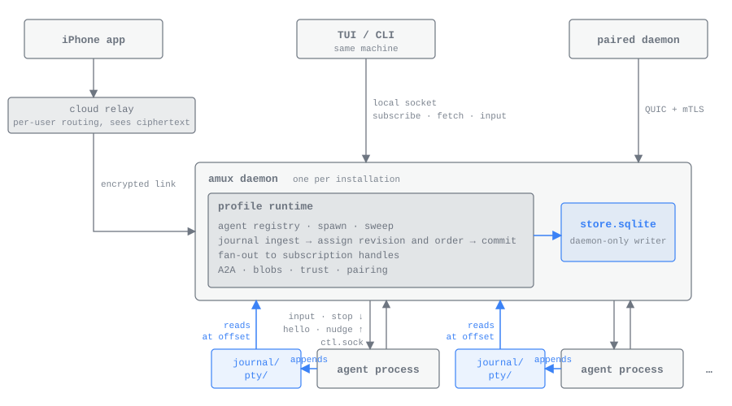
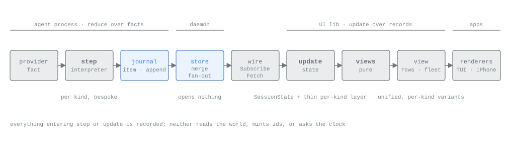
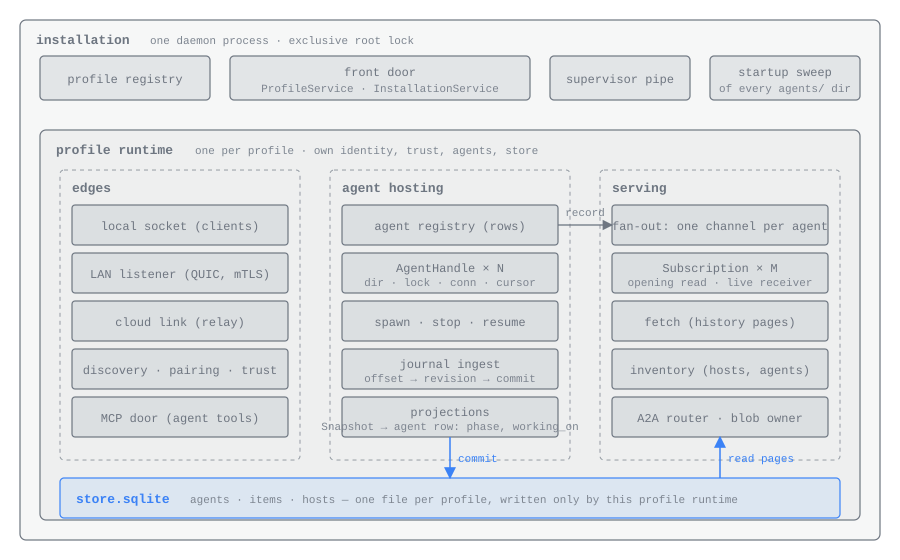
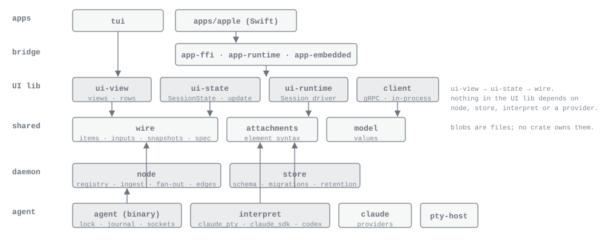

# Architecture

*For developers who need the whole system in their head before changing any part of it.*

This page is the map. It states what amux has to get right, names the
pieces, and shows how data moves between them. Each subsystem has its own
page for depth: the [agent process](AGENT_PROCESS.md), the
[interpreters](INTERPRETERS.md), the [journal and store](JOURNAL_AND_STORE.md),
the [wire](WIRE.md), the [link protocol](PROTOCOL.md),
[attachments](ATTACHMENTS.md), [agent tools](AGENT_TOOLS.md), the
[supervisor](SUPERVISOR.md) and the [client](CLIENT.md).

## Problem and goals

amux runs coding agents of several kinds (Claude Code in a terminal,
headless Claude Code over its stream-JSON interface, Codex over its app
server) on one or more machines, and shows them to clients that are equal
peers: the terminal client, the iPhone app, and any desktop app to come.
Machines pair with each other, update independently, crash independently,
and reach each other directly, over SSH or through a relay.

What the design holds itself to:

1. **A daemon crash or update never interrupts an agent's work.** An agent
   keeps working while a daemon comes back; only when none does may it stop,
   and then only at the end of a turn.
2. **Provider output is interpreted once, at the source,** into
   self-contained items any client can draw without knowing the provider.
3. **A client opens a chat with "the last N items"** and pages older
   history only if it needs it. There is no replay protocol.
4. **Every surface tolerates version skew by field discipline,** because
   paired machines, pinned agent processes and long-lived clients never
   update together.
5. **Lean on the operating system.** Files, file locks, sockets closing on
   process death and inodes surviving a binary swap do the work before any
   protocol does.
6. **Every client is an equal client,** and every behaviour is judged by
   how it reads from a phone that has just opened.

Out of scope: Windows parity (its costs are listed
[below](#windows-as-a-stated-cost)), semantic search, the daemon scheduling
or chaining agents (coordination is the agents' own job, through their
tools, or the person's), and remote raw terminals: a remote agent is a chat.

## Vocabulary

| Word | Meaning | Not to be confused with |
|---|---|---|
| **installation** | One data directory and the one daemon that holds its lock. It hosts any number of profiles. | a profile |
| **profile** | A complete amux inside an installation: its own host id, key, trust store, agents and store. One per account, plus unbound ones. | a user account |
| **host** | A profile as other machines see it, named by its host id. The phone is a host too; it runs no agents. | a machine |
| **agent** | One provider session hosted by one agent process, with a UUID that is amux's own and survives resume and `/clear`. | the provider's session id |
| **incarnation** | One run of an agent's process, started from one `spec.<n>` file. Resume starts the next incarnation. | a restart of the same process |
| **fact** | The provider's own data: a transcript row, a hook payload, a stream-JSON event, an app-server notification. Never leaves the agent process. | item |
| **interpreter** | The per-kind state machine in the agent process: a fact, an input or a tick in; a journal step and effects out. Pure. | a parser |
| **item** | A keyed, self-contained unit of a transcript, sent in full every time it is revised. | a row, an event |
| **append** | A revision that only adds text to one field of an item: the single kind of delta. | a patch |
| **snapshot** | The interpreter's current agent state: a kind-neutral envelope (queue, phase, what it is working on) and a per-kind body. Replaced whole. | the inventory row |
| **key** | The provider-derived identity of an item (a tool call id, a message uuid, a Codex item id). Opaque; carries no order. | a row id |
| **revision** | A per-agent integer the owning daemon assigns at commit. Answers "what changed since?" for a replica following its origin. Clients never see one. | order |
| **order** | An item's transcript position, assigned when its key is first committed and never changed. Answers "where does this sit?"; history is paged by it. | revision |
| **own / replica** | Rows for agents this profile hosts (truth) against rows copied from a paired host (a cache). | — |
| **source** | What feeds an agent's rows into a store: its journal for an own agent, one subscription to the origin for a replica. | — |
| **blob** | Content-addressed bytes (hash, MIME type, size) in an agent's directory. An attachment references one and carries its role and name. | — |
| **view** | A pure function of the client model returning content values: rows, cards, the fleet. Clients compose views; the view library never draws. | a screen |

## The mental model



Structured data moves one way. An agent process appends records to its
journal; the daemon ingests them into its profile's store and fans each
committed record out to the clients subscribed to that agent; a client
reduces the records into its model and draws views of it. Nothing flows
back along that path except inputs, which the daemon forwards to the agent
over its control socket and the interpreter answers with a verdict.

Raw terminal bytes take a second path that never touches the daemon. The
agent writes them to `pty/` in its directory and serves `pty.sock`; a
terminal client on the same machine derives the directory by convention and
connects directly (`amux attach`). No terminal byte crosses the network.

There are two reduce loops with one contract between them. The interpreter
reduces provider facts into records. The UI reduces records into a model.
The daemon between them stores and forwards records and never opens a
per-kind body.



The principles that follow from that picture:

- **The daemon interprets nothing.** Item and snapshot bodies are bytes to
  it. The one exception is the debug-bundle path, which links `interpret`
  for its per-kind redactor.
- **Commit before fan-out.** A client never sees a revision the store
  cannot serve, so catching up and going live join at one point.
- **Full state per revision.** Items are complete every time they are sent,
  except live appends to one text field, so a late arrival never needs a
  replay protocol.
- **Pure functions with recorded inputs.** The interpreter's step, the
  model's update and every view read nothing from the world: ids, time and
  randomness arrive as inputs. That is what makes every layer replayable
  from a [debug bundle](DEBUGGING.md).
- **Ask the operating system first.** Existence is a directory, liveness is
  a held file lock, "the peer went away" is end of file on a socket. A
  protocol earns its place only where the kernel has no answer.

## Processes

On a desktop, four kinds of process run, each with one job:

| Process | Started as | Job |
|---|---|---|
| **supervisor** | `amux supervise`, by the login item or `amux server start` | Parent of the daemon: restarts it whenever it exits and, under `updates: auto`, installs releases. See [the supervisor](SUPERVISOR.md). |
| **daemon** | `amux daemon`, by the supervisor (or by a service manager on a host without one) | The installation: every profile runtime, their stores, network edges and client sockets. |
| **agent process** | `amux agent <dir>`, by the daemon, detached into its own process group | One agent: holds its directory's lock, runs the provider child and the interpreter, writes the journal. See [the agent process](AGENT_PROCESS.md). |
| **provider child** | by the agent process | `claude` on a pseudo-terminal, `claude` speaking stream-JSON on stdio, or `codex app-server` on stdio. |

Two small helpers run on the provider's behalf, from the installed `amux`
binary: `amux mcp <dir>`, the tool server the provider launches for amux's
[agent tools](AGENT_TOOLS.md), and `amux hooks claude`, the command terminal
Claude runs for each hook event, which forwards the payload to the agent's
`private/hooks.sock`.

The cloud relay is the same binary run as `amux server start --cloud`. It is
not an installation: no profiles, no agents, no supervisor.

On the phone, the app hosts the daemon's profile runtime inside its own
process ([`app-embedded`](../crates/app-embedded/src/lib.rs)), one profile
per account. It runs no agents; to the machines it pairs with it is a host
like any other, with its own identity, trust and store of replica rows.

Clients never talk to agent processes, and agent processes never talk to
clients: the journal and the control socket are an agent's only interface.

## Who dials the daemon


| Caller | Where | What it speaks |
|---|---|---|
| CLI and terminal client | the front door (`amux.sock` in the per-user runtime directory), then the profile's `profiles/<id>/sock` | `ProfileService` and `InstallationService` on the front door; `ClientService` on the profile socket |
| phone UI | in process, through [`client::InProcess`](../crates/client/src/lib.rs) | the same `ClientService` calls |
| paired daemon | a link stream, after a pinned mutual-TLS handshake | `PeerService`, the peer-facing subset of the same calls |
| an agent's tool server | `agents/<id>/tools.sock`, which the daemon listens on for that agent alone | `ClientService`; the socket it arrived on is the caller's identity |

The daemon dials in the other direction exactly once per agent: it connects
to `ctl.sock`, reads a Hello, ingests the journal whenever a Nudge arrives,
and writes inputs and stops. The agent never dials the daemon.

Every surface is protobuf with one discipline: fields are only ever added,
never required, renumbered or retyped. `just proto-check` compares the
schema with a committed baseline (`crates/wire/proto/baseline.binpb`) and
fails on anything the baseline has that the schema lost. The link carries a
version integer for a deliberate break both sides must take; the control
socket and the journal carry none at all, because a daemon must always be
able to read an agent started by an older binary. [The wire](WIRE.md) has
the calls and records.

## Inside the daemon



One daemon process is one installation ([`node::start`](../crates/node/src/daemon.rs)).
It holds the installation lock, the profile registry, the generation file
and the front door, and hosts one
[`ProfileRuntime`](../crates/node/src/runtime.rs) per profile. A profile
runtime is a complete amux with three groups of work:

- **Edges** ([`node::edge`](../crates/node/src/edge/mod.rs)): the profile's
  local socket, its LAN listener, its links to paired hosts and to the
  relay, discovery, pairing and the account binding.
- **Agent hosting**: the agent registry (spawn, stop, resume, delete,
  rename), one handle per agent, and journal ingest into the store.
- **Serving** ([`node::serve`](../crates/node/src/serve.rs),
  [`node::fanout`](../crates/node/src/fanout.rs)): subscriptions, history
  pages, the inventory, messaging between agents, blob reads, and the two
  outboxes (deliveries to parents, and pushes).

### The two handles

The daemon holds exactly two kinds of per-thing state, and persists
neither.

**The agent handle** (`AgentHandle` in
[`runtime.rs`](../crates/node/src/runtime.rs)) exists for every agent whose
process is live. It holds the agent's directory, the write half of the
control connection, the inputs and dumps waiting for the agent's answer on
that connection, the last Hello, and the stop the daemon asked for (which
names the exit's cause). One watcher task per handle dials `ctl.sock`,
ingests on every Nudge, and when the connection ends decides whether the
process is gone (its lock is free: ingest the remainder, mark the row
exited, remove `tools.sock`) or the connection merely dropped (dial again).
The ingest cursor itself lives on the agent's store row, committed in the
same transaction as the rows it produced.

**The subscription handle** (`Subscription` in
[`serve.rs`](../crates/node/src/serve.rs)) exists for every open Subscribe
stream. It holds the opening read, taken under the store lock, and a
receiver on the agent's broadcast channel. Fan-out keeps one bounded
channel per agent with a subscriber, plus one for the inventory; publishing
never waits, and a subscriber that falls more than the channel's capacity
behind is told it lagged and closed, and re-tails from the store. The store
is never a buffer for a live stream.

After a restart both are rebuilt: agent handles from the directories on
disk and the store's rows, subscription handles from clients reconnecting.

## The agent directory is the contract

Everything the daemon and an agent process agree on is a path under
`profiles/<profile_id>/agents/<agent_id>/`. The names live in
[`agent-dir`](../crates/agent-dir/src/lib.rs), the one crate both sides
link for the contract; neither links the other.

```text
agents/<agent_id>/            the agent's UUID; ours, never the provider's
  spec.1, spec.2 …            one AgentSpec per incarnation, written by the daemon before that spawn, never rewritten
  lock                        held by the agent process for its life; the kernel releases it on death
  ctl.sock                    the agent listens; the daemon is its only client
  pty.sock                    the agent listens; local terminal clients connect (terminal Claude and Codex only)
  tools.sock                  the daemon listens; the agent's tool server is its only client
  agent.log                   the agent process's stderr
  journal/0000000000          length-prefixed protobuf steps; the file name is the global offset of its first byte
  journal/0001048576          the next segment (1 MiB by default)
  pty/0000000000              raw terminal bytes, named the same way (terminal Claude only; the newest four kept)
  blobs/<sha256>              bytes the agent references, named by their hash
  private/                    the agent's own state; the daemon never reads it
    facts/                    the ring of recent provider facts and interpreter checkpoints
    provider-session          the provider's session or thread id, so a resume continues it
    provider.log              the provider child's stderr
    transcript-cursor         how far terminal Claude's transcript has been read
    hooks.sock                terminal Claude's hook command connects here
    messaging.sock            terminal Claude's messaging socket
```

| Path | Created by | Written by | Read by | Deleted by |
|---|---|---|---|---|
| the directory, `spec.<n>` | daemon | daemon, one file per incarnation | agent at start | daemon, on delete, a parent's delete, or retention; never on exit, because resume uses the directory again |
| `lock` | daemon | — | held by the agent; the daemon try-locks it to probe liveness | with the directory |
| `ctl.sock`, `pty.sock` | agent | — | the daemon dials `ctl.sock`; terminal clients dial `pty.sock` | agent, at exit |
| `tools.sock` | daemon | — | the agent's tool server | daemon, when the agent exits; bound again at resume |
| `journal/*` | agent | agent | daemon, from its cursor | daemon: segments wholly below a cursor that has reached the drive, keeping the newest two for debug bundles |
| `pty/*` | agent | agent | terminal clients, by position | agent, oldest first |
| `blobs/*` | agent or daemon | the agent for what the model attaches; the daemon for what a person attaches and for diff patches; temp file then rename, so two writers are safe | the provider by path; the daemon to serve `GetBlob` | with the directory |
| `private/*` | agent | agent | agent, and its part of a debug bundle | with the directory |

The rest of the installation:

```text
<data_dir>/                   default ~/.local/share/amux ($XDG_DATA_HOME/amux)
  installation.lock           one daemon per data directory
  registry                    which profiles exist
  generation                  boot id, clean-shutdown flag and a counter a replica compares
  reports/                    dumps (debug bundles)
  profiles/<profile_id>/
    host_id, device.key       this profile's identity; the key never leaves the machine
    trust.json                the hosts this profile has paired with
    account                   the account binding and its credential, when bound
    sock                      the client socket, owner-only
    link.sock                 where `amux relay` hands in a peer's link over SSH
    store.sqlite              agents, items, hosts, deliveries, notifications; written only by this profile runtime
    agents/<agent_id>/        as above
    replicas/<host_id>/agents/<agent_id>/blobs/<sha256>
                              bytes fetched for a peer's agent, deleted with its rows
```

The journal, ingest, the store's schema, durability and retention are on
[the journal and store](JOURNAL_AND_STORE.md) page. What happens inside the
agent process, its lifecycle, stop modes and the terminal socket are on
[the agent process](AGENT_PROCESS.md) page.

### An agent outlives its daemon

An agent process is started detached, in its own process group and with no
pipe to the daemon, so neither the daemon's exit nor its terminal reaches
it. End of file on `ctl.sock` is the only way it learns the daemon went, and
it starts a grace timer (`agent.grace_secs`, five minutes by default). A
daemon that dials in cancels it. If none does, the agent drains: it
finishes the running turn, writes a final boundary item saying it lost its
daemon, and exits. An ask left open with nobody to answer it gets the drain
deadline (`agent.drain_secs`) and then exits as "orphaned while waiting for
you". Whichever daemon starts next ingests the journal remainder and shows
the agent exited with one-step resume.

A resume writes the next `spec.<n>` from the current configuration and
starts the directory again with the same agent id, so family edges and
replicas keep pointing at the same thing. There is no automatic resume.

## One startup path

There is no "started by an update" or "recovering from a crash" mode.
[`node::start`](../crates/node/src/daemon.rs) runs the same steps every
time:

1. Take the installation lock.
2. Read `generation`. If the boot id changed and the last run did not shut
   down cleanly, bump the counter. Rewrite the file with this boot's id and
   the clean flag cleared, durably, before anything is served.
3. Read the registry. For each profile, open its store and apply pending
   migrations (forward-only and additive), then look at every
   `agents/<id>/` without writing: try the lock, dial the live ones, read
   their Hello.
4. **Activate.** Under a supervisor this is one exchange on the pipe it
   handed down: write `prepared`, wait for `go`. Without a supervisor, go
   at once. Everything before this point is read-only apart from the
   migration and the generation file, which is what makes rolling back to
   the previous binary safe.
5. Finish the sweep: resume ingest from each stored cursor, and mark
   exited, with the cause "while the daemon was away", every agent whose
   process is gone.
6. Refuse to start if another daemon answers on the front door. Otherwise
   bring each profile into service: its client socket, its network edge,
   its outboxes, which first run only once every own journal has been read
   to its end. An installation with no profile gets one named `default`.
7. Bind the front door.

Crash recovery, a daemon update and a reboot after power loss all run this
code. A clean shutdown (`Daemon::shutdown`) stops serving and every store
writer, flushes each store to the drive, and sets the clean flag as its very
last write; the agents keep running and wait out their grace for the next
daemon.

## Remote hosts and the cloud

Each profile holds links to the hosts it trusts: direct QUIC on the local
network, SSH (`amux relay` joining the SSH session to the profile's
`link.sock`), or through a relay. Every link carries a control stream and
application streams; inside each stream the two hosts run a TLS handshake
pinned to the keys they exchanged when they paired, so the carrier never
grants authority. Pairing, the handshake, routing and the relay's
forwarding rule are on [the link protocol](PROTOCOL.md) page.

**Paired daemons are replicas of each other.** A daemon follows each trusted
host's inventory, keeps replica rows for the agents it lists, and for each
of those agents holds one subscription to the origin: a tail when it holds
nothing, or what came after its revision cursor. What arrives is absorbed
into the local store before it is broadcast to local subscribers
([`node::sources`](../crates/node/src/sources.rs)). So every client,
including the terminal on the same machine, reads through its own local
runtime: the calls on the local socket and on a peer link are one
vocabulary. A host that bumps its generation (an unclean reboot) has every
replica of it dropped at the next inventory catch-up; nothing else
invalidates a replica. Untrusting a host drops its replicas and ends its
followers.

**The relay** is the same binary run as `amux server start --cloud`
([`crates/amux/src/relay.rs`](../crates/amux/src/relay.rs)). A signed-in
profile keeps one cloud link to it, over QUIC with a TLS-over-TCP fallback,
authenticated by a short-lived token from the account service. The relay
routes streams only between hosts of the same account and forwards bytes it
cannot read. A link whose account has no subscription carries presence and
control messages only: the relay refuses every application stream to or
from it ([`link/piper.rs`](../crates/node/src/link/piper.rs)). Every daemon
can forward the same way for its own paired hosts, and a link admitted by a
pinned key has no tier to check. The account service is a separate
deployment; [the phone and amux.sh](CLOUD.md) describes what the app asks of
it.

**Push notifications** come from an outbox
([`node::outbox`](../crates/node/src/outbox.rs)). In the transaction that
turns an agent's phase to needs-you, ingest writes a notifications row with
a due time a short delay away; the row is deleted unsent if the phase moves
on first, or when the agent exits or is deleted. A drain hands due rows to a
`PushSender`. The payload is envelope fields only (host, agent, name, what
it is working on, the newest item's text), so producing it interprets
nothing. The daemon never talks to a push service or holds a device token:
`HttpSender` posts to an account endpoint, and the desktop daemon and the
phone's runtime currently run `NoopSender`, which sends nothing.

### Windows, as a stated cost

The code builds and its tests run on Windows in CI, but a Unix primitive is
nicer in several places, and Windows pays for each:

- **Local sockets.** `ctl.sock`, `pty.sock`, `tools.sock`, `hooks.sock`, the
  profile socket and the front door are named pipes whose names hash the
  path ([`agent_dir::local_socket`](../crates/agent-dir/src/local_socket.rs)).
- **Process groups.** Agents start with `CREATE_NEW_PROCESS_GROUP` and
  `DETACHED_PROCESS`; a kill ends the process tree with `taskkill /F /T`.
- **Terminals.** Pseudo-terminals are ConPTY, through `portable-pty` in
  [`pty-host`](../crates/pty-host/src/lib.rs).
- **Updates.** A running executable cannot be renamed over, so the
  supervisor stops the daemon before the swap and moves the binary aside by
  rename, and its own update is a spawn-then-exit rather than an exec.
- **Signals.** There are none: `amux server stop` asks the supervisor over
  its control socket (`supervisor.sock`), and the supervisor stops its child
  by closing the activation pipe.
- **SSH.** Pairing and linking over SSH need a Unix host at the far end.
- **Terminal Claude.** Not hosted on Windows in this build: an agent of kind
  `claude_pty` there ends before spawning anything, with the cause "terminal
  Claude is not hosted on Windows in this build; headless Claude and Codex
  are". Three things stand in the way. ConPTY re-renders the child's output
  in its own escape sequences, so the byte-exact conformance the terminal
  interpreter is held to against Unix recordings cannot hold; Claude's
  messaging socket is Unix-only; and the fake terminal Claude's raw console
  mode is Unix-only. Headless Claude and Codex talk over stdio and are
  hosted on Windows as everywhere else.
- The login item is a logon task, and keep-awake is `SetThreadExecutionState`.

## The crate map



Every workspace member, grouped by layer. The figure draws `codex` beside
`claude` under the agent; in the code the agent process speaks Codex's app
server itself, and the `codex` crate is used only by the Codex protocol
checks.

**Shared values** — no dependencies on other layers.

| Crate | What it is |
|---|---|
| [`wire`](../crates/wire/src/lib.rs) | Committed protobuf types for every boundary: the journal's records, the agent spec and control frames, and the client, peer, pairing, profile and installation services. Sources in `crates/wire/proto/`. |
| [`model`](../crates/model/src/lib.rs) | Plain values the views and the phone bridge share; the Swift mirrors are generated from them. |
| [`attachments`](../crates/attachments/src/lib.rs) | Attachments as positioned text, and the `<amux-attachment>` element the model sees. |
| [`settings`](../crates/settings/src/lib.rs) | Installation, profile and UI settings, and where their files live. |
| [`redaction`](../crates/redaction/src/lib.rs) | The structural redactor for free text and JSON in reports, logs and captures. |
| [`version-stamp`](../crates/version-stamp/src/lib.rs) | The version stamp in a built binary, and re-stamping a copy. |

**The agent side** — everything that reads a provider.

| Crate | What it is |
|---|---|
| [`agent-dir`](../crates/agent-dir/src/lib.rs) | The directory contract: names, the lock, local sockets, control-socket framing and the clock both sides' deadlines run on. |
| [`journal`](../crates/journal/src/lib.rs) | Append-only journal segments: writer, reader and reclaiming. |
| [`interpret`](../crates/interpret/src/lib.rs) | The per-kind interpreters (`claude_pty`, `claude_sdk`, `codex`), their shared core, the per-kind body redactor and the golden harness. See [interpreters](INTERPRETERS.md). |
| [`agent`](../crates/agent/src/lib.rs) | The agent process (`amux agent <dir>`) and the tool server (`amux mcp <dir>`). |
| [`claude`](../crates/claude/src/lib.rs) | Claude Code integration: launch, hooks, transcript reading, messaging, version probing and keymaps. |
| [`codex`](../crates/codex/src/lib.rs) | A typed client for Codex's app server, used by the Codex protocol checks. |
| [`pty-host`](../crates/pty-host/src/lib.rs) | Provider-neutral pseudo-terminal process hosting. |

**The daemon.**

| Crate | What it is |
|---|---|
| [`store`](../crates/store/src/lib.rs) | The profile store: own and replica rows, commit and absorb, retention decisions; SQLite and an in-memory implementation behind one trait. |
| [`node`](../crates/node/src/lib.rs) | The daemon: installation, profile runtimes, agent registry, ingest, fan-out, edges, pairing, the relay server, outboxes, debug bundles and the supervisor. |

**The UI library** — reaches the daemon only through `client`.

| Crate | What it is |
|---|---|
| [`client`](../crates/client/src/lib.rs) | The one seam both clients call the local runtime through: gRPC over the profile socket, or in process on the phone. |
| [`ui-state`](../crates/ui-state/src/lib.rs) | The pure session and fleet model clients reduce their streams into, with the thin per-kind layer that decodes snapshot bodies. |
| [`ui-view`](../crates/ui-view/src/lib.rs) | Pure content values: chat rows, ask cards, the session strip, the fleet, the review document. |
| [`ui-runtime`](../crates/ui-runtime/src/lib.rs) | The session and fleet drivers: the only place a chat does I/O. |

**Clients and binaries.**

| Crate | What it is |
|---|---|
| [`tui`](../crates/tui/src/lib.rs) | The terminal client: the fleet and the chat, composed from the views. See [the terminal client](TERMINAL.md). |
| [`amux`](../crates/amux/src/main.rs) | The one binary: CLI verbs, the terminal client, the daemon, the supervisor, the relay, and the hidden subcommands agents run. |
| [`app-runtime`](../crates/app-runtime/src/lib.rs) | The phone's chats and fleet over the local runtime, with changes gathered for the host's next turn. |
| [`app-embedded`](../crates/app-embedded/src/lib.rs) | The daemon's profile runtime hosted in the phone's process. |
| [`app-ffi`](../crates/app-ffi/README.md) | The C ABI the iPhone app calls, with view values as JSON. See [embedding](EMBEDDED.md). |

**Verification and tools** — never linked by production code.

| Crate | What it is |
|---|---|
| [`testnet`](../crates/testnet/src/lib.rs) | The many-daemons harness: topologies of production runtimes in one process, faults and observations. See [testnet](TESTNET.md). |
| [`provider-fakes`](../crates/provider-fakes/src/lib.rs) | Scripted stand-ins for the Claude and Codex binaries, playing authored scripts or recordings. |
| [`qualification`](../crates/qualification/src/lib.rs) | Environment-dependent checks: live providers and performance baselines on enrolled machines. |
| [`claude-specs`](../crates/claude-specs/src/lib.rs), [`codex-specs`](../crates/codex-specs/src/lib.rs) | Recorded protocol corpora for each provider, and the probes that record them. |
| [`replay-support`](../crates/replay-support/src/lib.rs) | Replays a debug bundle's three pure stages, and manages provider recordings for the capture tools. |
| [`fake-amux`](../crates/fake-amux/src/main.rs) | A stand-in `amux` binary running the real supervisor over a scripted daemon. |
| [`shot`](../crates/shot/README.md) | Deterministic PNG renderings of the terminal client's named states. |
| [`xtask`](../crates/xtask/src/main.rs) | Developer tasks: protobuf codegen and the only-add check, Swift type generation, re-stamping, iOS verification. |

## The dependency policy

`just dependency-policy` runs
[`scripts/check-dependency-policy.py`](../scripts/check-dependency-policy.py)
in CI over `cargo metadata`. It looks only at dependencies on other
workspace crates, and ignores dev-dependencies. Its rules:

1. **Every workspace crate is listed, and its edges are exactly the listed
   ones.** Each crate has an allowed set of workspace dependencies, and the
   check fails when the actual set differs in either direction, so adding
   an edge, or dropping one, is a deliberate edit to the policy. A crate
   missing from the policy fails too.
2. **Production never depends on test support.** `testnet`,
   `qualification`, `claude-specs`, `codex-specs`, `provider-fakes`,
   `fake-amux` and `shot` may be depended on only by each other.
3. **The UI never reaches the daemon or a provider.** `model`, `client`,
   `ui-state`, `ui-view`, `ui-runtime`, `tui` and `app-runtime` may not
   reach `node`, `store`, `interpret`, `agent`, `claude`, `codex` or
   `pty-host`, directly or through any chain of dependencies.

The allowed sets encode the layering above:

| Crate | May depend on | Why |
|---|---|---|
| `wire`, `model`, `settings`, `redaction`, `version-stamp`, `codex`, `pty-host` | nothing in the workspace | leaves everything else builds on |
| `journal`, `store`, `agent-dir`, `attachments` | `wire` | |
| `interpret` | `wire`, `redaction` | the pure step and its body redactor |
| `claude` | `pty-host` | |
| `agent` | `agent-dir`, `attachments`, `claude`, `interpret`, `journal`, `pty-host`, `wire` | the agent process is the only production crate that reads a provider |
| `node` | `agent-dir`, `interpret`, `journal`, `settings`, `store`, `version-stamp`, `wire` | reaches agents only through the directory contract, never the `agent` crate, so the phone can host a runtime with no provider in its graph; `interpret` only for the debug bundle's per-kind redactor |
| `client` | `agent-dir`, `wire` | the local socket and the clock come from the contract crate |
| `ui-state` → `model`, `wire`; `ui-view` → `attachments`, `ui-state`, `wire`; `ui-runtime` → `client`, `ui-state`, `wire` | | the view library |
| `tui` | `attachments`, `client`, `ui-runtime`, `ui-state`, `ui-view`, `wire` | |
| `app-runtime` | `client`, `model`, `ui-runtime`, `ui-state`, `ui-view`, `wire` | the phone's chats with no `node` |
| `app-embedded` | `app-runtime`, `client`, `node`, `wire` | the daemon in the phone's process |
| `app-ffi` | `app-embedded`, `app-runtime`, `client`, `model`, `node`, `ui-view` | the C ABI over both |
| `amux` | `agent`, `agent-dir`, `claude`, `client`, `node`, `settings`, `store`, `tui`, `wire` | the one binary |
| `replay-support` | `interpret`, `journal`, `redaction`, `ui-state`, `ui-view`, `wire` | replays the three pure stages |
| `xtask` | `app-runtime`, `model`, `ui-view`, `version-stamp` | generates the Swift mirrors |

The phone bridge (`app-embedded`, `app-ffi`) links `node` on purpose: it
hosts the runtime in process. `just embedded-check` and `just mobile-check`
build that provider-free graph for the host and for iOS.

## Where to go next

- How an agent runs, stops and exits: [the agent process](AGENT_PROCESS.md).
- How provider output becomes items: [interpreters](INTERPRETERS.md).
- Segments, ingest, the schema and retention:
  [the journal and store](JOURNAL_AND_STORE.md).
- Every call and record: [the wire](WIRE.md); links, pairing and the relay:
  [the link protocol](PROTOCOL.md).
- Images and files in chats: [attachments](ATTACHMENTS.md); what the model
  can call: [agent tools](AGENT_TOOLS.md).
- Restarts and releases: [the supervisor](SUPERVISOR.md).
- Session state, views and drivers: [the client](CLIENT.md).
- How it is tested: [testing](TESTING.md).
