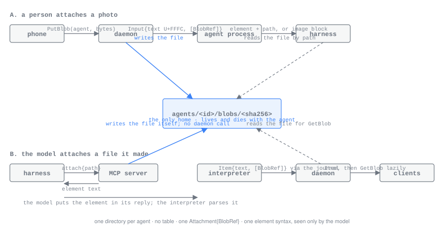

# Attachments and blobs

*For developers changing how images, files, pasted text and diff reviews travel between people, agents and clients.*

amux has one attachment type, one store of bytes and one way in. An
attachment sits at a position in text, on a person's prompt and on an agent's
item alike. Its bytes, when it has any, are a **blob**: a file named by its
SHA-256 in the agent's own directory. Models read attachments as files; clients
fetch bytes only when they draw them.

The pieces are:

- `wire::Attachment`, `wire::BlobRef` and friends in
  [`crates/wire/proto/amux/v1/records.proto`](../crates/wire/proto/amux/v1/records.proto).
- The [`attachments`](../crates/attachments/src/lib.rs) crate: positioned
  text and the `<amux-attachment>` element a model sees.
- The daemon's blob calls in
  [`crates/node/src/blobs.rs`](../crates/node/src/blobs.rs): `PutBlob`,
  `GetBlob` and `Diff`.
- The review document in
  [`crates/ui-view/src/review.rs`](../crates/ui-view/src/review.rs), drawn by
  the terminal's review page and the phone's.

## Shape

An attachment is one of four kinds:

| Kind | Carries | Bytes |
| --- | --- | --- |
| `image` | a `BlobRef` | a blob |
| `file` | a `BlobRef` | a blob |
| `text` | an `InlineText`: a name and the text | inline, no blob |
| `review` | a `Review`: a `Diff` and a person's comments | the diff's patch, a blob |

A `BlobRef` is the SHA-256 of the bytes (32 bytes), a name, a mime type and a
size. The name belongs to the reference, not to the bytes: the same bytes
attached twice under two names are one file with two references.

Text that carries attachments marks each one's position with U+FFFC, the
object replacement character, and lists the attachments in order beside it.
`PromptInput`, `QueuedInput` and `Item` all have this shape: `text` with one
placeholder per attachment, and `attachments`. A client splits the text at its
placeholders (`ui_view::segments`) and draws each attachment from its
reference alone (`ui_view::AttachmentView`): the name, type and size of an
image or file, the line count of pasted text, and the comment count of a
review. No bytes are needed to draw a row.

A review's `Diff` is exactly what the `Diff` call returned: the patch as a
`text/x-diff` blob, the base (the working tree or a branch), the head commit,
and the merge base for a branch. The file list, line counts and per-file
identity are not carried beside the patch; the review document parses them
from it, because a git patch already holds them in its index lines. A
`ReviewComment` is a path, a new-side line, an old-side line for a comment on a
removed line, and the text; line zero comments on the file as a whole.

## The element

A model reads attachments as `<amux-attachment>` elements in its
conversation. The syntax is formatted and parsed only by the `attachments`
crate, and it exists only inside the model's conversation: clients never see
element syntax or a host-local path.

```text
<amux-attachment kind="image" hash="sha256:…" name="shot.png" mime="image/png" size="1204" path="/…/blobs/…"/>
<amux-attachment kind="file" hash="sha256:…" name="trace.json" mime="application/json" size="8192" path="/…"/>
<amux-attachment kind="text" name="pasted-1">the pasted text…</amux-attachment>
<amux-attachment kind="review" hash="sha256:…" name="working-tree.diff" mime="text/x-diff" size="512" base="working-tree" head="4f2a9c1" comments="1" path="/…">…</amux-attachment>
```

- `hash` is `sha256:` and 64 lowercase hex digits.
- `path` is where the bytes are on the host that formatted the element, so a
  provider can open the file. The parser accepts it and ignores it: a blob is
  identified by its hash.
- A review's `base` is `working-tree` or `branch:<name>`; a branch review also
  has `merge-base`. Its body is the comments, each framed by byte counts so no
  path or comment text can be mistaken for the next heading:

  ```text
  ## path-bytes=10 line=12 old-line=0 text-bytes=11
  src/lib.rsUse helper.
  ```

- Attribute values and bodies escape XML-significant characters.

`attachments::format` turns positioned text into the text a model reads, each
placeholder replaced by its element with blob paths under the agent's blob
directory; `attachments::pieces` does the same but keeps each element apart,
so a caller can put a native image block right after an element.
`attachments::parse` goes the other way. Each valid element becomes a
placeholder and an attachment. A candidate that does not parse (unterminated,
nested, an unknown kind, a bad hash, an unknown or repeated attribute, a
malformed body) stays in the text exactly as written and is reported with its
byte offset, and scanning resumes just after its opening marker, so a later
valid element is still found. A stray U+FFFC in the text itself is replaced
with U+FFFD and reported. The parser never drops text.
`attachments::validate` checks a positioned value's shape: one placeholder
per attachment, every attachment set, every blob named by a 32-byte hash.

The agent side formats elements when it hands a prompt to a provider, and
the interpreters parse them back out of a model's finished reply
(`parse_reply` in [`shared.rs`](../crates/interpret/src/shared.rs), for every kind): each element becomes the
placeholder and an attachment on the reply's item, so clients draw the file
where the model put it. A reply still streaming shows its text as written
until it completes. A malformed element stays text.

## Bytes and metadata

A blob's only home is its agent's directory:

```text
<data_dir>/profiles/<profile>/agents/<agent>/blobs/<sha256 hex>
<data_dir>/profiles/<profile>/replicas/<host>/agents/<agent>/blobs/<sha256 hex>
```

The first is an agent this host runs; the second is a blob of another host's
agent that this host fetched. There is no profile-level blob directory and no
table: name, mime and size are on the reference in the input or item, and a
blob lives as long as its directory. Bytes are never in SQLite, because two of
the three providers read attachments from a path and every non-image file can
only be read that way. A blob is written to a temporary name and renamed into
place, so a reader sees the whole file or none, and the same bytes written
twice are one file. The same bytes sent to two agents are stored twice.

Whoever has the bytes writes them into the agent's directory, and the two
paths end in the same place.



**A person's attachment.** The client calls `PutBlob(agent, name, mime,
bytes)`; the daemon hashes the bytes, writes the file into that agent's
directory and returns the `BlobRef`. The client puts the reference in its
draft at the cursor, and the prompt goes out through `SendInput` with the
reference in its attachments. The terminal attaches a clipboard image or a
copied file path with Ctrl+V, and turns a paste of eight lines or 1000
characters into a `text` attachment; the phone stores bytes with
`amux_session_put_blob`. `PutBlob` for another host's agent is forwarded to
that host, since only the agent's own host writes its directory, and it is
refused on an agent's tools socket, since it is a person's act.

**A model's attachment.** The `attach` tool reads a file on the agent's host,
hashes it, writes it into the agent's directory and returns the element that
names it ([agent tools](AGENT_TOOLS.md#attach)); no daemon call is made. The
model puts the element in its reply, and the interpreter turns it into an
attachment on the reply's item when the reply completes. An
image inside a Claude tool result takes the same lane without a tool: the
interpreter decodes the base64 image block, hashes it, and emits a blob write
with the step; the agent process writes the blob before it journals the step,
and the tool's item carries the reference. The daemon does nothing at ingest.

**Reading.** `GetBlob(agent, hash)` reads the file whenever a client asks. On
a host holding a replica, a blob fetched before is read from the replica
directory; otherwise the call goes to the agent's own host, the bytes are
checked against the hash, and they are kept under the replica for the next
reader. So a blob behaves like an item: written locally by the agent side,
readable once the reference reaches a client, and the agent can keep
attaching while its daemon is away.

**Clients.** A chat asks for bytes only when it draws them. In the client
runtime, `ui_runtime::Session::blob(hash)` answers with the bytes if this open
chat has fetched them, and otherwise starts a `GetBlob` and answers nothing;
the rows that show the attachment draw a placeholder from the reference and
change when the fetch lands. Fetched bytes are held in memory for as long as
the chat is open. The phone reads them through `amux_session_blob`.

## Lifetimes

There are no pins, no expiry and no reference counts. A blob lives and dies
with the directory it sits in:

- An own agent's blobs go when the agent is deleted (`DeleteAgent`, which
  cascades to its children), or when own retention removes the agent: exited
  agents are removed whole, least recently active first, when the profile's
  own rows pass `retention.own_budget_mib`.
- A patch written by `Diff` goes into the requesting agent's directory and
  lives with that agent whether or not a review is ever sent.
- A replica's directory, blobs included, goes when its host stops listing the
  agent or is untrusted. Replica blob files also have a byte budget of their
  own, independent of rows, `retention.replica_blobs_mib` (512 MiB by
  default), evicted least recently read first: a replica blob can always be
  fetched again from its origin.

## Delivery to providers

The agent process hands a prompt's attachments to its provider in the form
that provider reads (`crates/agent/src/provider.rs`):

| Kind | What the provider receives |
| --- | --- |
| `claude_pty` | The prompt typed into the terminal with each placeholder replaced by its element, blob paths included. |
| `claude_sdk` | A user message whose text carries the elements with paths. When the prompt has images, the content is blocks instead: the text split at each image's element, with the image's bytes as a native image block right after it. |
| `codex` | The turn's input with each attachment appended after the text: an image as a `localImage` item naming its blob's path, anything else as its element text naming the same path. |

An agent message carries text only; attachments travel in prompts and items.

## The review document

A review starts with the `Diff` call. The daemon runs git in the agent's
working directory on the agent's own host and writes the patch as a blob of
that agent:

- The working-tree base diffs HEAD against the working tree, untracked files
  included. A temporary index holds HEAD plus intent-to-add entries for the
  untracked files, so the person's own index is never touched. The patch is
  named `working-tree.diff`.
- A branch base diffs the merge base of that branch and HEAD against HEAD,
  named `<branch>.diff`.
- Every diff runs with `--full-index` (index lines carry full object ids,
  each file's identity), `--no-renames`, and no external diff or text
  conversion.

`Diff` answers with the `Diff` value: the patch reference, the base, the head
commit and, for a branch, the merge base. A client freezes that value when its
review page opens: `ui_runtime::review::working_tree_review` makes the call
and fetches the patch, so the review a person sends names the same patch the
page showed, however the tree changes afterwards.

The document itself is `ui_view::review_doc(diff, patch, comments)`: it parses
the patch into files (path, old path for a rename, status, added and removed
counts, whether it is binary) and hunks of context, added and removed lines
with their old and new line numbers, and places each comment on its line, on
an old-side line for a removed one, or on the file as a whole. Both clients
draw that one document, so they agree on where a comment sits:

- The terminal's review page is
  [`crates/tui/src/chat/review.rs`](../crates/tui/src/chat/review.rs), opened
  with `<leader> r` from a chat. It owns the cursor, scroll and comment
  editor; the comments become one `review` attachment in the chat's draft,
  inserted with the first comment, updated as comments are saved and
  deleted, and removed with the last. `<leader> r` with that attachment still
  in the draft goes back to the same page.
- The phone gets the frozen diff through `amux_session_review` and the
  document through `amux_review_doc(review, comments)`, which parses again
  every time a comment is added (`ReviewModel` in
  `apps/apple/Packages/AmuxCore`).

Sent, a review is an ordinary attachment on the prompt: the model receives
its element, with the path to the patch and the comments in its body.

## Tests

- [`crates/attachments/tests/attachments.rs`](../crates/attachments/tests/attachments.rs):
  every kind round-trips through its element, the canonical spellings, and
  every way a candidate stays text.
- [`crates/node/tests/blobs.rs`](../crates/node/tests/blobs.rs): `PutBlob`
  writes the agent's directory, `GetBlob` reads own and replica files, a
  failed write leaves nothing behind, and `Diff` writes the patch as the
  agent's blob.
- [`crates/agent/tests/tools.rs`](../crates/agent/tests/tools.rs): the `attach`
  tool stores the file by its hash and answers its element without a daemon.
