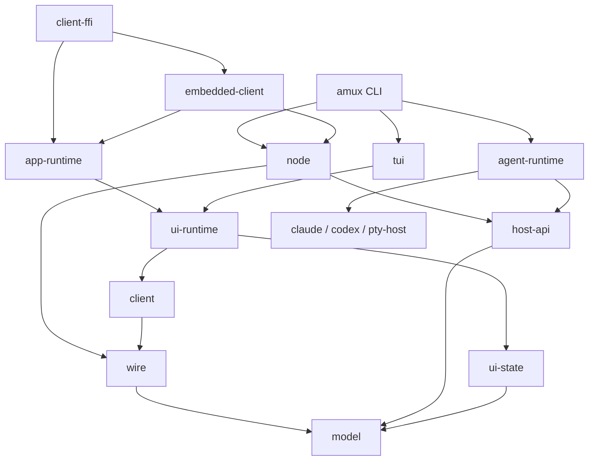

# Build and codebase foundations

Status: proposed architecture and implementation plan, 2026-09-11. No crate,
compiler setting, test runner, or build system has been changed by this audit.

The recommendation is to separate independently consumed Rust libraries,
retain Cargo and Xcode as the immediate build engines, and make worktree
isolation, artifact ownership, and bounded storage explicit. Evaluate Bazel
with the real Rust–Swift application before deciding to migrate the build
graph. Neither a crate split nor a compiler cache alone solves all four problems.

The native app should adopt these foundations before merging. There is no
requirement to preserve the current Rust API, crate names, feature combinations,
or native build scripts. Rename packages without compatibility facades.

## What the audit establishes

The current checkout was inspected at `c89f71a4`; the native app worktree at
`cd42647f`, including its in-progress recipe/documentation changes. This was a
workspace-wide structural audit: manifests, library surfaces, build scripts,
dependency resolution, test organization, CI, the Swift packages and bridge,
and wt's existing coordination facilities. It was not a correctness review of
every function. Existing artifacts and logs are observations, not fresh build
or performance verification.

| Observation | Implication |
| --- | --- |
| 13 Rust packages here; 14 in the native worktree. Current `amux` has 96,245 Rust lines across 189 files; `amux-ui` 37,713 and `amux-tui` 47,671. These totals include tests and generated code. | The library called `amux` is the main dependency and maintenance bottleneck, not merely a large CLI. |
| `amux-ui → amux → claude → replay-support` exists even in the selected UI-only host graph without local agents. The selected graph has 201 distinct dependency identities, excluding the root. | Disabling local hosting does not make the reducer independent of providers, networking, authentication, or storage. |
| Installation/profile supervision and front-door administration now live in `amux`; UI runtime imports `FrontDoorClient`, profile RPC types, and profile presentation helpers. | The older crate plan's `Client` extraction is incomplete for today's application. Both client service and owner administration must be separated from their implementations. |
| The host trait exposes artifact owners, an operation lock guard, persistence records, and tonic response streams. | Moving its implementor to another crate without redesign would preserve implementation coupling as public API. |
| `build.rs` gates scaffolding by profile in three libraries; TUI fixtures are in the normal library. | Test infrastructure changes production compilation and makes optimized test builds awkward. |
| `wt build` builds the whole workspace and all targets; metadata identifies 37 integration-test targets, 10 libraries, 8 binaries, an example, and 5 build scripts. | This stabilizes a broad graph but taxes even a small build with unrelated test executables and tooling. |
| Codegen is committed for the library, but `e2e-runner/build.rs` still runs protobuf generation during ordinary builds. | Building the workspace still builds codegen tooling and brings vendored protoc packages into the build graph. |
| No repository Rust toolchain pin; CI uses moving stable/nightly toolchains and most desktop jobs repeat commands outside wt. | Identical checkout contents do not determine the toolchain or effective recipe. |
| Global sccache 0.17.0 is installed, with a 10 GiB limit and no configured base directories. Its current counters were zero. | Cache configuration exists, but there is no observed cross-worktree hit-rate evidence. |
| `du -sh` reports 11 GiB here, 37 GiB under main, and 171 GiB under nativeapp, all for `target`. | The storage problem remains material. These directory totals do not distinguish old variants, current outputs, or captures, and do not establish exclusive APFS physical usage. |

The local rlibs still match the older note's approximate sizes, but their
presence is not evidence that they correspond to current sources. In particular,
counting one existing rlib is not a reliable build invariant.

The native target breakdown makes disk consumption a primary acceptance gate:

| Native worktree directory | Allocated size reported by `du -k` |
| --- | ---: |
| `target/debug/retained-codegen-20260910` | 101.57 GiB |
| `target/debug/incremental` | 39.34 GiB |
| `target/debug/deps` | 15.26 GiB |
| Other host debug outputs | about 2.50 GiB |
| Device-target outputs | 2.25 GiB |
| Simulator-target outputs | 2.69 GiB |
| `target/ios` including archives, DerivedData and captures | 7.29 GiB |
| Other outputs | about 0.22 GiB |
| **Total** | **171.12 GiB** |

The dated retained directory contains Rust `.rcgu.o` object files from many
libraries and test executables. Its creator and purpose were not established
from repository notes/scripts. It is outside Cargo's usual output layout; do
not assume Cargo manages its lifetime, or delete it based on its name. Rust
debug maps can refer to object files, so assess current binary/debugger needs
before retiring retained objects. The incremental subtree contains 600
directories; these include different targets and old artifacts, not necessarily
600 feature configurations. About 69.55 GiB remains even excluding the dated
directory. Neither deleting that directory nor merely adding sccache solves
the continuing generation and retention problem.

Retained host library fingerprints also show four `amux` feature sets:
`default + local-agents`, `local-agents`, `debug-tools`, and
`debug-tools + default + local-agents`. There are six corresponding library
fingerprints across two profile identities, with one compiler identity and no
extra rustflags recorded in those files. These are retained metadata, not a
measurement of which configuration is rebuilt today. They do establish that
the native branch has already expanded beyond the earlier single host feature
shape, including a development feature propagating into the shared node.

The required remedy has three parts: reduce compilation/link output, bound
retention of inactive configurations and diagnostic copies, and admit concurrent
work only within an aggregate storage budget. No task may quietly retain an
entire previous output tree as an unbounded precaution. When a diagnostic copy
is needed, declare its size, owner and expiry or deliberately pin it as evidence.

The native worktree already has five Swift packages, 195 Swift files, 22 Python
scripts directly under `scripts/`, and 41 wt tasks. Its shared foundation is
substantial enough to design now:

- `amux-mobile` combines a Rust runtime, JSON projection, cache, and C exports;
  it emits both `rlib` and `staticlib`, and generates its header in `build.rs`.
- `ios-rust.py` builds shipping simulator, shipping device, and debug-tools
  simulator archives. Each invocation removes and recreates the frameworks
  and runs a simulator linkage check. `ios-build` and `ios-unit` depend on it.
- All three archives use `opt-level = "s"`, fat LTO, and one codegen unit,
  including the bridge used for ordinary simulator development. An existing
  size report records approximately 240–244 MB per archive; this is not the
  installed application's size or a measure of linked Rust code.
- `AmuxCore` names the shipping binary framework while Debug and Measured
  force-load the development archive first. Comments document earlier duplicate
  bridge linkage problems in hosted tests. The build graph should choose one
  bridge, with no reliance on competing archives' linker order.
- Project generation runs before builds and repairs the generated scheme.
  App revision stamping runs every build and disables the app target's script
  sandbox because worktree Git metadata lives elsewhere.
- Worktrees use globally named simulators such as `amux-golden`, with the same
  bundle identifier. Separate DerivedData directories do not isolate installation,
  launch, appearance, Keychain state, or screenshots on that shared device.

## Corrections to the previous proposal

Keep its strongest ideas: a wire-free reducer, a provider-free node, test
support outside shipped libraries, and composition at application entry points.
Change these parts:

1. **Do not require one compilation of every dependency.** Track a bounded set
   of configurations. Host versus target, test harness versus library, checking
   versus code generation, proc macros, profiles, and dependency features can
   legitimately differ. Removing workspace features does not remove upstream
   feature unification. Cargo explicitly separates some host/build, target, and
   dev-dependency feature contexts. [Cargo feature resolution](https://doc.rust-lang.org/cargo/reference/features.html).
2. **Do not keep test dependencies in production to force uniformity.** Remove
   blanket `tokio/test-util` and test-only `tempfile` dependencies from product
   manifests when the new test targets exist. Some dev variants are worth their
   cost; building all tests on every command is not the universal remedy.
3. **Do not impose a blanket feature ban.** Replace `local-agents` and the
   profile-based scaffolding gates with composition. Platform cfgs remain.
   Permit a documented leaf-only development bridge feature if it cannot alter
   the shared runtime graph. Features enabling insecure transports or debug
   exports must not become a workspace-wide union or a runtime shipping switch.
4. **Do not expose internals merely to relocate tests.** Keep private-state unit
   tests beside their implementation. Move behavioral suites across stable,
   intentional boundaries; avoid public registries, mutable trust stores, or
   arbitrary backend insertion solely for tests.
5. **Do not introduce Rust orphan-rule violations while gathering conversions.**
   A crate owning generated wire structs can implement conversions involving
   those types; conversions between two types it does not own need functions
   or a locally owned wrapper. Provider payload types must not pull provider
   sessions into the model.
6. **Do not preserve old imports with re-exports.** Update consumers together.
   The earlier graph also contradicted its dependency-order prose; the direct
   dependency list below is the proposed authority.

## Rust ownership and crate graph

Keep one Cargo workspace and lockfile. Use explicit members and explicit
product/default selections so adding a development tool does not silently
expand ordinary builds. Packages are private (`publish = false`) and omit
the `amux-` prefix. The CLI package and executable are named `amux`.
Product-facing executable names and C symbol prefixes can retain the brand;
package renaming is not a reason to rename every protocol symbol.

Each row lists allowed **direct production dependencies within the workspace**.
External dependencies are still reviewed by capability. Test-only edges are
checked separately; transitive exclusions below also apply through third parties.

| Package | Owns and exposes | Direct local dependencies |
| --- | --- | --- |
| `model` | IDs including profile/account IDs, inventory and session vocabulary, requests/events/errors, artifact references, pairing payload values, typed provider row/input data, attachment element syntax | none |
| `wire` | Protobuf schemas and committed generated types/descriptors, domain conversions, payload codecs, capped RPC constructors, status mapping | `model` |
| `settings` | Persisted installation/profile preferences and explicit path configuration, validation and serialization; no process discovery or startup | `model` |
| `host-api` | Local hosting contract, owned request/result/stream types, capability advertisement, lifecycle coordination contract | `model` |
| `client` | ClientService and front-door/ProfileService/InstallationService client wrappers; explicit channel/socket connection, typed owner-client operations | `model`, `wire` |
| `node` | Identity/trust, routing, TLS and admission, RPC service implementations, profile and installation supervision, embedded node lifecycle, relay mode | `model`, `wire`, `settings`, `host-api` |
| `artifacts` | Content-addressed owner/cache implementations and retention, verified content I/O | `model` |
| `pty-host` | Existing provider-neutral PTY process lifecycle | none |
| `replay-support` | Provider recording formats, deterministic streams, replay clocks | none |
| `claude`, `codex` | Existing native provider session APIs; no amux model adaptation | `replay-support`; `claude` also uses `pty-host` |
| `agent-runtime` | Sessions, provider adapters, hooks, buffers, suspend records, A2A delivery, attachment pinning/materialization/diff and host implementation | `model`, `host-api`, `artifacts`, `claude`, `codex`, `pty-host` |
| `ui-state` | Pure Model/Msg/Effect/update, provider-specific folds, commands and send gates, review/draft values | `model` |
| `ui-runtime` | Client connections, effect execution, ordered delivery, profile directory client, artifact fetching, recording/report persistence | `model`, `ui-state`, `client`, `artifacts` |
| `tui` | Rendering, interaction state, terminal/clipboard handling, themes, and existing fleet event loop using the runtime | `model`, `ui-state`, `ui-runtime` |
| `app-runtime` | Shared rich-client sessions, account-scoped cache, typed presentation updates and operation routing; ordinary Rust API | `model`, `settings`, `client`, `ui-state`, `ui-runtime` |
| `embedded-client` | Embedded node/installation startup, credentials and shutdown ownership; supplies sessions to app-runtime | `model`, `settings`, `node`, `client`, `app-runtime` |
| `client-ffi` | Thin C boundary: opaque handles, ABI ownership, exported functions/header; initial embedding-capable bridge | `app-runtime`, `embedded-client` |
| `amux` | CLI composition, provider registration, configuration discovery, desktop process/update policy, OAuth device-login command, TUI launch | `model`, `settings`, `node`, `host-api`, `agent-runtime`, `client`, `ui-state`, `ui-runtime`, `tui`; `claude`/`replay-support` only for actual provider management commands |

The node's shared authentication implementation stays a private subsystem at
first. Expose the credential-provider contract needed by embeddings and the
device-login operation needed by the CLI. Extract `auth` only if those consumers
need it without `node`; do not put OAuth/JWT in every client to avoid naming a
small API. Desktop self-update/process discovery move to CLI composition;
node retains lifecycle primitives and an injected update/subscription reporter.

`settings` owns configuration values, including shared UI preference values;
TUI interprets them. `client` accepts explicit connection inputs rather than
loading a whole installation. Move front-door client wrappers out of service
implementation files, and move display formatting out of node supervision.
An embedded node exposes an owned local channel/endpoint and owner handle;
composition constructs the `client`. It does not import the client to manufacture
UI objects. Keep owner administration separate from peer-callable service APIs.

This is a consumer graph, not a demand for a crate per directory. Keep routing,
TLS, pairing, installation, and relay as private modules of `node` initially.
The highest-value separation is that provider/backend changes do not recompile
node, node changes do not recompile UI libraries, and reducer tests need neither.
The final CLI and embedded app still relink when their dependencies change.
`tui → ui-runtime → client` is deliberately allowed: the current event loop
really uses Runtime. If transport-free screenshots remain costly after this
split, extract rendering from the event loop as a measured follow-up, not by
claiming the current TUI is transitively client-free.

### Reuse across rich clients

The iPhone is the first rich client, not the owner of the shared client library.
Use `app-runtime` and `client-ffi` as the target package names instead of `mobile`
and `mobile-ffi`. Existing `amux-mobile` is the extraction source, not a name to
preserve. Keep product names such as Amux in Swift modules and C symbol prefixes
where they identify the product; name Rust packages by responsibility.

Keep three different layers clear: `client` speaks the RPC APIs; `ui-runtime`
executes a session's reducer effects and delivers observations; `app-runtime`
coordinates rich-client sessions and projects their state into typed fleet/feed
updates. It does not become another reducer or transport implementation. Start
projection and fleet-cache code as modules in app-runtime; extract additional
crates only when a consumer or compile boundary justifies them.

App-runtime accepts supplied session connections and scoped administration
capabilities. It must not depend on node, spawn a desktop daemon, choose a
platform credential store, or assume every client owns an installation.
`embedded-client` owns those node resources when embedding is selected. An
attached desktop client uses the existing daemon through client APIs. Dropping
an attached client closes its subscriptions; it must not shut down the daemon.
An embedded owner drains and shuts down only the resources it created.

The initial C bridge can depend on embedded-client because the existing native
application needs embedding. That makes this particular bridge embedding-capable;
it does not make app-runtime depend on node or oblige future clients to use the
C ABI. A Rust desktop UI can use app-runtime directly. If a later attached-only
foreign-language client needs a smaller binary, split the final bridge composition
then; do not force every backend or output format into one feature matrix now.
Keep the bridge's callback/handle implementation independent of node internals.

Selection and lifetime are not phone-wide globals. Keep account identity on
commands/results and expose independent view/subscription handles so desktop
windows can select different accounts and sessions. Shared account sessions may
serve multiple views; losing one view must not cancel another view's work.
Platform shells own navigation, window state, visibility/background policy,
credential-store adapters, file pickers, notifications and display cadence.
Projection accepts requested cadence and explicit time; it does not assume
one screen, a fixed refresh rate, or that any background event suspends all
sessions. Preserve stale-result rejection and cache-versus-live authority rules.
Keep presentation values independent of SwiftUI/AppKit/UIKit and C pointers;
serialization and callback delivery belong at the bridge edge.

Do this now by keeping node/client/UI APIs instance-scoped, capability-based and
free of mobile assumptions. At native integration, extract the existing bridge
logic into the packages above and test both an embedded composition and an
attached composition, plus two simultaneous view handles. Do not create these
future packages as empty scaffolding in the current pre-app checkout. Swift
model/adapter reuse can stay in an appropriately scoped AmuxCore package;
iPhone navigation remains in its app shell.

### Public API rules

- Private modules with a small root export list; `pub(crate)` for implementation
  collaboration. Avoid exporting all of `services`, `routing`, or `installation`
  just to make file moves compile. Rust's `pub` is a cross-crate contract even
  when the package is unpublished.
- `model` contains values actually shared by consumers. No tonic, tokio,
  filesystem owners, provider session objects, global clocks, or Git/process
  operations. Serialization and provider-specific data remain concrete; do not
  flatten distinct Claude PTY/SDK and Codex facts into a universal agent schema.
- `wire` owns encode/decode. Transport-independent libraries never mention
  `tonic::Status` or generated messages in public signatures. Keep the generic
  protocol error separate from contextual internal errors.
- `host-api` uses owned values and a typed event stream, not tonic responses,
  storage owners, mutable registries, or lock guards. Tokio channels and
  cancellation are acceptable implementation choices for this asynchronous
  seam; they do not belong in `model`.
- Profile deletion must continue to drain accepted writes before deleting
  storage. Put the lifecycle lease/admission protocol in `host-api`: opaque
  owned leases passed to the host, closure to new operations, cancellation,
  and a drain barrier. Node owns profile policy; the runtime holds leases until
  attachment writes/provider handoff finish. Specify ordering before moving
  code; replacing today's guard with an uncoordinated async method is incorrect.
- Runtime owns artifact preparation, pinning, attachment row ordering and
  owner cleanup. Node routes the request; model owns artifact IDs/kinds so UI
  values do not depend on a filesystem crate. Migrate those types and all
  consumers together to avoid a `model ↔ artifacts` cycle.
- Keep provider session implementations distinct. Reuse existing `from_io`,
  `from_sources`, and recording constructors where they are useful product
  abstractions. Keep `AgentBackend` private unless a real external implementor
  requires it; `LocalAgentHost` is the necessary public boundary today.
- Public diagnostics are immutable, redacted observations available through
  the owner handle. Transport injection accepts explicitly owned I/O and has
  cancellation semantics; it does not expose a mutable trust store or bypass
  peer admission. Test-only fault injection can remain inside node unit tests.

### Test and developer packages

Use `testnet` for multi-node/provider behavioral suites and the native journey
runner; it depends on node, client and agent-runtime. `claude-specs` and
`codex-specs` own probes and executable recording suites. `tui-fixtures` owns
named render states; `shot` uses it for the existing screenshot executable.
Retain `e2e-runner`, `test-agent`, and a small codegen `xtask`.

Move fixture-dependent TUI tests that pass TUI-owned types into integration
tests so they use the same normal library as the fixture crate. Keep purely
private unit tests without a fixture-crate cycle. Group related integration
tests under a few explicit harness entry points; moving every inline module
to a separate `tests/*.rs` file would create many expensive links.

The E2E client may depend on `wire`, never node or client implementation, or
retain its independent generated client as committed output. Prefer the shared
wire package unless an independent decoder is the assertion's purpose. Either
way, remove its normal-build protoc invocation. Keep freshness checking as an
explicit generator task. The mobile header should likewise be an explicit
generated artifact with freshness/ABI checks, not a reason to build cbindgen
for every mobile library edit.

Remove the three profile-cfg build scripts after scaffolding moves. Keep
`cfg(test)` for unit tests and real OS/architecture gates. Test-agent support
is registered only in development compositions; its wire enum remains total.
Do not turn debug/reporting support into unconditional shipping code without
preserving the current product boundary.

## Build configurations and storage

Use a small declared configuration matrix, not arbitrary command-line profiles
and feature sets. Changing a config fingerprint is observable and old state is
eligible for bounded cleanup. Do not add one directory per commit.

| Purpose | Proposed compilation policy | When built |
| --- | --- | --- |
| Host development and tests | Dev profile, unwind, workspace line-table debug info, dependency debug info off, incremental on, no LTO | Local build/check/test tasks; selected targets |
| Host CI tests | Same source/features and dev semantics; incremental off for immutable cacheable jobs | CI; intentionally distinct from local incremental state |
| Host distribution | Release, abort; retain current optimization until measured | Release verification/packaging only, selected product binaries |
| iOS simulator iteration | `ios-dev`, derived from dev, line tables, incremental, no LTO, ordinary parallel codegen, abort at product boundary | Ordinary simulator app build; one ARM64 slice |
| iOS measurement/distribution | `ios-release`, initially preserve current optimized mobile settings for comparison; benchmark thin versus fat LTO | Measured simulator and shipping device; shipping simulator only for its explicit bridge check |

Start by testing `debug = "line-tables-only"` for local workspace crates.
It preserves file/line backtraces but omits variable/type inspection; keep an
explicit short-lived full-debug recipe for LLDB when needed. Do not choose a
universal `debug = 0` just to improve a size number. macOS already defaults to
unpacked debug information in Cargo, so setting it again is not an optimization.
Benchmark LTO and codegen units independently; `opt-level = "s"` optimizes
product size, not build speed. [Cargo profiles](https://doc.rust-lang.org/cargo/reference/profiles.html).

The development mobile profile must explicitly define abort behavior and the
FFI API must never unwind into Swift. Host Rust tests retain unwind. Optimized
performance comparisons use the same bridge optimization as shipping, while
development exports live only at the bridge/application edge. Device and
simulator are distinct platforms even though both are ARM64. Do not add Intel
simulator or Catalyst configurations without an actual supported consumer.

Retain the existing ring-only TLS choice and narrow default dependencies.
Use per-crate Tokio capability declarations once targets are separated; inspect
their union instead of blindly disabling defaults or globally enabling test
features. Audit direct unused dependencies with cargo-machete. Remove duplicate
declarations, but do not replace a safe process API with unsafe libc solely to
save one transitive crate; measure its contribution first. Avoid global profile
overrides optimizing every dependency, forced codegen-units=1, native CPU flags,
and platform-inappropriate linker recommendations. Evaluate a linker only when
timings establish linking as the bottleneck on that platform.

### Worktree caches

Keep mutable Cargo outputs, incremental state, DerivedData, binaries on PATH,
and runtime data private to a tree. A global shared `CARGO_TARGET_DIR` causes
lock contention, fingerprint churn, and ambiguous executables; it is not the
proposed deduplication mechanism. Share package downloads and bounded immutable
compiler/action caches instead.

Use one local incremental configuration per active tree. sccache can cache
eligible dependency compilation, but it cannot cache incremental compilation
or linker-producing Rust crate types such as binaries and proc macros. Configure
and test checkout-relative path normalization (`SCCACHE_BASEDIRS`) for the
installed version. A high cache hit rate does not eliminate local materialized
rlibs, executables, incremental directories, or native packaging. Preserve the
native bridge's wrapper bypass until a native-input mutation test demonstrates
correct invalidation. [sccache behavior](https://github.com/mozilla/sccache),
[Rust caching details](https://github.com/mozilla/sccache/blob/main/docs/Rust.md).

Do not immediately disable incremental builds everywhere for sccache. Compare
local edit latency and second-worktree startup separately. If most development
is in disposable trees, an explicitly bounded nonincremental/cached mode may
win; choose one default after the experiment, not two casually intermixed modes.

Cargo now supports separating intermediates using `build.build-dir`. This can
put compiler state under an owned per-tree cache directory while keeping
discoverable products in `target`; it does not itself deduplicate trees. Prefer
Cargo's supported interface to symlinking its internal `deps` or fingerprint
directories. Adopt only after wt cleanup and editor behavior support the new
location. [Cargo cache layout](https://doc.rust-lang.org/cargo/reference/build-cache.html),
[build-dir configuration](https://doc.rust-lang.org/cargo/reference/config.html#buildbuild-dir).

Proposed initial storage policy, to be calibrated by clean measurements:

- Shared compiler cache: retain the existing 10 GiB limit initially.
- Per active tree: soft alerts at 15 GiB compiler state, an additional 15 GiB
  native intermediates, and 5 GiB disposable captures/results. These are
  starting operational budgets, not observed achievable build sizes.
- Keep the latest successful development products and five recent diagnostic
  runs; retain failures seven days unless explicitly pinned. Preserve baselines,
  user reports, and release evidence outside disposable compiler-cache cleanup.
- Expire inactive, unleased intermediate configurations after seven days.
  Pruning is dry-run by default for existing trees, owns only declared output
  roots, never follows symlinks into source, and refuses active build/test leases.
- Measure allocated and logical bytes per category, plus filesystem free-space
  delta in a controlled run. APFS clones/hardlinks and shared cache copies mean
  summing apparent directory sizes is not exclusive physical consumption.

In addition to category alerts, propose an initial **60 GiB aggregate admission
budget for amux's disposable worktree outputs**, with the shared 10 GiB compiler
cache accounted separately. This is a proposed operational limit to validate,
not a claim that today's builds fit it. At admission, reclaim eligible inactive
outputs, account for active tasks' measured peak scratch needs, and queue/refuse
new heavy work if the reserve cannot cover it. Report the category and owner
responsible instead of silently raising the limit or retaining another copy.
Use a safety reserve and monitor growth during builds; a strict physical byte
ceiling requires filesystem quota support, since task-boundary checks alone
cannot prevent compiler output overshoot. Simulator runtimes and pinned release
evidence are separately reported machine storage, not hidden inside this budget.

Before accepting the hygiene pass, the controlled three-worktree workload must
fit an explicitly chosen aggregate budget and repeated edits must plateau after
reclamation. If a fresh necessary build exceeds it, reduce its footprint or
make the capacity decision explicit; age-based cleanup alone does not pass.

No cleanup was performed during the audit.

The repository implementation places ordinary Cargo build, check, test,
codegen, and lint recipes behind
an output admission helper. A target becomes disposable only after the helper
writes a versioned marker for the same repository pool. Each running task holds
a process lease with its declared scratch reservation; the coordination lock is
released while Cargo runs, so separate worktrees retain private output and can
compile concurrently. Completion and forwarded termination refresh the cached
allocated size and clear that task's lease. Long-running tasks refresh that
measurement every 30 seconds and warn if participating outputs cross the
admission budget. A later admission may reclaim an
inactive marked target as one coherent directory, after rechecking both marker
and lease.

Ordinary inventory uses the cached measurements maintained at task boundaries.
It reports unmarked historical roots without recursively measuring them, which
keeps admission responsive even when old worktrees contain large targets. The
explicit `--include-unmanaged` audit performs that slower scan. Unmanaged bytes
are reported separately and excluded from the enforceable pool because the
helper neither owns nor deletes them. The 60 GiB limit is therefore an
admission bound for participating outputs, not a machine quota or a claim about
all existing disk use. The compiler cache remains a separately reported 10 GiB
category when its path is configured.

## Reproducible tasks and hermetic tests

Give each layer one responsibility: Cargo compiles Rust, Xcode compiles/packages
Apple targets, a pinned Python tool package runs orchestration, and wt selects
the tree, environment, resource leases, and recipes. Do not move all tooling into
the Rust `xtask`: nativeapp's verifier already enters through `cargo run -p xtask`,
which makes orchestrator startup subject to Rust builds and feature resolution.
Keep `xtask` for Rust-native code generation; move journey/capture orchestration
to the existing Python layer with one manifest of stages and artifacts.

Pin Rust in `rust-toolchain.toml` (including clippy and mobile targets), pin the
formatter nightly separately if nightly formatting is still needed, and pin
Python, wt, XcodeGen, and other tools. Use `mise` for tool provisioning only,
not as a second recipe scheduler; use `uv` with a lockfile for Python tools and
dependencies. Xcode's build number, selected SDK, simulator runtime and deployment
target must be checked against committed requirements. Existing native pins are
Xcode 26.6 / 17F113, iOS 26.5 simulator, and iOS 26.0 deployment. Validate their
availability before selecting the implementation's final pins.
[mise locking](https://mise.jdx.dev/dev-tools/mise-lock.html),
[uv locked environments](https://docs.astral.sh/uv/concepts/projects/sync/).

Three different properties need separate demonstrations:

| Property | Concrete demonstration |
| --- | --- |
| Repeatable recipe | The same pinned inputs select the same tools, target, profile, environment and stage graph locally and in CI. |
| Hermetic action | After explicit fetching, compile/codegen and offline suites succeed with outbound networking denied and undeclared user state inaccessible. |
| Reproducible output | Two clean roots produce matching generated files and, where promised, unsigned product bytes; explain legitimate signing/packaging differences. |

`--locked` prevents lockfile drift; `--frozen` adds Cargo offline behavior.
Neither confines a build script or test process. Start with a fetch/bootstrap
phase, then controlled environment, isolated test homes, readonly source,
private scratch outputs, a fixed locale/timezone, and OS-level network policy.
Use Linux containers/sandboxes for Linux lanes and a pinned managed Mac for
Apple lanes. The existing `offline-check.sh` tests denied outbound networking
and permits loopback, but otherwise allows filesystem access and retains much
of the caller environment: it is an offline guard, not a full hermetic sandbox.
No build system makes Xcode, signing services, or a simulator independent of
their platform provisioning automatically.

Do not hash secrets into shareable task keys or place live provider/account
tests in a remotely cached test lane. Build actions consume a compile-specific
environment; runtime `AMUX_CONFIG` and per-tree log paths are not compiler inputs.
Version metadata is an explicit input to a tiny composition/stamping action.
Include actual source digest or dirty-state identity in local provenance; HEAD
alone cannot identify a built dirty worktree. Re-enable Xcode script sandboxing
by passing a generated revision input instead of letting the build read `.git`
outside the source root.

### Fast command surface

These are proposed recipes to implement, not commands available today. During
the migration the existing wt commands remain authoritative.

| Recipe | Scope and behavior |
| --- | --- |
| `wt build` | Build host product binaries with locked dependencies; no blanket tests/examples/codegen tools. |
| `wt run check` | Fast host product checking; editor uses the same pins/config. |
| `wt test -- …` | Targeted Rust suites with explicit argument semantics; tests build their required executables only. |
| `wt run test-build` | Precompile selected harnesses, separate from their execution deadline. |
| `wt run verify` | Full offline Rust suites, doctests, codegen freshness, dependency/layer checks and lint; explicit OS matrix in CI. |
| `wt run ios-build` | Build one development simulator bridge and the Debug app. No device archive or linkage test. |
| `wt run ios-unit -- …` | Select owning schemes/suites and reuse built artifacts. Pure Swift tests do not acquire Rust/simulator prerequisites unless their graph needs them. |
| `wt run ios-verify` | Explicit mobile check, shipping bridge smoke, release exclusion audit, unit/journey/golden suites, and separately scheduled performance qualification. |
| `wt run build-report` | Configuration identities, build/test/package time, lock waits, cache observations, output sizes and budget warnings. |

Keep feature selection stable within each supported recipe family. Package
selection becomes useful after extraction; compare resolved features between
focused and workspace commands before enabling it broadly. Try cargo-hakari
only if measured recurring feature differences remain expensive. A global
workspace-hack dependency can pull a large union into every small consumer;
exclude the lightweight/mobile boundary or reject the experiment if it defeats
layering. Do not trade away `ui-state` isolation for a better rlib count.
[cargo-hakari](https://docs.rs/cargo-hakari/latest/cargo_hakari/).

Pilot nextest for Rust test execution: filtering, scheduling, per-test deadlines
and build reuse are useful. Preserve separate doctests and the opt-in
`harness = false` provider suites unless explicitly adapted. Nextest uses one
process per test; the repository already documents macOS executable-assessment
delays, so benchmark on macOS as well as Linux before making it the default.
Keep retries off in verification and retain failing evidence; a passing rerun
does not diagnose a hang. [Nextest execution model](https://nexte.st/docs/design/why-process-per-test/),
[doctest limitation](https://www.nexte.st/),
[custom harness protocol](https://nexte.st/docs/design/custom-test-harnesses/).

Separate pure reducer/codec tests, in-process protocol tests, OS/PTY/process
tests, simulator UI tests, and live external integration tests. Inject time and
randomness at useful seams; use notifications/readiness handshakes instead of
elapsed sleeps for deterministic tests. Keep real child processes where signal,
pipe, exit or process-group behavior is the assertion. Tests own temporary
directories, dynamic ports and cleanup. Run a two-worktree concurrent fixture
test and force cancellation to prove ownership and teardown.

CI should use the same pinned underlying recipes as local development. The
current test job runs `--all-targets` and then spec again: remove duplicate
execution after inventorying selected tests. Compile optional live harnesses
without invoking live work. Group check/lint/build preparation where reuse is
real, retain platform-specific tests, and build release products rather than
every development binary. Explicitly run doctests, which all-target selection
does not replace. Cache keys include toolchain/platform/profile/lockfile and
recipe configuration; restore-key fallbacks cannot stand in for correctness.

### Native artifact graph

Make distinct actions for header generation, each Rust slice, framework
assembly, project generation, app build, test build, test execution, and
verification. Use Cargo's reported artifact paths, as the existing script
already correctly does; never discover a header/archive by globbing old outputs.

`app-runtime` and `embedded-client` are rlibs so session/projection and embedding
tests do not require rebuilding a static archive. `client-ffi` is the thin C
boundary, initially packaged as a staticlib for Apple clients. Choose other
artifact formats only for actual consumers; do not emit every crate type by default.
Keep development-only exports/transport adapters in a leaf development
composition (separate small package if practical; otherwise one documented
leaf feature with no shared-library feature propagation). Shipping composition
must reject plaintext loopback and exclude diagnostic exports regardless of
optimization level. Preserve symbol/resource scanning and real shipping
simulator startup tests.

For Xcode, select exactly one bridge artifact in each generated configuration.
Generate its module map/header and link path from the artifact manifest. Remove
the shipping binaryTarget plus development force-load override; either a common
C module facade with configuration-specific linkage or separate generated app
targets can express the choice. Use the former as the initial implementation.
Verify the hosted-test and package-test link graphs contain one Rust runtime,
and exercise version, callback ownership, cancellation and stop/join behavior
from Swift.

Only reassemble frameworks when archive/header/module-map content changes.
Write in temporary output directories, then publish atomically; preserve the
last known-good artifact on failure and mark the new request failed. Consumers
require a matching digest/manifest, so retaining an old file cannot masquerade
as a successful build. Project generation includes all source/resource lists,
the generator version, and the scheme repair. If retaining the generated project
in Git, regenerate explicitly and check freshness in CI; ordinary builds must
not rewrite tracked project files.

Use `build-for-testing` then `test-without-building` where Xcode supports the
suite, tied to the exact `.xctestrun`, app and test bundle identities. Do not
cache a simulator test merely because its app binary is unchanged: fixtures,
runtime, device type, appearance and test inputs matter, and mutable device
state may make the run unsuitable for result caching.

## Changes to wt

Keep wt a worktree/resource coordinator. It already provides an acyclic `needs`
graph, task timeouts, repo-scoped named locks with capacity, resource lifetimes,
tree-specific environments, disk probing and timing logs. Adopt those before
requesting equivalents. Source audit: wt 0.3.0 and its local README/cookbook.

| Priority | Proposed capability or use | Acceptance demonstration |
| --- | --- | --- |
| Now, existing API | Repo-scoped simulator mutex and bounded compile slots in amux recipes | Two trees contend explicitly; independent non-simulator work proceeds; wait time is visible. |
| Now, existing API | Tree-owned simulator resource with unique name/UDID, cleanup tied to tree | Same app identifier can run on separate tree devices; deleting one tree leaves the other device/processes intact. |
| High, new capability | Machine-scoped named capacity pools with shared/exclusive claims for compiler load, simulator pools and performance isolation | A performance run excludes compiler/capture jobs across repositories; normal jobs share a bounded pool. Lost owners release claims. Coordination covers wt-managed jobs; unrelated host load is detected and invalidates measurements. |
| High, new capability | Declared disposable output roots, cache categories, quotas and leases; safe preview/prune | Disk reports distinguish compiler state, packaged products and captures; prune refuses active leases and never touches runtime reports or other trees. |
| High, new capability | Explain task decisions and artifact provenance in structured output | A no-op explains reused dependencies; a changed SDK/header forces the correct action; failure cannot reuse a stale success receipt. |
| Conditional | Declared task inputs/outputs with content validity and local result reuse for pure orchestration steps | Same inputs in a second tree reuse packaging/codegen; changing an input, declared environment value or tool identity invalidates; effectful tasks never skip. |

The retention workload also exposed a smaller lifecycle gap in wt 0.3.0. A
detached tree created with `--no-build` still has the repository's declared
tree-bound daemon resource, although no daemon instance exists. Removing that
tree reports the absent resource probe as `DESTROY_FAILED`; the caller must use
`--keep-orphans` and then target the stale record with `wt prune --records`.
Wt should treat a never-created tree resource as already absent, or provide one
removal operation that safely forgets that record after the tree disappears.

The last capability is a scope decision for wt. Do not grow a compiler dependency
scanner, remote executor, sandbox, or general CAS protocol inside it. If amux
needs cross-language action caching, delegate that to Bazel or native build
cache support. A small recipe runner can invoke Cargo cheaply every time and
let Cargo determine freshness; correctness is preferable to speculative hashes
that omit build scripts, resource globs, native objects or SDK inputs.

Use one layer for resource claims. An aggregate can hold a simulator lease for
its whole journey; nested tasks must inherit that lease or avoid reacquiring it.
Separate build and run timeout budgets. Task cancellation must terminate the
owned process group, collect diagnostics, release claims and preserve any
pre-existing user-owned simulator. Shared performance hardware needs an exclusive
measurement lease, not just a per-tree lock.

## Build-system decision

**Do not migrate the whole repository to Bazel as the first step. Do conduct a
bounded Bazel trial before the native build architecture is considered settled.**
The crate boundaries and explicit artifact contracts above are useful with
either backend. The difficult part is whether one graph can replace current
Rust/Swift packaging and improve real multi-worktree iteration without damaging
Xcode development or OS test coverage.

| Option | Recommendation and reason |
| --- | --- |
| Cargo + Xcode + wt, pinned tools | Implement immediately. Least disruption to the working Rust/Swift toolchains; needs explicit cross-language artifacts and cache/storage policy. |
| Bazel | The serious whole-codebase candidate. Model Rust, Swift, resources, generation and tests as actions; share immutable outputs across tree-private output bases. Costs include BUILD/rule maintenance, Apple toolchain provisioning and IDE integration. |
| Tuist/Xcode compilation cache | Evaluate if Swift compilation remains dominant and the full Bazel trial fails its cost/benefit gate. Xcode compilation caching can be trialed independently; adopting Tuist generation would replace XcodeGen, not sit beside it. |
| Nix/devenv | Useful alternative for stronger Linux/macOS tool environments; not the initial additional layer. A pinned environment alone does not express Rust–Swift artifact dependencies, isolate a simulator, or remove Apple SDK provisioning. |
| Buck2 / Pants / another task runner | Do not pilot concurrently. Buck2 has Rust and Swift support but publicly documents more setup work for Swift; Pants' target catalogue alone does not establish an end-to-end iOS app solution. Require evidence of a better fit before expanding the tooling comparison. |

Bazel has official Rust, Swift, and Apple rule sets; crate-universe can derive
external Rust dependencies from Cargo manifests/lockfiles. Keep one authority
for dependency versions and verify graph drift rather than maintaining two
hand-edited dependency universes. A Bazel target that merely shells out to a
whole workspace Cargo build would not demonstrate fine-grained cache benefits.
[Rust rules](https://github.com/bazelbuild/rules_rust),
[crate-universe](https://bazelbuild.github.io/rules_rust/crate_universe_bzlmod.html),
[Swift rules](https://github.com/bazelbuild/rules_swift),
[Apple rules](https://github.com/bazelbuild/rules_apple).

Bazel's action cache can share successful action results, but correctness
depends on declared inputs/toolchains/environment; it does not make arbitrary
scripts hermetic. Mutable output bases remain separate per worktree, and both
CAS and materialized outputs need storage limits. Restrict shared cache writes
to trusted producers and keep signing/credentials outside reusable compile
actions. [Bazel remote caching](https://bazel.build/remote/caching).

Xcode integration is a feasibility gate, not an assumption. `rules_xcodeproj`
advertises indexing, debugging, test selection and previews, but its published
tested compatibility table inspected for this audit only covers older Xcode
ranges than nativeapp's 26.6 requirement. This does not prove incompatibility;
it means the exact pinned combination must be exercised.
[rules_xcodeproj](https://github.com/MobileNativeFoundation/rules_xcodeproj).
The narrower alternative offers both Xcode compilation caching and generated
module caching. [Tuist Xcode cache](https://tuist.dev/en/docs/guides/features/cache/xcode-cache),
[Tuist module cache](https://tuist.dev/en/docs/guides/features/cache/module-cache).
For the other alternatives, see the documented capabilities of
[devenv](https://devenv.sh/guides/using-with-flakes/),
[Buck2](https://buck2.build/docs/about/language_support/), and
[Pants](https://www.pantsbuild.org/stable/reference/targets).

### Bounded Bazel trial

Allocate five engineering days after the first domain/UI extraction. Extend
only if the remaining blocker is understood and the evidence warrants it.
Use a disposable branch and the same controlled benchmark hardware:

1. Build real `ui-state` tests and the actual mobile bridge with pinned Rust
   and dependency inputs, including native TLS objects and generated headers.
2. Link that bridge into the real Swift app with assets and resources, build
   a simulator target and a device archive, run one bridge lifecycle test and
   one app-hosted/XCUITest journey, and reproduce the release exclusion check.
3. Generate/open the Xcode project. Verify indexing, Swift previews, a Swift
   breakpoint, a Rust breakpoint, and selected test execution.
4. In two separate roots with one warmed local action cache, measure warm
   no-op, node edit, reducer edit, Swift edit, fresh-worktree build and concurrent
   builds. Prove an altered native object/header and SDK identity invalidate
   cached actions. Fetch explicitly, then deny external networking for build
   and deterministic tests. Try one declared-input violation and require failure.

Adopt Bazel only if all correctness/IDE gates pass, second-tree compile/action
reuse is demonstrated, and the pilot improves the median fresh-tree or mixed
Rust/Swift edit workload by at least 30% versus the improved native-tool baseline,
without more than 10% regression in the other key edit loops. These are proposed
decision thresholds, not predictions. Require an owned maintenance plan and
bounded storage as well. A failed trial ends in a written native-tool decision;
do not retain two mandatory build systems indefinitely. Remote execution and
a hosted remote cache are later deployment decisions, not prerequisites for
this local trial.

## Implementation sequence and acceptance

Each step is a reviewable change with a DEVLOG entry. Change both the shared
code and native consumer as required; avoid compatibility shims. Do not roll
unrelated protocol redesign into file moves. Runtime behavior, especially
authorization, ordering, lifecycle and release exclusions, must remain covered.

| Order | Concrete work | Acceptance before continuing |
| --- | --- | --- |
| 1 | Add pinned tools, read-only build/size reporting, explicit configuration catalogue, scoped benchmark recipes, and cross-tree resource coordination. Inventory tests and native outputs. | Reproduce baseline measurements below without cleaning existing worktrees; archive environment and cold/warm labels. |
| 2 | Extract `model`, `wire`, `settings`; rename artifacts and move its shared value types; consolidate codecs; remove E2E implicit codegen. | Wire round trips/descriptor freshness and artifact identity tests pass; model dependency graph excludes I/O/frameworks. |
| 3 | Extract both client-service and owner-admin clients; split `ui-state`/`ui-runtime`; rename TUI and screenshot packages and update desktop/native consumers. | Reducer specs run without node/providers/tonic/tokio in their normal closure; node implementation edit does not recompile UI libraries. |
| 4 | Define host lifecycle/operation contract, then extract agent runtime and rename remaining node library. Adapt installation factory and mobile composition; remove `local-agents` and desktop-only policy from shared node. | Provider-free mobile graph; node and runtime have no dependency on one another; deletion/write drain, suspend/resume, attachments, A2A and admission suites pass. |
| 5 | Move testnet/provider specs/TUI fixtures, consolidate harness targets; remove profile gates and unnecessary production test dependencies. Simplify large service/pairing modules while preserving private tests. | Product dependency closures exclude test support. Debug and optimized test configurations work; release artifacts exclude test backend/tools. |
| 6 | Extract reusable app-runtime, embedded-client and client-ffi from the native bridge; make slice/header/project/packaging dependencies explicit; replace competing bridge links; introduce simulator development profile and tree-owned devices. | Swift-only edit runs zero Rust compilation, header generation, framework assembly or bridge smoke; Rust edit rebuilds only needed slice; two trees run independently; release and hosted-test bridge checks pass. |
| 7 | Compare profile/cache/runner choices; enable focused build/test recipes; unify CI recipes; enforce graph and storage budgets. Remove old profiles/output layouts only through declared cleanup. | No unexplained new configurations in a build→test→lint→build cycle; selected tests match intent; timed-out processes/resources are reclaimed; storage stays bounded. |
| 8 | Finish Bazel trial begun after step 3, using completed mobile artifact contracts; choose one supported build architecture before the native merge. | Publish measured adopt/defer decision against the gates above and retire the losing experimental path. |

The host contract and mobile packaging are the two highest-risk steps; split
each into API/lifecycle changes followed by file moves. Renames happen with the
owning extraction, not in a giant preliminary churn commit. Resolve native
worktree drift against its current installation/account APIs before each move.

Add a machine-readable dependency policy consumed by a small graph checker,
with docs generated or validated from it. Check normal, build and dev edges
separately on Linux, macOS, Windows and the two supported iOS targets. Enforce
transitive capability exclusions, not just local package names. Add
cargo-machete and cargo-deny checks with explicit, reviewed exceptions; their
findings are input to review, not authority to remove dependencies blindly.
[cargo-machete](https://github.com/bnjbvr/cargo-machete),
[cargo-deny](https://embarkstudios.github.io/cargo-deny/).

### Measurement protocol

Implement all measurements as wt recipes; do not invoke new bare Cargo build
permutations manually. Use a scratch tree/output root and its own cleanup lease,
never `cargo clean` another developer's target directory. Record the commit plus
source digest, machine/OS, compiler and Xcode/SDK versions, target, features,
profile, flags, cache state, job budget, and active competing load.

| Scenario | Record and judge |
| --- | --- |
| Clean build, then warmed-cache fresh worktree | Download/fetch separately; Cargo timings, wall/CPU time, peak memory, compile/link time, cache hit/miss/bypass counts, materialized and allocated bytes. |
| Warm no-op | Task discovery and lock time separately from tool startup; zero compiler/codegen/package actions for unchanged artifacts. |
| Private node edit; provider adapter edit; reducer edit | Actual recompiled crates and final relinks; node/UI and node/provider separation must hold. Use a real function-body change, not just `touch`. |
| One Swift view edit | Zero Rust compilation/packaging; appropriate Swift target/app rebuild only. |
| Focused codec/reducer test; full offline suite | Compilation versus execution, harness launches, test counts, p50/p95 and timeout failures; nextest comparison on Linux and macOS. |
| Three simultaneous worktrees | No mutable output sharing; usable throughput under memory/CPU limits; explicit simulator/performance coordination. |
| Repeated development over ten edit cycles | Directory growth by category; old variant retention; effect of lease-safe pruning; no unbounded per-run products. |
| Clean rebuild in two source paths | Generated output equality and unsigned artifact comparison; source-path/compiler-cache normalization correctness. |

Use at least five warm repetitions, report median and range, and retain raw
events. Do not present a single cold run under competing native work as a
stable performance baseline. Initial goals: halve node-edit-to-focused-test
latency and retained compiler bytes relative to the controlled baseline, make
Swift-only Rust work zero, and achieve zero cross-tree state interference.
Absolute latency and byte limits are ratified after baseline measurement.

The audit has not measured these speedups, tested proposed crate boundaries,
qualified Bazel, or proved bit-for-bit application reproducibility. Its concrete
deliverable is the architecture, migration order, configuration policy, tooling
decisions and experiments needed to establish those outcomes.
