# Chat vocabulary

*For developers changing an interpreter, a view, or how either client draws a chat.*

This page is the client contract: everything terminal Claude, headless Claude and Codex can tell amux, sorted
into one set of rows, asks and session facts that the terminal client and the iPhone app both draw. It says where
each kind of fact goes, what each row and ask carries, how the three agent kinds differ, and what the
interpreters and views must cover.

The three agent kinds are named by their `wire::Kind`: `claude_pty` (Claude in its own terminal, read from its
transcript and hooks), `claude_sdk` (headless Claude over stream-JSON) and `codex` (Codex over its app-server
protocol). [INTERPRETERS.md](INTERPRETERS.md) covers how each one's native events become items.

The pictures on this page are the terminal client's own renderings of each component, drawn from authored view
values at 100 columns. The phone draws the same facts in its own idiom; neither is a pixel spec for the other.

## Every fact goes to exactly one of five places

The rule is a question about the person, not about the protocol.

| Place | The question | What it is in the system | How clients read it |
|---|---|---|---|
| **Chat row** | Would you scroll back to find it? | An item in the agent's journal: a reply, an edit, a command, a decision. It stays in history. | `ui_view::chat_rows`, one row per item |
| **Activity line** | Does it only matter while it is happening? | Derived from the newest items and the snapshot's phase by `SessionState::activity`, timed by the renderer against item timestamps. Replaced as the agent moves on; never a row. | `ui_view::composer(state, now_ms).activity` |
| **Ask** | Does it need your decision? | An entry in the snapshot's ask list, opened and closed only by provider facts. It takes over the composer; once settled it leaves a decision in the chat. | `ui_view::ask_card` |
| **Session fact** | Does it describe the session rather than an event? | The snapshot's per-kind fields: tasks, context, model, effort, mode, usage, tool servers, sign-in, background processes. Always the latest value. | `ui_view::overview`, `ui_view::context`, `ui_view::sign_in`, `ui_view::settings` |
| **Hidden** | None of the above? | Plumbing, kept in the interpreter's facts ring for debug reports. An item that belongs to the overview or the activity line maps to `RowKind::Hidden`. A failure can promote a fact to a notice row. | never drawn |

Placement is decided once, by the interpreter inside each agent process, and stored: the item kind, the
snapshot's asks and session facts are what every client, every replica and the store see. The phone and the
terminal cannot disagree about where something goes because neither decides. A provider event this build cannot
read still shows, as an `Unrecognized` row, so a gap is visible rather than silent.

## Chat rows

Each row in the tables below is one entry of the catalogue in
[`crates/interpret/tests/vocabulary.toml`](../crates/interpret/tests/vocabulary.toml), numbered C1 to C31 there.
The availability columns give each kind's mark: **full** (the provider reports everything the row shows),
**partial** (it reports part of it), **none** (it cannot report it) and **n/a** (the row does not apply). The row
kind is the [`ui_view::RowKind`](../crates/ui-view/src/rows.rs) variant the view emits.

### Conversation

| Item | Row kind | How it is drawn | claude_pty | claude_sdk | codex |
|---|---|---|---|---|---|
| Your message | `Prompt { text, steered }` | Your text, images and files as chips. Sent while a turn runs, it waits under the composer as a queued row with withdraw and send-now; send-now steers it into the running turn, and it reads "steered" until its reflection lands. | full | full | full |
| Agent reply | `Prose { text, streaming, working_note }` | Markdown prose. Streams where the provider streams; Codex marks working notes apart from the final answer. | partial: arrives a whole message at a time | full | full |
| Thinking | `Thinking { text, open, duration_ms }` | A quiet "Thought for 8s" row that opens to the text when there is text. | partial | full | full: summary and full text |
| Message between agents | `AgentMessage { from, kind, text, to, sent, rejection }` | Sender and first line, opening to the body; a sent message shows its recipient and how the send went. | full | full | full |

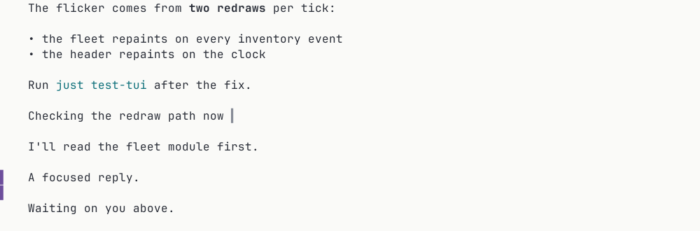

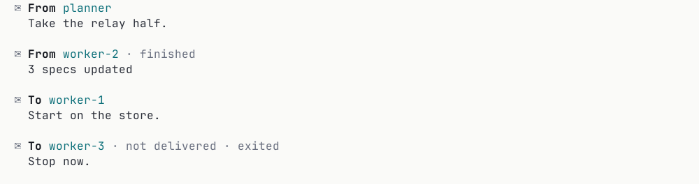

### Work

| Item | Row kind | How it is drawn | claude_pty | claude_sdk | codex |
|---|---|---|---|---|---|
| Exploring | `Explore { verb, subject, state }` | Reads, searches, listings, fetches and web searches; each is a step of its run and folds with it. | full | full | partial: web search is its own item; reads and searches are shell commands Codex labels |
| Command | `Command { command, state, exit_code, output_head, more_lines, output_trimmed, duration_ms }` | "Ran cmd · time" with the output's first lines (`OUTPUT_HEAD_LINES` = 3), opening to the full output. When a long command's output lost its start to the bound, `output_trimmed` is set and a faint "earlier output trimmed" line sits above what is left. A failure shows its exit code where the provider gives one. | partial: failed flag, no exit code | partial | full: exit code, duration, streamed output |
| File edit | `FileChange { files, state }` | Each `FileRow` as path +N −N, opening that file's diff. | full: exact patch and counts | full | partial: per-file diff |
| File created, deleted, moved | `FileChange` with `Created { lines }`, `Deleted`, `Moved { to }` | "Created path · 38 lines", "Deleted path", "Moved a → b". | partial: create and overwrite only | partial | full |
| Tool call | `ToolCall { server, tool, fact, state, result }` | "Used github · create_issue" plus one fact, opening to input and result. | partial: name and text result | full | full |
| Subagent | `Subagent { description, running, tool_count, last_tool, answer, duration_ms }` | Live while running ("12 tools · 48s · last: Read"), its answer once finished; its own steps are rows with a `parent`, collapsed under it. | partial | full | partial |
| Background process | `Background { command, running }` | "Started in background npm run dev"; the running job is listed in the overview. | partial | partial | partial |
| Image | `Image { image, path, generated }` | A thumbnail opening full size; Codex can report generated images. | partial | partial | full |
| Slash command output | `SlashOutput { command, args, output }` | The command, then its output block. | partial | partial | n/a: skills run as prompts |

A call's `state` is a `CallPhase`, decided once in the view for both clients: `Asking` while an open ask points
at the call and nothing has decided it (it runs only if the person allows it, and both clients mark it as
waiting on the person), `Pending` when it is announced, not started and asks nobody, `Running`, `Succeeded`,
`Failed`, `Denied` when the person or the agent's rules refused it whatever the call reports after, and
`Cancelled`. Each client words the phase and branches on it, never on its own words.

A native subagent (Claude's Task tool, a Codex child thread) is a row with detail inside the parent's
transcript, not an agent. Only an amux spawn makes an agent with a chat of its own
([AGENT_TOOLS.md](AGENT_TOOLS.md)).

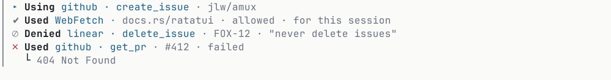

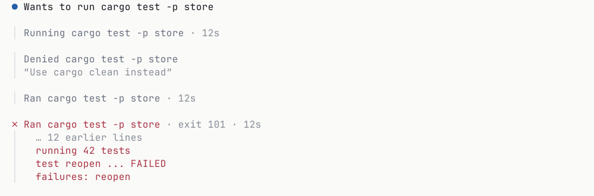

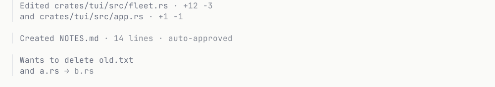

### Session events

| Item | Row kind | How it is drawn | claude_pty | claude_sdk | codex |
|---|---|---|---|---|---|
| Turn finished | `TurnEnd { duration_ms, cost_usd, failed }` | A quiet footer under the last reply: "Worked 1m 42s". | full | full: duration and cost | full |
| Stopped | `Stopped` | "You stopped it". | full | full | full |
| Compaction | `Compaction { tokens_before, tokens_after, automatic }` | A rule: "Compacted · 148k → 22k". | full | full | partial: a compacted boundary, no counts |
| Error | `Error { error_kind, message, attempts, gave_up }` | What failed and what to do. While the provider retries, the retry shows on the activity line instead. | full | full | full: typed error kind and will-retry |
| Model switched | `ModelSwitch { from, to, reason }` | A notice: "Switched to Sonnet · reason". | none | full: refusal fallback | full: reroute with reason |
| Session boundaries | `Boundary { kind, cause }` | A rule: started, cleared, compacted, resumed, forked, restarted, ended with its cause, or lost its daemon. | full | full | full |
| Automatic review | `AutoReview { decision, risk, rationale, subject }` | "Auto-approved · low risk", opening to the reviewer's rationale. | n/a | n/a | partial |

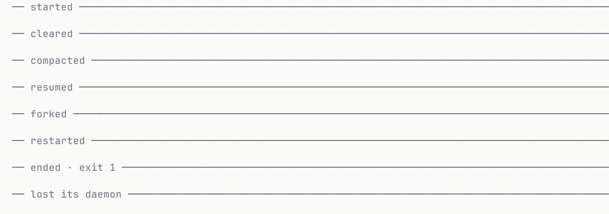

## The activity line

The moving mark above the composer says the agent is doing something, and its words say what. It is not a row,
so none of it ends up in history. `SessionState::activity(now_ms)` returns an `Activity` whose `ActivityKind` is
one of:

| Kind | When |
|---|---|
| `Working` | The default whenever the agent is busy and nothing more specific applies, including right after sending and while a reply streams. |
| `Thinking` | A thinking item is still open. Terminal Claude writes its thinking row only when thinking ends, so it stays on Working. |
| `Running { key }` | A tool is in flight, named by its subject. For terminal Claude, a call its hooks announced (`running_calls` in the snapshot) counts before its row lands. |
| `Subagents { count }` | The parent waits on its children. |
| `Compacting` | Until the compaction row lands. |
| `Retrying { attempt, max_attempts, retry_at_ms }` | The provider failed a request and says it will try again. |

The line is empty unless the phase is working. Elapsed time is measured from the relevant item's timestamp with
the renderer's clock, which is why the terminal ticks while an agent works and at no other time. The terminal
draws it as the running turn's live end in the feed (`Working · 33s`), where `Worked 6m` stands once the turn
ends; its steps say what is running.

## Asks

An ask takes over the composer's box. The chat above stays visible as context, and the draft is kept. Every kind
of ask has one anatomy, the [`AskCard`](../crates/ui-view/src/ask.rs):

- **Head, subject, choices.** What it wants, "1 of 3" when several are open (`position`, `count`), then exactly
  what is being asked about, verbatim (`AskBody`), then the choices.
- **Choices say outcomes.** Each `Choice` is a `ChoiceOutcome` ("Always allow cargo test in this project", never
  rule syntax), with the answer it sends. The likely choice comes first and is marked `primary`. A choice appears
  only when this agent offers it. `takes_note` marks the choices whose note goes back to the agent (a Claude
  denial, a plan sent back).
- **There is always a way out.** Stop is always in the menu. It is the interrupt: it cancels the turn, which
  dismisses the open ask, and the agent stays live and idle. It never ends the process; stopping or deleting the
  agent does that.
- **Sending, then a row.** After an answer, `CardState` goes `Sending` and the card shrinks to one line until the
  agent confirms; the decision then lands in the chat. A rejection brings the card back as `Rejected(reason)`,
  the reason a typed `RefusalReason` each client words. If the connection dropped before any reply,
  `NotConfirmed` offers resend and discard; nothing is resent on its own. An exited agent's open asks are drawn `Dismissed`, and the composer offers Resume.

An answer names its ask by key, so any open ask can be answered from any client, not only the head one. Before
CaughtUp a card is drawn only if the inventory entry says the agent needs you, so an ask already answered on
another device does not flash from a cached snapshot.

### Permissions

The body is `Command` (command, working directory, reason, description), `Edit` (path, file count, counts, the
patch as parsed lines and the new file's line its first change lands on) or `Tool` (server, tool and
pretty-printed arguments). The edit's lines are `EditLine`s: a `Hunk` marker with where the hunk starts in the
old and new file, or a `PatchLine` (added, removed or context, numbered where the patch says). A file's header
lines are dropped and only outside a hunk, so a removed `-- comment` or an added `++i` stays a line of the patch;
a file Codex adds or deletes whole reads as added or removed lines. Each client decides whether to draw a
hunk's start: the terminal names the first change's line beside the path, the phone draws each hunk's start
as its line in the new file. A Claude edit is only the text replaced and the text replacing it, so its lines
carry no numbers and no line.

| Outcome | Offered by |
|---|---|
| `AllowOnce` | every kind |
| `AllowAlways { subjects, directories, mode, scope, label }` | Claude: one per scope the provider suggested, its rule lifted to plain words; `Scope` is `Session`, `Project` (this project, for this person), `ProjectShared`, `User` (every project) or another destination |
| `AllowForSession` | Codex |
| `AllowSimilar { prefix }` | Codex: the exact command prefix it would allow |
| `AllowNetwork { hosts }` | Codex: a network rule naming the hosts |
| `Deny { stops }` | every kind. Terminal Claude's denial always ends the turn (`stops: true`), so there it is the only deny |
| `DenyAndStop` | headless Claude and Codex, beside a denial that lets the agent carry on |

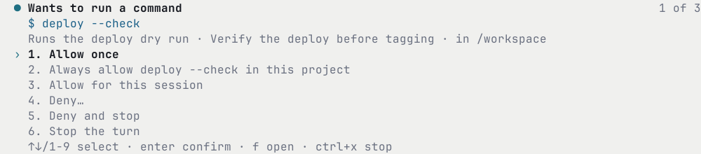

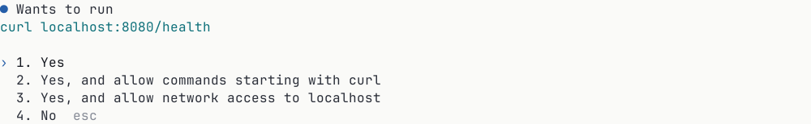

### Questions

`AskBody::Question` holds one `QuestionView` per question: header, question, options (each with a description,
an optional preview, and "(Recommended)" lifted out of the label into `recommended`), `multi_select`,
`allow_other` ("Something else…", always last) and `secret` (a typed answer is hidden, and the row later reads
"answered (hidden)"). The client builds the answer with `question_answer(card, picks, note)`, one `Pick` per
question: `Options(indices)` or `Other(text)`.

- One pick-one question without previews answers on the pick.
- Several picks, several questions, previews and "Something else" collect picks and send from a review screen,
  where every answer shows before sending.
- Several questions go one at a time, with the headers as steps.
- A question may be skipped where the agent takes one (`question_skip`): the review reads it skipped and the
  answer leaves it out. Where it takes none, an unanswered question blocks Send.
- A note may go out with each question's answer (`question_note`).
- Instead of answering, the person may reply in their own words (`question_reply`); the answer carries the words
  and whatever was answered so far, and the row reads replied instead.
- Terminal Claude, as a limit of Claude's own form: it takes no note, since the form has nowhere to type one, and
  it takes a skip only when it asks several questions, whose form ends in a review screen that submits with some
  unanswered. A lone single-select question is submitted by answering it, so it cannot be skipped.

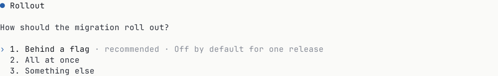

### Plans, forms and the rest

| Body | Choices |
|---|---|
| `Plan { title, body }` | `ApprovePlan { auto_accept_edits: false }`, `ApprovePlan { auto_accept_edits: true }` where the provider offers it, and `SendBack`, whose note says what should change. Codex proposes plans in plan mode with no approval step; its plan is a prose row and you reply in the composer. |
| `Form { server, message, fields }` | `Submit` and `Decline`. The view reads the tool server's schema once into fields in the order it writes them, each text, a number, a toggle, one choice or several picks, with its title, whether it is required and what it starts holding; the client draws native controls for them, required fields gate Submit, and `with_form_content` puts the values in the answer. |
| `Link { server, message, url }` | `OpenLink` and `Decline`. |
| `Access { reason, read, write, network, hosts }` | `GrantForTurn`, `GrantForSession` and `Deny` (Codex). A grant covers everything the agent asked for; the row records what was granted and for how long. |
| `Unanswerable { reason }` | None: the provider showed something this build cannot read. The only ways out are Stop and, where the agent's own terminal is on this machine, attaching to it. |

A plan's title is its first line when that line is a `#` heading, past any blank lines, unless the heading only
says "plan"; the body is the rest. While the first line is still arriving there is no title yet, so a heading
never shows half-written as prose. The view splits the plan once, for the card and for the row it becomes, and
both clients draw the title and body they are handed.

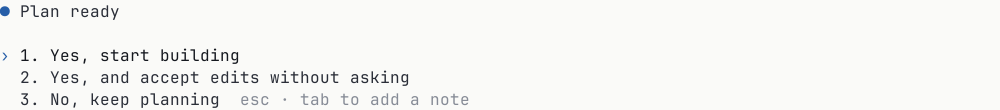

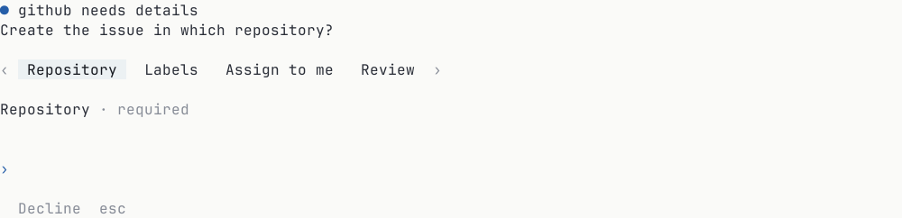

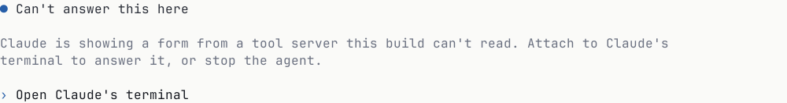

## In the chat afterwards

Once settled, an ask leaves one of two things behind, because rows are one per item:

- **A permission decision is meta on the tool call's own row**, since the ask pointed at that item. `Row.decision`
  is a `Decision` with its `DecisionView` (`Allowed`, `Denied`, `AutoApproved`, or `Dismissed` when a fact closed
  it without saying how), the `scope` and the `note` when the provider says them, and `elsewhere` when it was
  answered in the provider's own interface. When the scope cannot be recovered (terminal Claude), it is left off
  rather than guessed.
- **An ask that is the work is its own row**, `RowKind::Ask(AskRow)`, which resolves in place: `Question`
  (Claude's question tool: its questions, then each `AnswerView` with the picks, what was typed and whether it was
  hidden, whether it was skipped, and the note), `Questions` (Codex), `Plan` with its title, body, `PlanVerdict` and send-back note, `Form` with the
  fields sent, `Link`, `Grant` with what was `Granted` and for how long, and `Unanswerable`. Each carries a
  `Resolution`: `Open`, `Answered`, `Declined`, `Cancelled` or `Dismissed`.

The attention ink is reserved for what needs you and for failures: `Row.attention` is set when an open ask points at the
row or the row failed.


## Session facts

`overview(state, diff)` returns the `Overview`, what is still in flight around the chat; each part is empty or
`None` when there is nothing to show. The composer's edge reads it folded and the overview reads it whole:

| Field | Shown | claude_pty | claude_sdk | codex |
|---|---|---|---|---|
| `tasks` | "3/7 · Updating the pairing copy", opening to the list (Claude's task list, Codex's plan steps) | partial | partial | full |
| `jobs` | Each background job still running: its command, when it started, and the step that started it | partial | partial | partial |
| `failed_servers` | Only tool servers that failed to start or need signing in | none | full | full |
| `usage_near_limit` | Nothing while fine; a warning near a limit; a foot card when blocked | none | full | full |
| `changes` | The changed files by folder, root files first, once fetched with `Diff` and no patch (`changes(diff)`) | full | full | full |

Beside it, read from the same state:

| Function | Shown | claude_pty | claude_sdk | codex |
|---|---|---|---|---|
| `context(state)` | Always in settings; set apart from 80% used (`CONTEXT_NEAR_FULL_PERCENT`, `near_full`) | partial: tokens, no window | full | full |
| `controls(state)`: the model's name, the effort in force, a permission or mode other than the normal one | Composer facts and the settings view | partial | full | full |
| `sign_in(state)` | A foot card in place of the composer when there is a problem | partial: as an API error | full | full |

`diff_base(state, comparison)` names what the changed files are counted against: the uncommitted work, or
everything on the branch since it left its base branch.

`settings(state)` is the settings view, read from the agent's catalogue: the offered models with their efforts,
the permissions (how much the agent may do without asking), the modes (how it works: Codex's default and plan;
Claude has none, its plan is a permission), the commands the agent offers, and for each setting how it changes
(`changeable`). Every choice carries the name a person reads: the catalogue's, else for the running model the
interpreter's, else its value. A permission is settable only while a model it names runs. Codex settings that match
no named permission are reported as `custom`. Terminal Claude offers no model or effort pick (`ByTyping`, naming its
own `/model` and `/effort`, typed in the composer), and its permission changes only by its own cycle (`Cycle`).

## Hidden

Never a row; kept in debug reports: hook started and finished (a notice only when a hook failed), startup
details, thinking-token estimates, tool progress ticks (which feed the activity line), tool summaries,
"requesting" and "compacting" statuses (the activity line), command-list changes, persisted files, plugin
installs, memory recall, prompt suggestions, context reminders injected into a turn, checkpoints, session-state
changes and model verification metadata. In the view, headless Claude's status items, terminal Claude's
compaction summary, interruption and task items, and Codex's tool-server startup and whole-turn diff items map to
`RowKind::Hidden`. A body this build cannot decode is an `Unrecognized` row, never hidden.

## Claude versus Codex

Far more is shared than not, and differences show up as extra choices or extra meta on the same object, never
as a different screen.

**Shared:** messages with images; replies (streaming everywhere but terminal Claude); thinking or reasoning;
commands, edits, web search and tool-server calls; subagents; a task list or plan steps; compaction, stop and
errors with retry; context, model, effort, usage limits and tool-server health (headless Claude and Codex);
permission once, for longer, or deny; structured questions with an "Other" answer; forms from tool servers
(headless Claude and Codex).

**Claude only:** question previews and multi-select, up to four questions; plan approval with an auto-accept
choice; scope choices tied to saved rules and directories; cost per turn (headless); the compaction summary text
(terminal, recorded but not drawn).

**Codex only:** exit codes and durations on commands; a whole-turn diff item (recorded but not drawn); "allow similar commands" and
per-host network rules; decline and stop as a separate choice (headless Claude has it too); access grants for
files and network; secret answers to questions; image generation; automatic reviewer verdicts and model
reroutes; working notes marked apart from the final answer.

**Terminal Claude's limits** follow from reading a terminal: replies arrive whole, thinking has no live phase, a
denial always stops the turn, a question takes no note and is skipped only in a form of several, a tool server's form is unanswerable from a client
(its escape card sends you to Claude's own terminal), and usage, tool-server health and model switches are not
reported.

## What interpreters and views must cover

The contract is enforced at both ends.

**The interpreters.** [`crates/interpret/tests/coverage.rs`](../crates/interpret/tests/coverage.rs) reads
`vocabulary.toml`, which must hold every catalogue row C1 to C31 in order. For each row and each kind whose mark
is full or partial:

- its `carriers` must name real places in that kind's wire bodies: `item:<arm>` (or `item:<arm>.<field>`) in the
  kind's item message, `snapshot:<field>` in its snapshot, `ask:<arm>` in its ask. The test walks the wire
  descriptor set, so a carrier naming a field that does not exist fails;
- some line of a golden under `crates/interpret/fixtures/<kind>/` must show it: every string in the row's
  `golden` list appears on one line, and none prefixed with `!` does.

A row marked none or n/a must name no carriers and no goldens. Run it with
`just test-crate interpret --test coverage`. Adding a row to the catalogue means adding it to `vocabulary.toml`
and raising the row count in the test; a provider that starts reporting something means raising its mark and
naming the carrier and the golden line that shows it.

**The views.** [`crates/ui-view/tests/goldens.rs`](../crates/ui-view/tests/goldens.rs) replays every interpreter
fixture of all three kinds, commits its emission the way the daemon does, reduces it into a `SessionState`, and
records the views (rows, ask card with its choices, overview, composer, queue, prompts underway and refused, settings) after every frame
into `crates/ui-view/tests/goldens/<kind>/<fixture>.golden`. Authored goldens cover inputs and composer states;
`views.rs` checks row invariants over random windows; `answers.rs` checks that the interpreter accepts the input
each card's choices build. These goldens are the content oracle for both clients. Rewrite them with
`UI_VIEW_UPDATE_GOLDENS=1 just test-crate ui-view` and review the diff.

**The renderers.** The terminal draws each component once from authored view values
([`crates/tui/src/vocabulary.rs`](../crates/tui/src/vocabulary.rs)), in light and dark, into the text goldens
under `crates/tui/tests/golden/` (`just test-tui`; rewrite with `UPDATE_GOLDENS=1 just test-tui`). Because
ui-view's goldens already prove the projection per kind, one drawing of each component is the whole terminal
claim. The phone's component snapshots are described in [IOS.md](IOS.md).

## Regenerating these images

The pictures on this page are rendered by `amux-shot` from the same components the terminal's goldens draw
([`crates/shot/README.md`](../crates/shot/README.md)):

```sh
just shot -- render vocabulary --out DIR
```

Copy the light PNGs listed in [the manifest](figures/vocabulary/manifest.json) from `DIR` into
`docs/figures/vocabulary/`, and update each entry's `sha256`. `just docs-check` verifies every image's hash
against the manifest, so a stale or hand-edited rendering fails.
