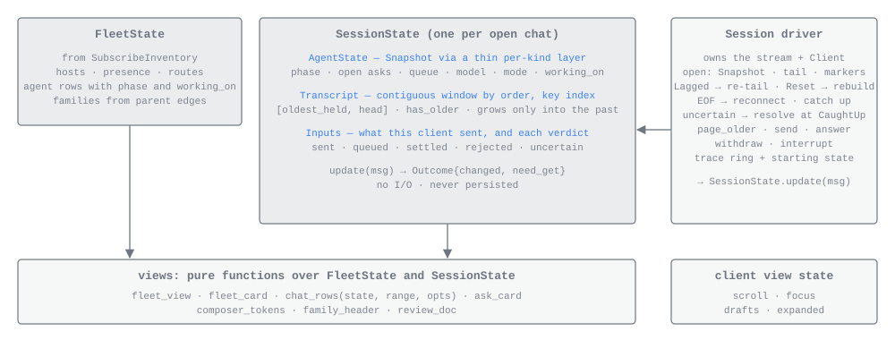
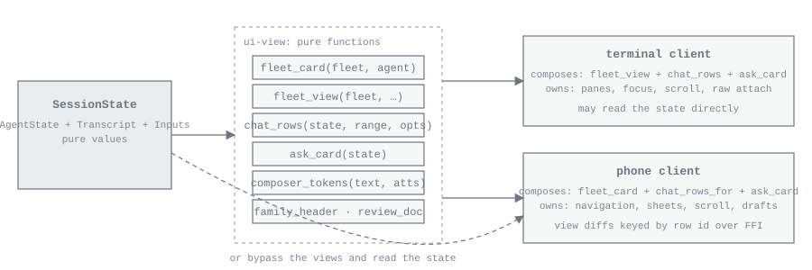

# The client library

*For developers changing either client, or the shared crates both clients link.*

amux has two rich clients, the terminal client ([TERMINAL.md](TERMINAL.md)) and the iPhone app
([IOS.md](IOS.md)). Both are thin shells over one Rust library: a pure model of an open chat and of the fleet,
a driver that owns the streams and does every piece of I/O, and a set of views that turn the model into plain
content values. Each client composes those values in its own layout and owns only what is ephemeral: panes,
scroll position, focus, drafts and which rows are expanded.

Three rules shape the library:

- **A client talks only to its local runtime.** It calls the client service of the profile on its own machine,
  which answers from its rows and reaches other hosts itself. A client never opens a store, never dials another
  host, never holds a cursor, and never reads disk.
- **Per-kind knowledge lives in one thin layer.** The model knows an agent's kind (terminal Claude, headless
  Claude, Codex) only where it decodes a snapshot or item body. Everything above that works on kind-neutral
  facts; the views read the decoded bodies to produce typed rows and cards.
- **Nothing is persisted.** Every value the model holds can be re-served by the runtime, so the model is never
  saved, checkpointed or restored. Closing a chat narrows its session to the few rows the fleet keeps, or drops it
  for an exited agent; opening it again pages or rebuilds the rest from the runtime's rows.

## The crates

| Crate | What it owns |
|---|---|
| [`client`](../crates/client/src/lib.rs) | The `Client` trait: the one seam both clients call the runtime through, with a gRPC implementation over the profile socket and an in-process one for the phone. |
| [`model`](../crates/model/src/lib.rs) | Plain shared values: `Key`, `AgentKey`, `Attention`, `Connection`, `BlobStatus`, `Composer`, `Waiting`, `PhaseView`, `Activity`, `InputState`. The Swift mirrors are generated from these. |
| [`ui-state`](../crates/ui-state/src/lib.rs) | `SessionState` (one open chat) and `FleetState` (the inventory), updated by messages. No I/O, no clock, no handles. |
| [`ui-view`](../crates/ui-view/src/lib.rs) | Pure functions from the state to content values: chat rows, the ask card, the composer and overview, the settings view, fleet rows and cards, the review document. |
| [`ui-runtime`](../crates/ui-runtime/src/lib.rs) | The drivers, `Session` and `Fleet`: subscribe, reconnect, page, send, fetch blobs, and keep a bounded trace for dumps. The fleet holds the one session each live agent has. The only place a chat does I/O. |
| [`replay-support`](../crates/replay-support/src/lib.rs) | Replaying a dump bundle through the interpreter, the session state and the views, and replaying recorded provider traffic for the provider spec crates. |
| [`redaction`](../crates/redaction/src/lib.rs) | The structural redactor for free text and JSON in reports, captures and specs. |

The terminal client ([`tui`](../crates/tui/src/lib.rs)) and the phone's runtime
([`app-runtime`](../crates/app-runtime/src/lib.rs)) sit on top. The dependency policy
(`scripts/check-dependency-policy.py`, run by `just dependency-policy`) holds the shape: `model`, `client`,
`ui-state`, `ui-view`, `ui-runtime`, `tui` and `app-runtime` may not link the daemon (`node`), its `store`, the
interpreters (`interpret`), the agent process (`agent`) or any provider crate, directly or through another crate.
Among amux's own crates, `ui-state` links only `model` and `wire`; `ui-view` adds `attachments`; `ui-runtime`
adds `client`.

Every value the views return for drawing derives `Serialize` and `JsonSchema`. The phone receives them as JSON over the C
bridge, and its Swift types are generated from the Rust definitions (`cargo run -p xtask -- swift-types`), so
there is one definition of each. [EMBEDDED.md](EMBEDDED.md) covers the bridge.

## The client seam

[`client::Client`](../crates/client/src/lib.rs) has one async method per call of the client service
(`crates/wire/proto/`), with the same names: `subscribe_inventory`, `resolve_agent`, `subscribe`, `fetch`, `get`,
`send_input`, `create_agent`, `rename_agent`, `stop_agent`, `resume_agent`, `delete_agent`, `send_message`,
`put_blob`, `get_blob`, `diff`, `list_repositories` and `dump`. Streams come back as
`EventStream<T>`, a boxed stream of `Result<T, RpcError>`.

Two implementations exist, generated by one macro so they cannot drift:

- **`GrpcClient`** connects to the profile's local socket (`GrpcClient::connect(path)`). The channel redials on
  the next call after the connection drops, so a client outlives a daemon restart; an open stream ends and its
  reader subscribes again.
- **`InProcess<S>`** wraps a `ClientService` implementation and calls it directly. The phone hosts its runtime in
  the app's own process and reaches it this way. Errors take exactly the shape they would over a socket.

`RpcError` has two cases, and the difference matters for inputs:

| Case | Meaning |
|---|---|
| `Transport(String)` | The runtime could not be reached, or the connection failed before the answer. Whether the call took effect is unknown. |
| `Refused(wire::Error)` | The runtime answered with an error; `code()` returns its `ErrorCode`. |

A gRPC status that carries the runtime's `wire::Error` in its details is that error. A bare status is a
transport failure only when its code says nothing about whether the call landed (unavailable, unknown,
cancelled, deadline exceeded, internal, aborted); any other code maps to the matching `ErrorCode`.

## Session state



[`SessionState`](../crates/ui-state/src/session.rs) is one open chat. It is built from the agent's inventory
entry and the window's cap with `SessionState::new(agent, cap)` and changes only through `update(msg)`. Its
parts:

- **The entry and host.** The agent's inventory row (lifecycle, phase, incarnation, exit cause) and its host's
  entry, both fed from the fleet.
- **`AgentState`**, the newest snapshot decoded. [`body.rs`](../crates/ui-state/src/body.rs) is the thin
  per-kind layer: `decode_snapshot` reads a `ClaudePtySnapshot`, `ClaudeSdkSnapshot` or `CodexSnapshot` into one
  shape (phase, queue, working-on, open asks, model, effort, mode, sandbox, offered models and commands, tasks,
  context, usage, tool servers, sign-in, background jobs, running calls). A field the provider has not
  reported stays at its explicit unknown. Open asks keep the provider's own shape as `OpenAsk::Claude` or
  `OpenAsk::Codex`.
- **`Transcript`**, the window of items by order, and the rows that arrived above it while the reader was in
  history. See [the transcript window](#the-transcript-window).
- **Whether the reader follows** the newest row, as the client last said. It is the one fact about the view the
  state is told, because the window's rules depend on it.
- **`Inputs`**, what this client sent during this open and what became of each input. Only the sender can know
  this, so it is the one thing the state holds that is not in the runtime's rows.
- **Connection flags**: `caught_up`, whether the stream is detached, and the `Connection` to the local runtime
  (`Connecting`, `Live`, `Reconnecting`).
- **Blob status** for each attachment hash the driver fetched.

It holds no other view state, no rows and no effects, and it never reads a clock: anything timed takes the
caller's `now_ms`.

### Messages

The driver forwards everything as a [`Msg`](../crates/ui-state/src/session.rs):

| Message | Effect |
|---|---|
| `Event(SessionEvent)` | A Snapshot overwrites `AgentState`; an Item or Append goes into the transcript; CaughtUp, Lagged, Reset and Detached move the connection flags. |
| `Page { items, exhausted, .. }` | An older page merged under the window. A page requested before a Reset's swap is dropped. |
| `Connection(Connection)` | The driver's connection to the runtime. `Reconnecting` clears `caught_up`. |
| `Send(Input)` | This client is sending an input; its optimistic row exists from now. |
| `Sent(id, InputOutcome)` | The verdict (`Reply(SendInputResponse)`), or `Lost` when the transport failed first. |
| `Discard(id)` | The person dropped an input that was not confirmed. |
| `Entry(Agent)` / `Host(HostEntry)` | The agent's inventory row and its host, from the fleet. |
| `Blob { hash, status }` | An attachment's bytes changed state in the driver's cache. |
| `Following(bool)` | The reader left the newest row (`false`) or returned to it (`true`). A session starts following. |
| `Reloading` | The driver reopened the stream for the reload a return asked for; a fresh tail follows. |

`update` returns an `Outcome`: `changed` lists every row key whose row may differ (including every member of a
run whose attributes moved, and nothing else), `need_get` names an Append to a held item at another revision than its base,
`reloaded` says a Reset's or a reload's transcript was swapped in, `session` says something outside the rows
moved, and `reload` asks the driver to reopen the stream with a fresh tail.

### The transcript window

A [`Transcript`](../crates/ui-state/src/transcript.rs) is a contiguous window: every item the client holds with
order in `[oldest_held, head]`. Each item is decoded once per revision into a `Held` (the item, its decoded
`ItemBody`, and its kind-neutral `ItemClass`). The rules:

- An item above the head appends. Inside the window it overwrites the held item with the same key only if its
  revision is higher, and is otherwise ignored; that absorbs the overlap between the runtime's store read and its broadcast.
  An item below `oldest_held` is dropped, because a page brings the current version if the reader ever scrolls
  there.
- Pages only extend the low edge.
- While the reader follows, the window keeps the newest rows up to its cap and drops older rows from its top as
  live rows arrive, so a chat left open under a flood holds a bounded set. The dropped rows' key, input-id
  and run entries go with them, a later revision of a dropped key is ignored like any row below the
  window, and the run at the new low edge reads `open_below`. The rows stay in the runtime's store and come back
  only by paging from the low edge.
- While the reader is in history, nothing is dropped and the window's head does not move. A row above the head
  is held by the session apart from the window; revisions and appends to rows inside the window still apply,
  and appends to a held row apply to it. The snapshot, asks, queue and inputs stay live, and the activity line
  reads the held rows, so the composer and ask cards stay current. `arrivals_held()` reports that rows are held,
  and both clients show their new-activity affordance from it. The held rows continue the window without a gap
  and are bounded by the cap: past it, or past a gap, the session stops holding and remembers only that the
  head moved on.
- Returning to the newest row releases the held rows into the window when they are all held, and trims the
  window back to the cap, which fetches nothing; a window grown past the cap by paging with few rows held is
  released and trimmed the same way. When the head moved on instead, the return sets `reload`: the driver
  reopens the subscription with a fresh tail, the fresh window is built apart and swapped in at CaughtUp exactly
  as a Reset's is, the old window stays on screen until then, and the swap reports `reloaded`.
- Nothing is paged downward, and no live row lands outside the window except into the held rows.
- `has_older()` is true while the oldest held order is above 1 and neither a page came back exhausted nor the
  window was trimmed since. Orders start at one and are dense, so a window that reaches order one has everything.
- The window also indexes items by input id (a prompt's reflection).

**Runs.** A run is two or more consecutive held tool items whose class says they only looked (a read, search,
listing, fetch or web search, each by its verb). [`RunIndex`](../crates/ui-state/src/transcript.rs) keeps run
membership current on every message rather than rediscovering it per frame: an item at the head extends the
last run in place; a change inside the window rebuilds only the runs around it. `RunIndex::rebuild` is the
oracle the incremental upkeep is tested against. A run whose oldest member is the oldest held item while older
history exists is `open_below`: it may continue below the window.

A call's class, including the verb a look is drawn with, is a per-kind fact the interpreter sets from native
tool kinds, never a text rule in a view; once it is set, run detection and the rows are kind-independent.

### Reading the state

The state answers the questions every client asks, so no client re-derives them:

| Method | Answer |
|---|---|
| `can_send()` | Caught up, and the entry does not say exited. Drafting is never gated. |
| `composer()` | `Send`; `Resume` for an exited agent (the draft becomes the next incarnation's first prompt); or `Disabled(Waiting)` with `CatchingUp`, `Detached` or `Reconnecting`. |
| `phase()` | `PhaseView`: lifecycle from the entry, everything else from the snapshot. |
| `open_asks()` | The asks to draw, head first. Before CaughtUp an ask is drawn only if the entry says needs-you, so an ask answered on another device does not flash from a cached snapshot and vanish. |
| `activity(now_ms)` | The activity line, derived from the newest items and the phase (see [the chat vocabulary](CHAT_VOCABULARY.md)). |
| `queue()` | The agent's shared queue, each entry marked `mine` and `steered`. An entry this client holds as uncertain is drawn once, as not confirmed, instead. |
| `sending()`, `not_confirmed()` | This client's prompts in flight, and those whose connection dropped before a verdict. |
| `answering(ask_key)` | This client's newest answer to an ask, while its card shows it. |
| `oldest_order()` | The page-older cursor. |

The rule for which stream to believe is by owner. For what the agent is doing (phase, open asks, queue, model,
mode) the chat believes the snapshot, the interpreter's own state. For whether the process exists it believes
the entry's lifecycle, a daemon fact: a clean exit ends with a boundary item, but a killed agent writes nothing,
and only the daemon sees its lock released.

### Inputs

Each input this client sends becomes a `SentInput` with an `InputState`:

| State | Meaning |
|---|---|
| `Sent` | In flight, or accepted and waiting for its reflection. The optimistic row exists. |
| `Queued` | Accepted into the agent's queue; every snapshot lists it until it is submitted or withdrawn. |
| `Settled` | Accepted and, for a prompt, reflected by an item carrying its input id. |
| `Rejected(reason)` | The interpreter's verdict was a rejection. A rejection never touches the transcript. |
| `Uncertain` | The connection dropped before a reply. |

An uncertain input is resolved only at the next CaughtUp: found in the snapshot's queue it is queued; found among
the items it is settled; found in neither it stays uncertain and the person decides to resend or discard it.
Nothing is resent automatically. A rejection with reason `exited` flips the composer to Resume for that
incarnation, so a send that raced the exit keeps its draft.

### The fleet state

[`FleetState`](../crates/ui-state/src/fleet.rs) is the inventory: hosts by id, agent rows by `AgentKey` (host
and agent id, since a parent may live on another host), and `Families` derived from parent edges. `update`
takes a `FleetMsg` (an `InventoryEvent` or a `Connection`) and returns the agent keys whose card or family
attention may differ, including every ancestor whose family ranking may move. `attention(agent)` ranks a row
`Exited < Idle < Starting < Working < NeedsYou`, and a family is as loud as its loudest member
(`family_attention`). A child whose parent is removed heads its own family until the parent returns.

After a reconnect the fleet re-lists: rows not listed again by the next CaughtUp are dropped. Agent rows stay
small (phase, since-when, git facts); what an agent is saying or running comes from its session, which the fleet
driver keeps open for every live agent (see [the fleet](#the-fleet)).

## The drivers

[`Session`](../crates/ui-runtime/src/session.rs) owns one agent's Subscribe stream and its `Client` handle and
feeds everything into a `SessionState` behind a mutex. It is the only place a chat does I/O. Clients get
sessions from the fleet, which holds exactly one per agent, so home and a chat on the same agent read the same
state and the agent is subscribed to once.

```rust
let fleet = Fleet::connect(client, SystemClock).await?;
let session = fleet.open(&agent, Window { tail: 40, cap: 200 }).await?;
let state = session.state();          // a guard; never hold it across an await
let mut changed = session.changed();  // level-triggered watch channel
// ...
fleet.close(&agent);                  // the chat left the screen
```

`Session::open(client, agent, tail, cap, clock)`, which the fleet calls, subscribes with `tail` rows and resolves
once the Snapshot and the rows the runtime already holds are applied, up to the first CaughtUp or Detached marker
already in hand. The first render is therefore correct at once: from the runtime's own rows for an agent on this
host, and from its replica for another host's agent even while that host is away. CaughtUp may follow later.

| Method | What it does |
|---|---|
| `state()` | A `StateGuard` dereferencing to `SessionState`. |
| `changed()` | A `watch::Receiver<()>` marked on every change. |
| `take_changes()` | `Changes { keys, reloaded, session }` since the last take, each key once: what a retained list needs to reconfigure only changed cells. |
| `set_entry(agent)`, `set_host(host)` | Feed the chat its inventory row and host from the fleet. |
| `page_older(n)` | Fetch up to `n` rows older than the oldest held; see [paging](#paging). |
| `send(input)`, `send_prompt(text, attachments)` | Send under a fresh input id; returns `Sent { id, outcome }`. |
| `resume_with(draft)` | ResumeAgent with the draft as the next incarnation's first prompt; on failure the draft is discarded from the state and handed back to the composer. |
| `withdraw(queued)`, `send_now(queued)` | Take a queued prompt back, or steer it into the running turn. |
| `answer(input)` | Answer an ask with the input `ui_view::answer_input` built. Any open ask can be answered. |
| `interrupt()` | Stop the turn; the agent stays live and idle. |
| `discard(id)` | Forget an input that was not confirmed. |
| `blob(hash)`, `fetch_blob(hash)`, `put_blob(name, mime, bytes)` | Attachment bytes; see [attachments](#attachments). |
| `working_tree_review()` | The agent's working-tree `Diff` and the patch it names, for a review page. |
| `ended()` | Set when the runtime refuses to serve the chat again, as when the agent was deleted. |
| `suspended()` | Whether the stream is dropped because the phone left the foreground. |
| `trace()`, `dump_part()` | The bounded trace, and this chat's part of a dump bundle. |
| `close()` | Drops the stream. Nothing is flushed; results of calls still in flight change nothing. |

The acts that wait on the agent return `InputError::Rejected(reason)` or `InputError::Uncertain` when they do
not take effect. `page_older` returns `PageError::OriginUnreachable` when older history is held only by the
agent's host and that host cannot be reached; the chat says so rather than showing an empty page.

**The pump.** A background task reads the stream. `Lagged` means the runtime closed the stream because this
client fell behind: the pump reopens it with a tail at once. Any other end of the stream marks the connection
`Reconnecting`, waits (250 ms, doubling to at most 5 s, back to 250 ms once a stream catches up; see
`RECONNECT_FIRST_MS` and `RECONNECT_MAX_MS`), and subscribes again with the same tail. A refusal that is not a
transport failure ends the session (`ended()`). An Append to a held item at another revision is answered with a
`Get` for that key before the next event is applied, so later appends meet it. The origin's presence is not the
driver's concern: Detached and CaughtUp on the stream say whether the chat is current, and the runtime's source
reconnects to the origin on its own.

[`Fleet`](../crates/ui-runtime/src/fleet.rs) is the same shape one level up: `Fleet::connect(client, clock)`
subscribes to the inventory and resolves once it has caught up (or once the stream ended first, in which case
the pump reconnects). `take_changed()` returns the agent keys that moved and `take_hosts_changed()` whether any
host did. It also holds the sessions:

| Method | What it does |
|---|---|
| `session(agent)` | The live agent's session, held off screen with `HELD_ROWS` (16) rows; `None` for an exited agent no chat shows, or while the session is still opening. |
| `open(agent, window)` | The same session widened to a chat's `Window { tail, cap }`: older rows page in from the local runtime up to the tail. An exited agent's session opens here. |
| `close(agent)` | The chat left the screen. The last close narrows a live agent's session back to its few rows and drops an exited agent's. Every `open` is paired with a `close`. |
| `set_foreground(foreground)` | The phone leaving or returning to the foreground: every session's stream is dropped, or reopened with a tail. |
| `sessions()` | Every session held, for a dump. |

**The trace.** Each driver keeps a bounded trace (between 200 and `TRACE_EVENTS` = 400 events, memory only) of
every message it applied and every act of its own (`DriverEvent`: subscribed, stream ended, backoff, re-tail,
page requested, Get, blob fetch), together with a clone of the state taken when the trace's oldest segment
began. `DriverTrace::replay()` rebuilds the final state from that start, which is what makes a dump replayable
rather than only inspectable: the order this client saw things in is the one thing the runtime's rows cannot
reproduce. `dump_part()` writes `client/sessions/<agent id>/state.txt` and `trace.txt` with the structure only
(keys, orders, revisions, input ids and states, markers), never item text or bodies. The phone's runtime adds
these parts to a dump bundle; the daemon's part carries the content, redacted per kind. See
[DEBUGGING.md](DEBUGGING.md).

## Views



Every function in [`ui-view`](../crates/ui-view/src/lib.rs) takes a `SessionState` or `FleetState` plus explicit
arguments (an order range, a set of keys, an option struct, an expansion set) and returns a value. No view takes
a size, a width or a theme. Views carry typed facts; wording, wrapping, geometry, colour and animation belong to
each renderer. A client may also read the state directly.

| Function | Returns |
|---|---|
| `chat_rows(state, range, opts)` | One `Row` per held item whose order is in `range`, widened to include any run that crosses either edge. The terminal's call, for what is on screen. |
| `chat_rows_for(state, keys, opts)` | Rows for these keys, in order. The phone's call, for the cells an update changed. |
| `ask_card(state)` | The head ask as an `AskCard`, with its count, or `None`. |
| `answer_input(card, answer, note)`, `question_answer(card, picks, note)`, `with_form_content(answer, json)` | The input that answers the card in its kind's arm. |
| `composer(state, now_ms)`, `waiting(state)` | The composer mode and the activity line inside it; the waiting reason. |
| `composer_tokens(draft, attachments)`, `segments(text, attachments)` | Text runs and attachment chips at their placeholder positions. |
| `queue_rows(state)`, `outbox_rows(state)` | Queued prompts (withdraw, send now) and this client's prompts still sending, not confirmed or rejected. |
| `overview(state, diff)`, `changes(diff)`, `diff_base(state, comparison)` | The `Overview`: tasks, background jobs, failed tool servers, usage near a limit, and the changed files by folder (root files first) from a `Diff` fetched without a patch; the base a comparison asks `Diff` for. |
| `context(state)`, `sign_in(state)`, `effort_in_force(agent)` | Context use (near full from 80%), a sign-in problem, and the effort the agent runs at. |
| `settings(state)`, `setting_input(kind, change)` | What the agent offers to change (models, efforts, modes, commands), why a setting cannot change from here, and the input a pick sends. |
| `fleet_view(fleet, lines, expand, keep)`, `session_line(state, now_ms)` | Home's sections (needs you, running, exited) with each family in its loudest member's section, newest since-when first, and every row's second line; what one session knows for that line. |
| `fleet_card(fleet, agent_id)`, `family_header(fleet, agent_id)` | One agent's card (name, branch, host, family counts), and a chat's family header. |
| `away(fleet, local_host, host)`, `signed_out(fleet, local_host)` | Why a host is out of reach, as far as this machine can say. |
| `review_doc(diff, patch, comments)` | A patch parsed into files, hunks and lines, with review comments placed. |
| `patch_head(state, key, max)`, `run_subjects(state, order, n)` | The first lines of an edit's patch, and the subjects of a run's newest members. |
| `stretch_at(state, order)`, `stretch_steps(state, stretch)` | The stretch of tool steps between two pieces of the agent's text that holds an item: its steps counted by what they did, whether a step still runs, whether text or the turn's end has closed it, and the failures its ended turn left unresolved; and its steps' orders. Thinking, retries, a subagent's own steps and items that draw nothing pass through a stretch. |

A few facts exist so that a client can say what happened without reading further: an edit's ask says whether it
`created` the file (so it reads "Wants to create"); a plan's row carries `edits_accepted` (approved with edits
accepted from then on) and `writing` (the plan still streaming in); pasted text's chip carries the `text` itself, so
a sent message can show what was pasted in place of the chip; a command's row keeps its `output_tail` beside its
head, for a step opened to show how it ended; and a background command's row its `duration_ms` once it has ended.

**Rows are items.** `chat_rows` emits exactly one [`Row`](../crates/ui-view/src/rows.rs) per item, and the row id
is always the item key. A `Row` carries its `kind` (a `RowKind`), its `run` (`RunInfo`, when it is in one), a
`collapsed` flag the client skips, the permission `decision` drawn on a tool call's own row, `attention` (an open
ask points at it, or it failed) and a `parent` for a subagent's own step, which collapses under the subagent's
row. The row kinds and what each draws are in [CHAT_VOCABULARY.md](CHAT_VOCABULARY.md).

**Runs are attributes.** Grouping is neither in the state nor a row of its own. `RunInfo` on each member names
the run's newest and oldest keys, its read and search counts, its length, the anchor subject, whether this row
is the summary (the newest member), and `open_below`. `ChatOptions { tools }` chooses `ShowAll`, `Hide` or
`CollapseRuns { expanded }`; both clients use the last, and a run is expanded if any member key is in the set, so
expansion survives merges and growth. When a page merges eight more reads into a run of two, the summary row the
reader is looking at keeps its id and grows its count while the older members insert above it; when a live call
extends a run at the bottom, the summary moves to the newest item, where nothing is anchored.

Three guarantees follow, and any list technique, including the inverted list chat apps use, can rely on them:
row ids never move; the window changes only at its two edges; appends touch only items still open.

## Flows


### Opening a chat

`Fleet::open` widens the agent's session to a tail: 40 rows in the terminal (`PAGE` in
`crates/tui/src/chat/layout.rs`), 200 on the phone (`DEFAULT_TAIL` in `app-runtime`). A live agent's session is
already open with its few rows, and the rest of the tail pages in below them from the local runtime; an exited
agent's opens with the whole tail. Either way the Snapshot and the newest rows come from the runtime's own rows,
so the first render is correct at once. CaughtUp follows at once
if the runtime's source for that agent is current, or after the delta if it is catching up; live events follow.

- The header always paints from the inventory entry and host presence.
- The composer takes a draft at any time. Send is enabled only while `caught_up` is true, which CaughtUp sets and
  Detached clears: a person can type while a chat catches up but cannot send into one that is stale or
  unreachable.
- An agent with no rows yet arrives as a Snapshot with no items. The client shows a loading hint after 300 ms
  (`LOADING_HINT_MS` in the terminal, `loadingHintDelay` on the phone) until the tail lands.
- Losing the host mid-chat arrives as Detached: the header changes, send disables, the rows stay. When the
  runtime's source reconnects, the delta or a Reset follows under the same rules; the client does nothing.
- A deleted agent's session reports `ended()`, and the client closes it to the fleet. The fleet is home: no
  client reopens a chat on its own.

### Sending

`send_prompt` puts the text and attachments in the kind's prompt input (`ui_runtime::inputs`), gives it a fresh
input id, applies `Msg::Send` so the optimistic row exists at once, and calls `SendInput`. The reply is the
interpreter's verdict: accepted (possibly `queued`), or rejected with a reason. A prompt sent while a turn runs
waits in the agent's queue, which every snapshot lists, so other clients see it too; `queue_rows` offers
withdraw and send-now on it, and send-now steers it into the running turn, where it reads "steered" until its
reflection lands. `outbox_rows` draws this client's own prompts that are sending, not confirmed (resend or
discard) or rejected.

When the entry says exited, the composer is `Resume`: the draft goes through `resume_with` as the next
incarnation's first prompt, one tap.

### Answering an ask

`ask_card` builds the card for the head ask. Each `Choice` carries its `ChoiceOutcome` and the answer body it
sends; the client passes the chosen answer (with a note, for choices that take one) to `answer_input`, then to
`Session::answer`. An answer names its ask by key, so any queued ask can be answered from any client. While the
answer is in flight the card's `CardState` is `Sending`; a rejection brings it back as `Rejected(reason)`; a lost
connection leaves it `NotConfirmed` with resend and discard; an exited agent's asks are `Dismissed`. On the phone,
answers never carry a provider's answer body across the bridge: the phone names a choice by position, or gives one
`Pick` per question, and the answer is built in Rust.

### Attachments

To attach bytes, the client calls `put_blob(name, mime, bytes)`, which stores them in the agent's directory on
its host and returns a `BlobRef` (hash, name, mime, size). The draft is text with one placeholder character
(U+FFFC, `attachments::PLACEHOLDER`) per attachment and the attachments in order, which is the wire's own shape
for a prompt; `composer_tokens` and `segments` split it into text runs and chips.

Rows that show an attachment draw a placeholder from the reference's name, type and size. The first
`Session::blob(hash)` for a missing hash starts a `GetBlob`; when the bytes land (or fail), `Msg::Blob` marks
every row referencing that hash as changed, and the rows redraw. Bytes are cached for the life of the session
only. [ATTACHMENTS.md](ATTACHMENTS.md) covers blobs, review attachments and delivery to providers.

### The fleet

`Fleet::connect` subscribes to the inventory; `FleetState` holds hosts, agent rows with their phase,
since-when and git facts, and families. `fleet_view` puts each family in the section of its loudest member
(needs you, running, exited) and orders families by since-when, newest first, with expanded families' members
beneath their parents. Since-when moves only when an agent's state does, so rows never move while an agent
streams. A folded family whose head does not need the person carries the member that does.

Each row's second line goes by the state the inventory row says, in words its session supplies: the head ask
when it needs you; the step it is running (the chat's activity line, with the step's command or file) when
working; when idle, why it is stuck (signed out, a spent usage window) or else the first line of what it last
said; nothing while starting or before its session opens; why it ended once exited; and that its host is away
when the host is out of reach. What an agent is working on is how agents find each other and is not shown.
A client reads each session with `session_line` on its own, then the fleet, so it never holds both at once.

The fleet keeps one live session per live agent, and it is the only session that agent has: home reads it for the
row's second line, and a chat on the agent reads the same one, so one agent never has two subscriptions.

- **Off screen** a session holds `HELD_ROWS` (16) rows while its reader follows, enough for what the agent last
  said or the step it is running, and gathers no changes for a list. Opening a chat widens it and pages older
  rows in from the local runtime; closing the chat narrows it again.
- **An exited agent has no session** until a chat opens it, and loses it when that chat closes. An agent that
  exits while no chat shows it loses its session at once; one going live again gets a new one.
- **Home is woken only by what is outside the rows.** A session's rows streaming in redraw its chat, never home;
  a snapshot (which is how a turn ending arrives), the queue or the stream's markers mark the agent changed in
  `take_changed()` and fire the fleet's change signal.
- **The foreground.** `set_foreground(false)` drops every session's stream, an open chat's included, leaving
  its rows and reading as reconnecting; `set_foreground(true)` reopens each with a tail at once and starts
  sessions for agents that went live meanwhile.

The fleet feeds each session its entry and host (`set_entry`, `set_host`) whenever the inventory moves them,
which is how the chat's header and its exited rule stay current. The two streams can disagree for one round trip, and the ownership rule above decides who wins:
the entry on lifecycle, the snapshot on everything else.

### Streaming

The interpreter streams a reply as Appends: a key, the base revision it extends, the revision it produces, and
text. The transcript applies an Append only when the held item's revision equals its base; an Append the held
revision already covers is stale and ignored; a held item at any other revision returns `need_get`, and the
driver fetches the full item with `Get`. An Append for a key the session holds nothing for is dropped. Appends
are only ever sent live, after CaughtUp, so their base is what the client holds. The final full item closes the
stream: a `Prose` row reads `streaming: false` once its item is complete.

Dropping is safe because an item always reaches the stream before its first Append. A session that holds
nothing for a key has let that item go: it is below the window (a session off screen keeps only a few rows), or
it arrived while the reader was away and was released for the reload. The row comes back whole from the store
the next time it is read, by a page or the reload. Fetching it instead would cost a `Get` per running item below
the window, and with appends going to any open item, a long command below a small window would fetch on every
chunk of its output.

### Paging

`page_older(n)` sends `Fetch { before_order: oldest_order, limit: n }` and applies the response as `Msg::Page`.
Rows merge downward below the window, keep their ids, and never land above the head; a page that comes back
`exhausted` rules out older history and clears the `open_below` mark of the run at the low edge. Scrolling back
down fetches nothing: in history the window only grows, and the rows paged in stay.

Paging is the client's decision, never the model's: a client pages when fewer than a page of held rows sits
above the top of the screen and `has_older()` is true. While the reader follows, `page_older` fetches only what
fits under the cap (`SessionState::page_room`) and nothing once the window is full, so a following client never
fetches rows the next live row would trim. When the top visible row is a collapsed run marked
`open_below`, it asks for a larger page, up to a cap (1000 rows, `RUN_PAGE_CAP` in the terminal and
`largestPage` on the phone), so a run of two thousand calls costs a few round trips rather than fifty.

### Resets and reconnects

A Reset means the origin's history changed under the chat (a rewind, for example). The state keeps the rows on
screen and builds a fresh transcript from the events that follow; at the next CaughtUp it swaps the fresh one in
and reports `reloaded`, one of the two times a client reloads its whole list; the other is the reload of a head
that moved on while the reader was in history. A re-tail after a reconnect whose rows do not meet the held
window is handled the same way while the reader follows; in history it only marks the head as moved on. Detached
clears `caught_up`; the rows stay.

## The two draw loops

Both clients make the same three moves: when the change signal fires, ask for rows; keep the model a page ahead
of the screen; own the view state. Each redraws on change and never on a clock. The change signal is a
level-triggered `watch` channel, so every change that lands during a draw collapses into the next one: a flood of
records costs whatever draw rate the machine sustains, and each frame shows the latest state.

**The terminal is immediate mode.** [`tui::run`](../crates/tui/src/run.rs) waits in one `select!` on a key, the
fleet's change signal, the open chat's change signal, a finished task, or a tick. Ticks are scheduled only while
something on screen moves with time: every 250 ms while the agent works (the activity line's elapsed time) or the
chat is still empty, and at the end of the quit guard or a notice. Each frame,
[`chat/layout.rs`](../crates/tui/src/chat/layout.rs) lays rows out from the anchor (a row key and line offset, or
pinned to the bottom) at the known width until the feed is full, so heights are exact before anything is painted
and the cost is the visible rows; ratatui then writes only the cells that differ. An item outside a run asks
`chat_rows` for its own order; a run member asks `chat_rows_for` by key, and collapsed members are skipped before
any row is built. When fewer than `LOOKAHEAD` (40) held rows sit above the screen and older history exists,
layout asks for a page, no larger than the room under the cap while the reader follows. After every key, mouse
event and frame the app tells the session whether the anchor is pinned to the bottom, and the "new activity"
line under a scrolled-back feed reads `arrivals_held()`.

**The phone is retained mode.** [`app-runtime`](../crates/app-runtime/src/chat.rs) watches each open chat's session's
change signal and gathers `take_changes()` into a coalescer that wakes the host once per main-thread turn, however many
updates land. The Swift `ChatModel` holds the id sequence, which changes only at its two edges
(`keys(above:)`, `keys(below:)`, and `oldestKey()` for the rows a following window dropped), reads a cell's row by
key when the cell is first drawn, and re-reads only the cells whose keys changed, so a streaming append costs one
cell. A `reloaded` change reads the whole sequence again. The top of the list coming into view asks for an older
page. `AppRuntime::set_foreground` hands the app's foreground to the fleet, and dropping a `Chat` closes it to
the fleet. `ChatModel.following` is told to the session with `follow(_:)` whenever it changes, and New activity shows
from the frame's `arrivals_held`. [IOS.md](IOS.md) and
[EMBEDDED.md](EMBEDDED.md) cover the phone side.

## Replay and redaction

[`replay-support`](../crates/replay-support/src/lib.rs) serves two purposes.

- **Dump bundles.** [`bundle.rs`](../crates/replay-support/src/bundle.rs) opens a bundle the daemon wrote and
  replays its three pure stages: `AgentDump::replay_facts` runs the agent's facts ring through its interpreter
  from the checkpoint at the oldest segment (compare the result with the journal the bundle also carries);
  `AgentDump::session` feeds the store slice through `SessionState` exactly as a Subscribe opening delivers it
  (snapshot, held rows, CaughtUp); `AgentDump::rows` renders that state through `chat_rows`. An interpreter bug
  reproduces from the first stage, a client bug from the second and third.
- **Recorded provider traffic.** `ReplayTransport`, `strict_replay`, recording manifests and probes let the
  provider spec crates (`claude-specs`, `codex-specs`) replay captured sessions byte for byte.

[`redaction`](../crates/redaction/src/lib.rs) is the structural redactor for everything that is not a per-kind
body: `redact_value` for JSON and `redact_text` for free text replace secrets, machine paths, emails and the local
user and host with fixed placeholders and count what they replaced in a `RedactionSummary`. It knows key names
and text shapes, never a record's schema; item and snapshot bodies are redacted per kind inside `interpret`, the
only code that can decode them.

## Tests

| Where | What it holds | Run |
|---|---|---|
| `crates/ui-state/tests/spec/` | The session and fleet model: window rules, runs against `RunIndex::rebuild`, inputs and uncertainty, asks before CaughtUp, the activity line, opening, snapshots, the fleet, and properties: arrival-order independence, and catch-up plus live equal to uninterrupted delivery at every cut. | `just test-ui` |
| `crates/ui-view/tests/` | View goldens replayed from every interpreter fixture of all three kinds (`goldens.rs`), authored goldens, row invariants over random windows (`views.rs`), and the interpreter accepting each card's answers (`answers.rs`). Rewrite goldens with `UI_VIEW_UPDATE_GOLDENS=1` and review the diff. | `just test-crate ui-view` |
| `crates/ui-runtime/tests/` | The drivers against an in-memory runtime whose every answer and clock tick the test controls (opening, reconnect and re-tail, uncertain inputs, paging, blobs, traces and dump parts), and against a real daemon in process running an agent on a fake provider, through both clients. | `just test-crate ui-runtime` |
| `crates/client/tests/seam.rs` | Both `Client` implementations answer alike against one real daemon. | `just test-crate client` |
| `crates/replay-support/tests/` | A real dump bundle replayed through its three stages, and strict replay of recordings. | `just test-crate replay-support` |

[TESTING.md](TESTING.md) places these in the suite catalogue.
