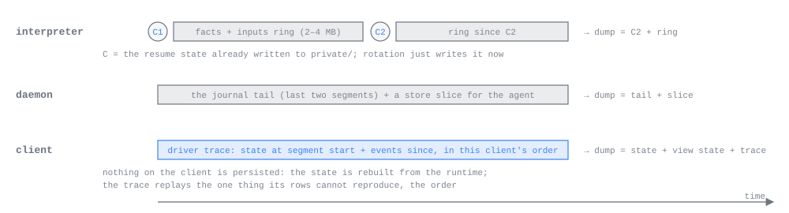

# Debugging

*For anyone, person or agent, working out why amux did something wrong: start here.*

amux is built so that a wrong row on a screen can be traced back to the provider bytes that caused it. Each
process keeps a bounded record of what it was fed, each stage between provider and screen is a pure function that
can be replayed from that record, and one command gathers all of it, redacted, into one directory: a dump. This
page says where things are on disk, how to take and read a dump, and how to narrow a problem to one stage.

## Where to look first

1. **Take a dump while the problem is visible.** `amux dump <agent> --reason "what looks wrong"` prints the
   bundle's directory. Everything below is easier from a dump than from a live system, and the bounded records
   it copies roll over as the agent keeps working.
2. **Read the bundle's `manifest.json`.** Its `errors` list says what could not be gathered (an agent process that
   did not answer, an unreachable host), so a missing file is never a mystery.
3. **Find the stage.** Compare what each layer holds for the item that looks wrong (see [Narrowing a problem to
   one stage](#narrowing-a-problem-to-one-stage)): facts, journal, store, client. The first layer where it goes
   wrong owns the bug.
4. **Read the logs** for the moment it happened: the daemon's `daemon.log` (a redacted tail is in the dump), the
   agent's `agent.log`, and the provider's `private/provider.log`.
5. **Turn it into a test** at the boundary you found, before fixing it (see [Testing](TESTING.md)).

## Where things are

The installation root is `root:` in the installation config (`$XDG_CONFIG_HOME/amux/config.yaml`, normally
`~/.config/amux/config.yaml`, or the file `--config` or `AMUX_CONFIG` names). It defaults to
`$XDG_DATA_HOME/amux`, normally `~/.local/share/amux`.

```text
<root>/
  daemon.log                 the daemon's log; AMUX_LOG names another file
  supervisor.log             the supervisor's log, when amux runs under one
  reports/                   dumps: dump-<unix ms>-<id>/
  profiles/<profile id>/
    store.sqlite             the profile's store: own rows and replica rows
    agents/<agent id>/       one agent's directory
      lock                   held by the agent process for its lifetime
      ctl.sock  pty.sock     the agent's control and raw-terminal sockets
      tools.sock             the daemon's socket for this agent's tool server
      spec.<n>               what each incarnation was started with
      journal/<segment>      the agent's steps, segments named by byte offset
      pty/<segment>          raw terminal bytes, for terminal Claude
      blobs/<hash>           bytes the agent's items reference
      agent.log              the agent process's standard error
      private/               the agent's own state; the daemon never reads it
        facts/<segment>      the facts ring
        facts/<segment>.checkpoint
        provider.log         the provider's standard error
        provider-session     the provider's own session id, for resume
    replicas/                blobs fetched from other hosts
```

On the phone the embedded runtime keeps the same layout inside the app's container; its log is `runtime.log`,
capped at 8 MiB and cut back to its newest 4 MiB.

What the agent directory is and who writes what is described in [the agent process](AGENT_PROCESS.md); the
journal and the store in [Journal and store](JOURNAL_AND_STORE.md).

## What each process keeps



**The agent process** records every event it feeds its interpreter in the facts ring, `private/facts/`, before
stepping: provider output, inputs, ticks, the provider's exit, the daemon going away, stop requests. Each line is
one JSON object:

```json
{"event":"tick","at_ms":1790524769870}
{"event":"fact","channel":"stream","text":"{\"type\":\"assistant\", …}"}
{"event":"input","hex":"0a10…"}
```

Provider payloads are text (hex only if a payload is not UTF-8); inputs are their encoded protobuf in hex. The ring
is two segments named by byte offset, like the journal. A segment rotates when it reaches half the ring's size
(`agent.facts_ring_mib` in the installation config, 4 MiB by default), and the oldest is deleted. Rotation writes a
checkpoint beside the new segment: the interpreter's whole state, as JSON, before the segment's first entry. That
checkpoint is not extra machinery: it is exactly what a resume starts from (the newest checkpoint with its
segment's entries fed through the interpreter again), and so it is also what a replay starts from. Each
incarnation starts a new segment from the state it resumed.

For terminal Claude and Codex the provider's own transcript is also a complete record of what it said; the ring
adds what that transcript lacks (hooks, inputs, ticks). For headless Claude the ring is the only record.

**The daemon** keeps each agent's journal and its rows in the store. It keeps the last two ingested journal
segments of every agent for dumps, so a dump always has the records behind the newest rows.

**A client** keeps, in memory only, a driver trace per open chat and for the fleet: the session state as it stood
when the trace's older segment began, then every message and driver event since (subscribed, stream ended,
reopened with a tail, backoff, page, get, blob) in the order this client saw them. It holds between 200 and 400
events. The order is the one thing the store's rows cannot reproduce, which is why the trace exists. Nothing on a
client is persisted or checkpointed: its state is rebuilt from the runtime's rows.

## Taking a dump

```sh
amux dump                                 # every agent of the profile, own and replica
amux dump worker reviewer --reason "the reviewer's last answer never appeared"
amux --profile Work dump worker
```

Agents are named by name or id. `amux dump` asks the running daemon, which writes the bundle into
`<root>/reports/` and prints its directory. The bundle is assembled under a dotted name beside its final one and
renamed into place when complete, so a directory without a leading dot is whole.

For an agent another host runs, the daemon asks that host for its side over their link and adds it to the bundle.
A host that cannot be reached is named in `errors`; the local rows and store slice are still there.

On the phone, reporting a problem takes a dump of the profile at the moment the screen freezes (see [A report
from the phone](#a-report-from-the-phone)).

## Reading a dump

```text
reports/dump-<unix ms>-<id>/
  manifest.json                 dump id, time, reason, profile, host, generation, daemon version,
                                one entry per agent, and errors
  daemon.log                    the last 4 MiB of the daemon's log, redacted
  agents/<agent id>/
    row.pb                      the inventory row (a wire.Agent)
    store.pb                    the store slice: one wire.Step holding the snapshot and the newest
                                1,000 rows, oldest first, with their orders and revisions
    journal/<segment>           the last two journal segments, whole frames only (own agents)
    part/facts/<segment>        the agent process's facts ring, redacted line by line
    part/facts/<segment>.checkpoint
    part/spec.<n>               the spec of each incarnation
    part/dump-errors            anything the agent process could not read
    host/row.pb, host/store.pb  for another host's agent: that host's row and slice
  hosts/<host id>/manifest.json that host's own manifest
  client/fleet/state.txt        a client's part, when the client adds one:
  client/fleet/trace.txt        the structure of its state and its driver trace,
  client/sessions/<agent>/…     with no names, paths or message text
```

Each agent's manifest entry names its kind, whether it is this host's own, its lifecycle and incarnation, how
many rows the slice holds, and the files its process sent. An agent with no running process has only its specs in
`part/`, and its entry in `errors` says its facts ring was not gathered. Protobuf files are encoded without a
length prefix; journal segments keep the journal's own framing. The facts lines are plain JSON and the checkpoints
are JSON, so both can be read directly.

The client parts come from the app runtime, which adds the fleet's and every open chat's part to the bundle the
daemon wrote. `amux dump` from a terminal carries only the host's parts.

## Redaction

Everything in a dump is redacted before it is written, and before it leaves the process that produced it. Only an
interpreter can decode its kind's item and snapshot bodies, so the redactor is per kind, in `crates/interpret`:
the agent process applies it to its facts ring, checkpoints and specs when the dump asks, and the daemon applies it
to every row, store slice and journal frame it writes (the one place the daemon uses per-kind code). Free text
such as the daemon's log goes through the shared rules in `crates/redaction`.

The redactor keeps structure and removes secrets: values under secret-named keys, environment values, tokens with
known credential prefixes, secret assignments in text, machine paths, email addresses, the local user and host
name. Provider session and thread ids become a placeholder derived from the id, so one session stays recognisable
across a dump. Conversation text is kept: a dump shows what the agent said and was told. Read a bundle before
sharing it.

## Replaying a dump

`replay-support` (`crates/replay-support/src/bundle.rs`) opens a bundle and replays its three pure stages:

```rust
let bundle = Bundle::open(path)?;
for agent in &bundle.agents {
    let steps = agent.replay_facts()?;          // facts through the interpreter, from the oldest checkpoint
    let state = agent.session();               // the store slice through SessionState, as Subscribe delivers it
    let rows = AgentDump::rows(&state);        // that state through the chat view
}
```

`final_texts(steps)` reduces a sequence of steps to each item key's final text, which is how two sequences are
compared when their revisions differ. The simplest way to work on a bundle is a scratch test beside
`crates/replay-support/tests/bundle.rs`, which replays the committed bundle in
`crates/replay-support/tests/fixtures/bundle` the same way. A bundle whose interpreter state format has changed
since it was written will not decode its checkpoint; take a fresh one.

### Narrowing a problem to one stage

Find the item that looks wrong by its key, then compare layer by layer:

| Compare | If they differ | The bug is in |
| --- | --- | --- |
| The facts: what the provider actually sent | The provider changed or misbehaved | the provider; check [Interpreters](INTERPRETERS.md) for recordings |
| `replay_facts()` against the journal | The interpreter is not deterministic, or its checkpoint does not resume | the interpreter's state or checkpoint |
| The journal against what the facts should mean | The interpreter decided wrong | the interpreter: add the facts as a fixture in `crates/interpret/fixtures` |
| `store.pb` against the journal | Ingest committed something other than the steps | the daemon's ingest or store |
| `rows(session())` against `store.pb` | The client state or views drew the right rows wrong | `ui-state` or `ui-view`: reproduce from the slice |
| A client's `trace.txt` | The order the client saw explains what it drew | the session driver or runtime |
| The screen against the rows | The renderer drew the right rows wrong | the terminal or the phone |

A row carries its agent and key; the key finds the journal frames that wrote it, and the replayed facts show which
event produced the step that first emitted it.

## A report from the phone

A phone gives up its diagnostics two ways, both under Help. **Export Diagnostics** writes a dump of the profile,
with the app runtime's client parts, and hands its directory to the share sheet, so it can be AirDropped or saved
to Files and read as above. **Report a Problem** sends a report to the person's amux account.

Reporting a problem is in every build of the app. Taking a screenshot makes the app freeze its own composited
frame and offer to report it; Report a Problem under Help freezes the screen and opens the report directly. In the
same instant the app starts a dump of the profile. The person marks rectangles on the frozen frame, writes a note
on each and one overall, and presses Send, which uploads one bundle to their amux account (the account signed in on
screen; with none, Send is refused and says why). A failed send keeps everything for a retry. Nothing is sent in the
background.

The bundle holds:

| File | Contents |
| --- | --- |
| `report.json` | Build and git revision, time, note, marks in points with the frame's size and scale, and every part declared present or absent with a reason |
| `frame.png` | The frozen screen, without the status bar |
| `trace.jsonl` | The view-state trace, in builds with the driving tools only; a shipping build declares it absent |
| `log.txt` | The last 64 KiB of the runtime's log |
| `dump/…` | The profile's dump, as above, with the app runtime's client parts |

What the account service does with reports is on [Cloud](CLOUD.md); the report screen itself is on [the iPhone
app](IOS.md).
