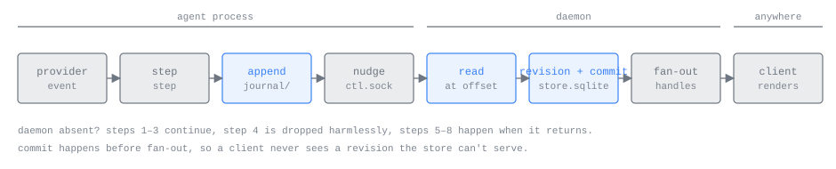

# Journal and store

*For developers working on the journal, ingest or the store.*

Everything an agent does reaches a client along one path. The interpreter in
the agent process turns each provider event into a step and appends it to the
agent's journal. The daemon reads the journal, commits what it finds to the
profile's store and then broadcasts each committed record to the subscriptions
open on that agent. Clients read only through their local runtime, which
serves every call from the store (see [the wire](WIRE.md)).

This page covers the three crates on that path:

| Crate | What it holds |
| --- | --- |
| [`journal`](../crates/journal/src/lib.rs) | Segment files, frames, the `Writer` the agent appends with and the `Reader` ingest reads with |
| [`store`](../crates/store/src/lib.rs) | The schema, the `Store` trait, commit for own rows, absorb for replica rows, retention |
| [`node`](../crates/node/src/runtime.rs) | Ingest (`ProfileRuntime::ingest`), the generation file, fan-out, the retention sweeps, peer sources |

How the agent process produces steps is in [the agent process](AGENT_PROCESS.md)
and [interpreters](INTERPRETERS.md). How the daemon is laid out as a whole is in
[the architecture](ARCHITECTURE.md).

## On disk

```
<data_dir>/
  generation                         boot id, clean flag and counter (see Durability)
  profiles/<profile-id>/
    store.sqlite                     the profile's store (WAL mode)
    agents/<agent-id>/               one directory per own agent
      journal/0000000000             journal segments, named by global byte offset
      journal/0001048576
      pty/                           raw terminal bytes, same naming (terminal Claude only)
      blobs/<sha256-hex>             attachment bytes this agent references
      private/facts/                 the interpreter's facts ring and checkpoints
      spec.<n>, lock, ctl.sock, ...
    replicas/<host-id>/agents/<agent-id>/blobs/<sha256-hex>
                                     bytes fetched for a paired host's agent
```

The names are constants: `GENERATION`, `STORE`, `AGENTS` and `REPLICAS` in
[`crates/node/src/install.rs`](../crates/node/src/install.rs), and `JOURNAL`,
`PTY`, `BLOBS` and `PRIVATE` in
[`crates/agent-dir/src/lib.rs`](../crates/agent-dir/src/lib.rs).

## The journal

The journal is a queue between two processes that needs no acknowledgements
and no shared memory, survives either side dying and can be read from any
offset later. It is a directory of append-only files.

### Segments

Each segment file is named by the global byte offset of its first byte, zero
padded to ten digits (`segment_name`). A reader's whole state is one integer,
a global offset: it opens the segment whose name is the largest at or below
that offset and seeks to the difference.

The writer closes a segment before it creates the next one. A segment is
therefore final, never written again, exactly when a later segment exists
(`journal::is_final`). Nothing else needs to record which files are complete.


The writer rotates when a frame would take a non-empty segment past the
segment size; frames never span segments. The size comes from the agent's spec
(`EffectiveConfig.journal_segment_bytes`) and defaults to 1 MiB
(`DEFAULT_SEGMENT_BYTES` in [`crates/agent/src/host.rs`](../crates/agent/src/host.rs)).
The `pty/` log and the facts ring under `private/facts/` use the same naming
and the same `journal::segments` listing.

### Frames

A frame is a varint length prefix followed by one protobuf `Step`
(`journal::encode_frame`). A `Step` is everything one interpreter step
produced:

| `Step` field | Meaning |
| --- | --- |
| `items` | Full items, keyed by the interpreter. The durable payload. |
| `appends` | Text appended to an item already held |
| `snapshot` | The agent's snapshot, when this step changed it |
| `turn_end` | Set when the step ended a turn: the turn id and the key of the turn's last message |

The snapshot rides in the same frame because it costs nothing, but nothing
depends on it being there: after a restart the interpreter re-derives and
re-emits it. The fields are in
[`records.proto`](../crates/wire/proto/amux/v1/records.proto); their meaning on
the wire is in [the wire](WIRE.md).

`journal::decode_frame` answers one of three things about the front of a
buffer: a whole frame, an incomplete one (more bytes may complete it), or
corruption (a zero length, a length above `MAX_FRAME_BYTES` = 64 MiB, or bytes
that are not a `Step`). A zero length is how the zero-filled tail a file system
can leave after power loss is recognised.

A reader never returns a partial frame. `Reader::read_up_to` reports bytes at
the end of a segment that do not make a whole frame as `Torn`:

- In the newest segment the writer may still be completing the frame, so the
  reader's cursor stays at the last whole frame and a later read picks it up.
- In a final segment the bytes can never complete. The reader skips them,
  reports `Torn { skipped: true }` and continues at the next segment.

`Writer::open` cuts a torn tail off the newest segment, so a restarted agent
appends after its last whole frame. A failed append truncates back to the last
whole frame for the same reason.

### Writing

The agent writes with plain `write` calls and never calls `fsync`. A process
crash loses nothing, because the kernel's page cache survives it. Only an
operating system going down loses unsynced journal bytes, which is what the
generation file below exists for.

The agent appends a step, then sends `Nudge` over `ctl.sock`. If no daemon is
connected the nudge is dropped and the journal simply grows. Within one step
the agent writes blobs first, then the journal, then carries out effects: an
input's verdict is sent and the provider is written to only once the step that
explains it is in the journal (`Host::apply` in
[`crates/agent/src/host.rs`](../crates/agent/src/host.rs)).

A failed journal write, which in practice is a full disk, ends the
incarnation: nothing the provider does from then on could be recorded. The
agent stops the provider, writes its final boundary item if the disk takes it,
and exits with the write failure as its cause (`Host::write_failed`).

## Ingest

Ingest lives in [`crates/node/src/runtime.rs`](../crates/node/src/runtime.rs).
Each live agent has one watcher task. It dials `ctl.sock`, reads the agent's
`AgentHello`, and calls `ProfileRuntime::ingest` on every `Nudge`. It also
ingests when it first adopts a connection, when the startup sweep finds an
agent, and once more when the process is gone, so a journal that ran ahead of
the daemon is always read to its end.



One ingest pass:

1. Lock the store and read the agent's `ingest_cursor` from its row.
2. Read whole frames from that offset with `journal::Reader::read_up_to`, at
   most `INGEST_BATCH` (256) frames.
3. Commit them in one transaction (`Store::commit`), which also writes the
   advanced cursor.
4. Still holding the store, broadcast each committed record once on the
   agent's fan-out channel, and publish the agent's inventory row if a
   snapshot changed its phase, `working_on` or last activity.
5. Reclaim segments that lie wholly below the committed cursor.
6. At the end of the journal, the first time after each Hello, set the
   agent's CaughtUp marker and broadcast `CaughtUp`.
7. If the batch was full, release the store and go again.

Holding the store lock through the broadcast makes commit order the broadcast
order, and lets a subscriber that opens under the same lock read a cut that is
wholly before or wholly after a batch. Batching bounds how long a backlog holds
every other reader and writer off: at the measured cost of tens of
microseconds a frame, 256 frames hold the store for several milliseconds.
A batch is half the agent's fan-out ring: its records go out in one burst,
and a short batch can follow a full one within a millisecond, so a
subscriber that has read everything when a batch lands is closed with
`Lagged` only if it reads none of it for a whole batch's commit.

A torn frame in the newest segment means a write is still under way, so that
pass is not at the end of the journal and does not announce `CaughtUp`; the
next nudge brings the rest.

### Commit and revisions

`Store::commit` ([`crates/store/src/lib.rs`](../crates/store/src/lib.rs))
processes the frames in journal order, inside one transaction:

| Record | What commit does |
| --- | --- |
| Item | Assigns the agent's next revision. A key the agent already holds keeps its order; a key not held yet takes the next order above the highest committed. Upserts by key. |
| Append | Appends the text to the held item and assigns it the next revision. The broadcast `Append` carries the item's previous revision as `base_revision`. An append naming a key the store does not hold is skipped and counted. |
| Snapshot | Assigns the next revision, stores the snapshot on the agent row and copies `phase`, `working_on` and `at_ms` (as `last_activity`) from its envelope onto the row. |
| Snapshot turning the phase to `NEEDS_YOU` | Inserts a `notifications` row due after the push delay. Leaving `NEEDS_YOU` deletes the agent's pending rows. |
| `turn_end` on an agent with a parent | Inserts a `deliveries` row carrying a copy of the turn's last message. |

Then the row's `ingest_cursor` is set to the offset just past the last frame
and the row is written, in the same transaction as the records it describes.

Three consequences follow:

- Revisions are per agent and strictly increasing, assigned only by the daemon
  that owns the agent. The agent writes zero for `order` and `revision` and
  never learns the values.
- Journal order is item order. An item keeps the order its key was first
  committed at, forever, so a revised item stays where readers saw it.
- Nothing is deleted by commit. An older revision never overwrites a newer one
  in the store or in a client.

The unique index `items_by_order` holds one key per order, so a bug that would
place two keys at one order fails the transaction instead of corrupting the
transcript.

### At-least-once emission

The agent can re-emit records the journal already holds: after a crash it
resumes from its checkpoint and re-derives from the provider's own record. This
is accepted rather than deduplicated. Items are keyed by the provider's own
identifiers, so a re-derived item has the same key and content. Commit gives it
a fresh revision and keeps its order, and clients merge by key with no visible
change.

Appends cannot double, because re-derivation after a restart always emits full
items: every stream ends with a full item, at every restart boundary too.

The `deliveries` primary key includes the child's incarnation, kind and turn
id, and the insert is an upsert, so a turn end committed twice is one row.
Agent messages are deduplicated by the recipient's daemon against the
recipient's items by envelope id, using the `items_by_input` index.

### Reclaiming segments

A segment is deleted only when it lies entirely below a cursor that has
reached the drive, so the journal is never the only copy of something the store
might lose. `ProfileRuntime::reclaim` asks `journal::reclaimable` for segments
wholly below the committed cursor, keeps the newest `KEPT_SEGMENTS` (2) of
them for dumps, flushes the store to the drive (`Sqlite::flush_to_drive`), and
deletes the rest only if that flush succeeded. That costs one full flush per
segment the agent fills.

## Durability

| Rule | Where |
| --- | --- |
| The agent writes its journal with plain writes and no fsync. | `journal::Writer` |
| The store runs WAL with `synchronous=NORMAL`: no fsync per commit; SQLite syncs at its checkpoints. | `Sqlite::open` in [`crates/store/src/sqlite.rs`](../crates/store/src/sqlite.rs) |
| A journal segment is deleted only below a cursor that has reached the drive. | `ProfileRuntime::reclaim` |
| `<data_dir>/generation` holds the boot id seen at the last start, a clean-shutdown flag and a counter. | [`crates/node/src/generation.rs`](../crates/node/src/generation.rs) |
| At start, before anything is served: if the boot id differs and the flag is clear, bump the counter; then rewrite the file with the current boot id and the flag cleared. | `Generation::start`, called from `node::start` |
| At clean shutdown, last: stop links, background work and watchers, flush every store with `fullfsync`, then set the flag. | `Daemon::shutdown` in [`crates/node/src/daemon.rs`](../crates/node/src/daemon.rs) |
| Both generation writes are temp file, fsync, rename, fsync of the directory. | `write_durably` in [`crates/node/src/install.rs`](../crates/node/src/install.rs) |

Why the file exists: revisions are published to other machines, and the store
commits without syncing. A power cut can roll the store back to before
revisions a peer has already seen, and the host would then mint the same
numbers again for different content. Only an unclean reboot loses the page
cache. A daemon crash, an agent crash, an update and a clean reboot lose
nothing committed, so none of them change the counter.

The counter is the host's generation. It travels on the host's inventory entry
(`HostEntry.generation`). A peer compares it when that host's inventory stream
reaches `CaughtUp`, before any source for that host opens. On a change it
drops every replica of the host and records the generation in one transaction
(`Store::rewind_host`), and each agent's source starts again with a tail. That
invalidation restores consistency between machines; it cannot recover work
whose only copies were lost.

After power loss on the origin:

- The store opens at its last durable transaction, with the cursor and
  `next_revision` that go with it.
- Ingest finds the cursor either still inside the journal, and re-reads the
  same frames from there, producing the same revisions with the same content;
  or beyond the journal's end (`journal::end`), because the unsynced journal
  lost its tail. In that case `Store::rewind_cursor` moves the cursor back to
  the last whole frame and keeps `next_revision`, so whatever the agent writes
  again takes revisions every reader has not seen.
- Raw terminal bytes from those seconds are gone.

The Windows boot id is the boot time rounded to ten seconds. A reading that
lands across a rounding edge looks like a reboot, which bumps the counter only
after an unclean shutdown, the safe direction.

## The store

One SQLite file per profile, `profiles/<profile-id>/store.sqlite`. It is the
truth for this host's own agents, a cache of paired hosts' agents, and the only
history any client on the machine reads.

### Writer and readers

The profile runtime is the store's only writer and only reader: the daemon on
a desktop, and the embedded runtime in the phone app. No client opens the file,
not even the terminal client on the same machine. Every client reads through
`Subscribe`, `Fetch` and `Get` against its local runtime; on the phone that is
an in-process call. The runtime holds the store behind one async mutex, and
every read the runtime serves runs in one read transaction, so each read sees
one commit point.

The runtime's interface is the `Store` trait in
[`crates/store/src/lib.rs`](../crates/store/src/lib.rs):

| Method | Use |
| --- | --- |
| `agent`, `agents` | Agent rows, own and replica |
| `cut(agent, n)` | The snapshot, the newest `n` rows of the block and the marker, read together: what a subscription opens with |
| `page(agent, before_order, limit)` | Older rows by order, newest first, from the block only; says whether it ended at the limit, at the block's boundary, or at the end of history |
| `get(agent, key)` | One held item, in the block or not |
| `after(agent, revision, cap)` | What a peer holding everything through `revision` is missing, or `None` when that is more than `cap` rows |
| `commit` | Journal frames into an own row |
| `absorb` | Records from a peer into a replica row |
| `rewind_cursor`, `rewind_host` | Power-loss recovery on this host and on a peer |
| `sweep_own`, `sweep_replicas` | Retention |

The logic is written once over a small `Tables` trait of row primitives.
`Sqlite` is the profile file; `InMemory` keeps the same rows in memory for the
store's tests. The conformance suite in
[`crates/store/tests/conformance.rs`](../crates/store/tests/conformance.rs)
holds both to the same answers.

The CaughtUp and Detached markers are not persisted. They live in memory beside
the connection and are rebuilt as ingest and sources run.

### Schema

The schema is the migrations in
[`crates/store/src/migrations.rs`](../crates/store/src/migrations.rs).

`agents`: one row per agent, own or replica, keyed by `(origin_host, agent_id)`.

| Column | Meaning |
| --- | --- |
| `origin_host`, `agent_id` | This host for own rows; the owning host for replicas |
| `kind` | `claude_pty`, `claude_sdk` or `codex` |
| `name`, `cwd` | As the registry holds them |
| `parent`, `parent_host` | A child records its parent as host and id, because families cross hosts |
| `lifecycle`, `exit_cause` | Live or exited, and why. Owned by the daemon. |
| `phase`, `working_on`, `last_activity` | Copied from the newest snapshot's envelope at commit; `last_activity` is the snapshot's `at_ms`, never commit time |
| `snapshot`, `snapshot_revision` | The newest snapshot, body opaque |
| `ingest_cursor` | Own rows: the journal offset committed through |
| `next_revision` | Own rows: the revision the next record takes |
| `source_cursor` | Replica rows: the origin revision this agent's source is complete through |
| `complete_from_order` | The order from which the held rows are known to be contiguous up to the newest (see below) |
| `exhausted` | No older history exists: the origin said so, or retention trimmed it |
| `created_at`, `producer_version`, `incarnation` | Creation time, the agent binary's version from its Hello, and the `spec.<n>` it is running |
| `turn_open` | Own rows: the incarnation has a turn it has not ended. An incarnation that exits with one open tells its parent it failed. |

Lifecycle and phase are stored as their wire integers, so a value from a
newer peer is stored and served rather than refused.

`items`: one row per item, keyed by `(origin_host, agent_id, key)`.

| Column | Meaning |
| --- | --- |
| `key` | The interpreter's key |
| `"order"` | Transcript position, assigned once per key |
| `revision` | Assigned on every upsert |
| `at_ms` | When it happened, from the envelope |
| `producer_version` | The agent binary that wrote it |
| `input_id` | Set on a prompt's reflection and on an agent message's item |
| `text` | The one appendable field |
| `kind` | The envelope's kind tag |
| `attachments` | The envelope's attachment list, encoded |
| `body` | The per-kind body, never decoded or re-encoded by the store |

Three indexes sit on `items`: `items_by_order` (unique: one key per order),
`items_by_revision` (what `after` reads) and `items_by_input` (partial, where
`input_id` is set: the agent-message dedupe).

The rest:

| Table | Rows |
| --- | --- |
| `deliveries` | The daemon's outbox to parents: a child's `finished` (turn ended; body is its last message) or `failed` (the incarnation ended without one; body is the cause). Keyed by child, incarnation, kind and turn id. Holds a copy of the message, because retention may remove the child's transcript while a parent is offline. |
| `notifications` | The push outbox: one row per turn into `needs_you`, keyed by agent and snapshot revision, with a due time and a body built from envelope fields only. Deleted unsent if the phase leaves `needs_you` first, and with the agent. |
| `hosts` | One row per peer host: the generation last seen. Written in the transaction that drops that host's replicas. |
| `schema_migrations` | Each applied migration's number and SHA-256 |

There are no blob tables. A blob is a file in its agent's directory; its name,
mime type and size are on the attachment in the item that references it, and it
lives as long as that directory. See [attachments](ATTACHMENTS.md).

The outbox drains are in [`crates/node/src/outbox.rs`](../crates/node/src/outbox.rs).
The shipped daemon and the phone runtime install `NoopSender` as the push
sender, so notification rows are written, fall due and are deleted without a
push being sent.

### Migrations

Migrations are forward only, append only and additive: a column with a
default, a table, an index. Each runs in its own transaction. Shipped text is
never edited: the store records each migration's hash in `schema_migrations`
and refuses to open a file whose history disagrees (`OpenError::EditedMigration`).

`user_version` holds the schema stamp, `SCHEMA_STAMP`: the minimum number of
migrations a binary must know to read the file. A binary opens any store whose
stamp is at most the migrations it ships, so an older binary opens a store a
later one migrated; one that is too old fails with `OpenError::TooNew`. A drop,
rename or rewrite ships only after the stamp has been raised past every binary
that read the earlier shape. The file's `application_id` marks it as an amux store;
any other SQLite file is refused as foreign.

### Own rows and replica rows

One table and one `origin_host` column hold both, with two write paths and two
retention policies.

Own rows are the truth. Only `commit` writes their records; they are removed
only by delete and by retention.

Replica rows are a cache of a paired host's agent. Only `absorb` writes their
records, copying the origin's revisions and orders as received. Each replica
agent has one source in [`crates/node/src/sources.rs`](../crates/node/src/sources.rs):
one `Subscribe` to the origin. With no block it asks for a tail of K rows; with
one it asks for what came after its `source_cursor`, capped at K, and the
origin answers either that delta or `Reset` and a fresh tail. The source holds
a catch-up until the origin's `CaughtUp` and then absorbs it in one go, so a
stream that dies midway never leaves the block half-replaced.

**The block.** A replica's rows for an agent are either empty or one
contiguous block ending at the origin's newest row, and only the agent's source
writes the top of it. `complete_from_order` records where the block starts.
That is what lets many subscriptions and any number of pages share one cache
with no reconciliation: a page inside the block is served from it; a page below
it is fetched from the origin and extends the block.

**Absorb.** Every write into a replica goes through `Store::absorb`:

| `Absorb` | Effect |
| --- | --- |
| `Delta { events, live }` | Joins the block above its newest row. Items are upserted unless a newer revision is held; an append applies only when its base matches; a snapshot only when newer. Live records advance `source_cursor`; a catch-up does not. |
| `Reset { tail, snapshot }` | Starts the block again from the tail: `complete_from_order` moves to the tail's oldest order. Rows below stay stored and are served by `Get`, but do not count as contiguous. |
| `Page { before_order, items, exhausted }` | Extends the block downward, only when `before_order` is the block's boundary. A page that does not join is served to its requester and not stored, because only a source starts a block. |
| `CaughtUp(revision)` | Sets `source_cursor` to the revision the origin's replay is complete through |

Absorb is idempotent by key, and an older revision never overwrites a newer
one, so pages and a live source need no coordination. The row's snapshot and
`source_cursor` are written in the same transaction as the items they describe.

A replica row is dropped when its origin's inventory, read to `CaughtUp`, does
not list the agent, when the origin's generation changes, and when its host is
untrusted.

### Retention

Retention runs when the runtime's background work starts and then every ten
minutes (`ProfileRuntime::start_retention` in
[`crates/node/src/retention.rs`](../crates/node/src/retention.rs)). The store
decides what goes; the daemon then closes the removed agents' streams, tells the
fleet (`AgentRemoved` with reason "removed by retention") and deletes their
directories, which takes their blobs with them. Row cost is `store::item_bytes`:
the envelope's variable fields plus a fixed 48 bytes a row.

**Own rows** (`Store::sweep_own`, in
[`crates/store/src/retention.rs`](../crates/store/src/retention.rs)), against
the profile's own budget:

1. Remove exited agents whole, least recent activity first. An exited child
   whose parent's row says live is skipped, because its parent can still send
   to it; a parent goes together with its descendants, and one with a live
   descendant stays.
2. If still over, trim live agents in rounds: each round takes the largest live
   agent and deletes its oldest rows until about one chunk of bytes is gone,
   then measures again. No agent is taken below its newest K rows.
3. When every live agent is at K and the pool is still over, the sweep stops;
   from there the budget is soft.

A trim sets the agent's `complete_from_order` and `exhausted`, so `Fetch`
truthfully reports no older history. Trimmed own history is gone for good,
since the journal below the cursor was already deleted.

**Replica rows** (`Store::sweep_replicas`), against the replica budget:

1. Agents with no open source lose all their rows, least recently used first.
   Their agents row stays, with an empty block, because it is the origin's
   registry entry: it says whether a parent is live and which incarnation a
   child's delivery names.
2. If still over, sourced agents first lose any rows a Reset left below their
   block, then are trimmed to their newest K rows, largest first, keeping the
   block contiguous.

**Replica blob files** have their own byte budget, evicted least recently read
first (`store::BlobLru`), independent of rows: they are disposable and
refetchable. Own blobs have no budget of their own; they go with their agent's
directory, and the own budget counts rows, not blob files.

The budgets and K are listed in [parameters](PARAMETERS.md).

### Disk full

- **Agent journal write**: the incarnation ends, as described under
  [Writing](#writing). The next incarnation writes any missing boundary when it
  starts.
- **Blob write**: `PutBlob` fails with `RESOURCE_EXHAUSTED` and leaves nothing
  behind. A blob the agent writes itself fails like a journal write and ends
  the incarnation the same way.
- **Store commit**: the transaction fails and the cursor does not move. Ingest
  logs the error and the next nudge reads the same frames again.

## Tests

The claims on this page are held by named tests, mapped in
[`tests/contracts.toml`](../tests/contracts.toml). The main ones:

| Where | What it holds |
| --- | --- |
| [`crates/journal/tests/journal.rs`](../crates/journal/tests/journal.rs) | Segment naming, rotation, torn tails, reclaim below a cursor |
| [`crates/store/tests/conformance.rs`](../crates/store/tests/conformance.rs) | Commit, absorb, pages, cuts and deletes, for both store implementations |
| [`crates/store/tests/retention.rs`](../crates/store/tests/retention.rs) | Own and replica sweeps |
| [`crates/node/tests/single_daemon.rs`](../crates/node/tests/single_daemon.rs) | Ingest, re-derivation, power loss and the generation bump |

Power loss is tested without cutting power: the test truncates the WAL to its
last checkpoint and the journal to an arbitrary byte, then restarts the daemon
under a different boot id. See [testing](TESTING.md).
