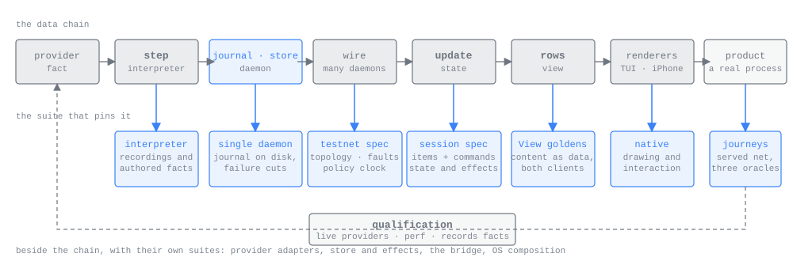

# Testing

*For developers adding a test, running one, or deciding where a new one belongs.*

This page is an index. The suites themselves are listed in `tests/catalog.toml`; the promises they hold are
listed in `tests/contracts.toml`; `just --list` is the command surface. The multi-host harness has its own page,
[TestNet](TESTNET.md), measured performance has [Performance](PERFORMANCE.md), and the phone's snapshots,
goldens and journeys are described in [the iPhone app](IOS.md).

## The rule

Test at the smallest boundary that contains the code whose promise can fail. Most cases use explicit inputs and
a driven policy clock; a smaller set uses real sockets, files and processes; a few complete stories drive each
client through its real UI. Every suite says what is real, what is replaced, and which observation would reject
the failure it exists to catch.



The data chain is how a provider's output becomes something a person sees: a provider fact becomes an
interpreter step, the step becomes journal records and store rows, rows become session state in a client, the
state becomes views, and views become terminal cells or phone pixels. The chain names the suites and says where
fixtures come from. It is not the whole product: provider IO, SQLite, the Swift bridge, process ownership and
native interaction sit beside it and can each fail on their own, so they have suites too. A test goes at the
lowest boundary that can catch its failure: a view test of an ask card does not replace the Swift test that
proves the button sends the answer, and neither needs a relay and a simulator.

## Boundaries

Each catalogued suite names one boundary.

| Boundary | What it proves | Main homes |
| --- | --- | --- |
| Interpreter | Each provider event yields one step: keyed items, appends and a snapshot, with no hidden IO or clock; checkpoints resume from any prefix. | `crates/interpret/tests`, `crates/attachments` |
| Provider adapter | Real provider bytes and hooks reach the interpreter, commands produce the right provider writes, and recordings replay strictly. Terminal Claude's cases run on Unix only: Windows does not host it (see [Windows, as a stated cost](ARCHITECTURE.md#windows-as-a-stated-cost)). | `crates/agent/tests`, `crates/claude-specs`, `crates/codex-specs`, `crates/provider-fakes`, `crates/replay-support` |
| Single daemon | Ingest commits a step's items, snapshot and cursor together, assigns revisions, pages and subscribes without loss, and reclaims only what was ingested. | `crates/journal`, `crates/store`, `crates/node/tests` |
| Many daemons | Discovery, trust, routing, relay, replication, inventory, families and blobs hold across production runtimes under faults. | `crates/testnet/tests` |
| Client model | `update(state, msg)` gives the same state under any arrival order; inputs reach a settled, rejected or uncertain state. | `crates/ui-state/tests/spec` |
| Store, effects, bridge | Runtimes and the embedded owner reach the right service; Swift decodes and applies the Rust view and command contract. | `crates/ui-runtime`, `crates/app-runtime`, `crates/app-embedded`, `crates/client`, Swift unit suites |
| Views | Each view is a pure function of session state; row ids are item keys and never move. | `crates/ui-view/tests` |
| Native presentation | The terminal and the phone draw a view correctly and interaction sends the right command. | `crates/tui/tests`, `apps/apple` snapshot and golden suites |
| System composition | Built binaries launch, survive, stop and clean up as promised: agents outlive a killed daemon, the supervisor updates and rolls back. | `crates/amux/tests`, `crates/agent/tests/lifecycle.rs`, `crates/node/tests/supervisor.rs` |
| Journeys | A person completes a declared task through a real client and the production path. | `journeys/`, `scripts/terminal-journey.py`, `scripts/ios-journey.py`, `crates/amux/tests/system_journeys.rs` |

Choose cases by distinct transitions, authorities and failure cuts, not by product words: "allow this ask" rightly
appears in interpreter semantics, in Swift command dispatch and in one journey, because each catches a different
failure. Pair every replay or golden with explicit expected outcomes at the transitions that matter; a replay can
reproduce its own mistake.

## Lanes

A lane says when and where a suite runs.

| Lane | What it holds | Where it runs |
| --- | --- | --- |
| fast | Offline, credential-free, deterministic suites: most of the table above. | `just test` on every push, on Linux, macOS and Windows; `just ios gate` for the phone |
| system | Real processes, PTYs, sockets and the supervisor, with bounded deadlines. | Also `just test`, since they are ordinary Cargo targets; the phone's loopback smoke runs in `just ios gate`, the store on the simulator in `just ios captures` |
| journey | Both clients driving complete stories against a served network. | Terminal journeys on every push (Linux and macOS); phone journeys and goldens in `just ios captures`, nightly and by hand |
| tool | The repository's own machinery: scripts, source policy, CI command surface, the shipping-scope audit. | Beside the fast lane |
| qualification | Live providers, measured performance, production cloud and purchases. | Only on request, on enrolled machines; results are `pass`, `fail`, `unavailable` or `not_run` |

Nothing in an ordinary push inherits credentials, spending or hardware. The live lane is the `live` feature of the
qualification crate; `just test` and `just ci` never select it. `just ci` refuses to start when an `UPDATE_*`
variable is set, so no asserted run can rewrite a golden.

## The catalogue and the contracts

`tests/catalog.toml` lists every suite once: its contract in a sentence, paths, focused recipe, boundary, oracle,
what is real and what is substituted, its time requirement (`none`, `driven` or `real`), required capabilities,
lane, evidence location, update command, and the Cargo targets, features and journeys it owns.

```sh
just tests-list    # print the catalogue: suite, boundary, lane, time, recipe
just tests-check   # fail on a missing recipe, target, feature, journey or baseline,
                   # or on a test target the catalogue does not list
```

`tests/contracts.toml` lists every promise the design makes that a test must hold, grouped by source (a worked
failure, an invariant, or a suite contract), each with the tests that hold it. A test is named as
`<package>/<target>::<test path>` for Cargo (`<target>` is a test target, `lib`, or `bin:<name>`),
`swift:<Target>/<Class>/<method>` for XCTest, or `journey:<client>/<story>` for a story in
`journeys/manifest.json`.

```sh
just contracts-check                      # fail when a contract names no test or a test that does not exist
just contracts-check --table coverage.md  # also write the contract-to-test table as Markdown
```

Renaming a test means updating its contract entry; CI runs both checks.

## Running tests

```sh
just test                                  # every ordinary workspace target
just test -- --test spec_replication       # one Cargo target across the workspace
just test-crate interpret -- --test codex  # one crate, then Cargo arguments
just test-store                            # one reader and writer suite against both store implementations
just test-ui                               # the client model spec
just test-tui                              # terminal presentation and goldens
just offline-test                          # workspace tests with isolated config and no network
just journey terminal reach-host           # one terminal journey
just journey system survive-daemon         # the built binaries' system journey
just ios unit                              # phone package and app-hosted unit suites
just ios journey                           # the shared stories on the phone; `-- <story>` for one
just live claude_sdk all                   # live compatibility for one kind (qualification)
just perf                                  # performance qualification (see Performance)
```

`just tests-list` gives the focused recipe for every suite. Recipes carry outer timeouts; a timeout that fires is a
hang to diagnose, not a limit to raise. On macOS a freshly built test binary can stall before its first
instruction while the system assesses it; rerun before diagnosing a first-launch timeout.

## Time

Three clocks are kept apart. Policy time (retention, outbox retries and notification delays, credential
refresh, reply and start deadlines) is injected: each timer takes its clock as a parameter, the interpreter has no
clock at all and receives quiet periods as tick events, and the harness advances a `DrivenClock` to just before,
at and after a real boundary.
Transport time (QUIC timers, sockets, processes) runs normally. Harness deadlines are real and bounded, still fire
when policy time is stopped, and are never the oracle.

Waits subscribe before they read, return what they saw, and fail on a deadline or a closed stream; a wait never
passes by timing out. An absence is shown by draining to a declared boundary or watching a whole declared window,
never by one empty poll.

## Fixtures and goldens

Three kinds of fixture, kept distinguishable: recordings of a real provider, reviewed derivations produced by the
production code, and small authored scenarios. Ordinary runs compare and never regenerate.

| Fixture | Where | Updated by |
| --- | --- | --- |
| Terminal Claude (played back on Unix only) and headless Claude recordings | `crates/claude-specs/fixtures` | `claude-probe record (--sdk\|--pty) <spec>` |
| Codex recordings | `crates/codex-specs/fixtures/runtime` | `codex-probe record <spec>` |
| Agent-process replays cut from those recordings | `crates/agent/tests/replay` | by hand; see its README |
| Interpreter emission goldens (`*.json` input, `*.golden` output) per kind | `crates/interpret/fixtures` | `INTERPRET_UPDATE_GOLDENS=1` |
| View data goldens | `crates/ui-view/tests/goldens` | `UI_VIEW_UPDATE_GOLDENS=1` |
| Terminal component goldens (text plus style map, both themes) | `crates/tui/tests/golden` | `UPDATE_GOLDENS=1 just test-tui` |
| Login-unit goldens | `crates/amux/tests/goldens/login` | `AMUX_UPDATE_GOLDENS=1 just test-crate amux -- --test supervise_cli` |
| Fake-provider scripts and served topologies | `journeys/scripts`, `journeys/topologies` | by hand |
| Hand-written provider traffic | `journeys/recordings` | by hand |
| Journey screen goldens | `journeys/goldens/terminal/<story>`, `journeys/goldens/phone/<story>` | `UPDATE_JOURNEY_GOLDENS=1` |
| Phone whole-screen goldens | `apps/apple/Goldens` | `just ios goldens -- --update` |
| Phone component snapshots | `apps/apple/AmuxComponentSnapshotTests/__Snapshots__` | `just ios component-snapshots -- --record` |
| A dump bundle replayed through its three stages | `crates/replay-support/tests/fixtures/bundle` | a fresh `amux dump`; see [Debugging](DEBUGGING.md) |
| Performance baselines | `perf/baselines` | `just perf --baseline`; see [Performance](PERFORMANCE.md) |

Every update is reviewed as a diff before it is committed.

## Journeys

A journey starts at a real user entry point, crosses the production path and observes the outcome.
`journeys/manifest.json` declares each story once: its id, the clients that enact it (`terminal`, `phone` or
`system`), the topology it is served on (and `phone_topology` where the phone's differs), and its claim. The
terminal and the phone enact the same story each in their own way.

The shared stories are `reach-host`, `conversation-decision-claude-pty`, `conversation-decision-claude-sdk`,
`conversation-decision-codex`, `leave-and-recover`, `manage-agent`, `attachment-or-review` and `keep-authority`.
The phone has its own besides (`account-sign-in`, `purchase-restore`, `report`, `accessibility`,
`local-network`, `push-wake`; `just ios journey -- --native` runs them), and `survive-daemon` is the system
journey on the built binaries.

```sh
just journey terminal <story>   # builds amux, the fakes and testnet, then runs the story in tmux
just ios journey -- <story>     # the app on the leased simulator, driven through its door
```

Both drivers serve the topology with `testnet serve` and drive the real client. A pass needs three judgements
together: the action really happened through the UI; the hosts independently record the exact outcome (with a
deliberately wrong expectation shown to fail the same check); and the screens reached compare with reviewed
goldens.

## Where results land

| Run | Output |
| --- | --- |
| Terminal journey | `target/journeys/<story>`: frames, `observations.json`, `result.txt`, `testnet.log` |
| Phone journey | `target/journeys/phone/<story>`, differences under `diff/` |
| Phone goldens | `target/ios/goldens`, perturbation runs in `target/ios/goldens-perturb` |
| Phone component snapshots | `target/ios/component-snapshots` |
| Phone accessibility audit | `target/ios/accessibility` |
| Phone performance | `target/ios/perf` |
| TUI evidence bundle | `just tui-evidence`; rendered PNGs from `just shot` (see [amux-shot](../crates/shot/README.md)) |
| Desktop performance | printed report; `--baseline` writes `perf/baselines/desktop/<model>.json` |
