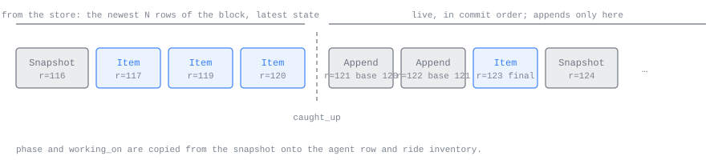
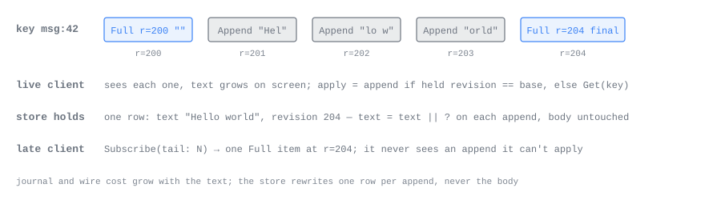
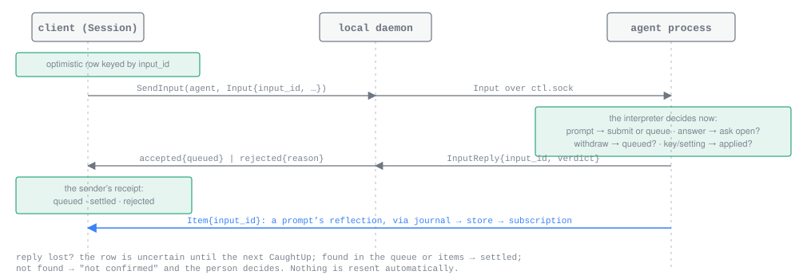

# The wire

*For developers writing a client or changing the amux.v1 service.*

The wire is the protobuf package `amux.v1`, in
[`crates/wire/proto/amux/v1/`](../crates/wire/proto/amux/v1/amux.proto), with
generated Rust committed under `crates/wire/src/generated/`. This page covers
the client-facing surface: the `ClientService` calls, the records its streams
carry, how inputs are answered, and the discipline that keeps binaries of
different versions talking. Host-to-host links, pairing and the relay are in
[the protocol](PROTOCOL.md).

| File | Holds |
| --- | --- |
| [`amux.proto`](../crates/wire/proto/amux/v1/amux.proto) | Errors, link control, pairing, `ClientService`, `PeerService`, inventory, the profile and installation services |
| [`records.proto`](../crates/wire/proto/amux/v1/records.proto) | The kind-neutral records: `Step`, `Item`, `Append`, `Snapshot`, attachments, blobs, diffs, shared item bodies, shared inputs, `SendInputResponse` |
| [`agent.proto`](../crates/wire/proto/amux/v1/agent.proto) | `Input`, the agent spec, and the `ctl.sock` and `pty.sock` frames |
| [`claude.proto`](../crates/wire/proto/amux/v1/claude.proto), [`codex.proto`](../crates/wire/proto/amux/v1/codex.proto) | The per-kind item, snapshot and input bodies |

## Where clients call

A client talks only to the runtime of its own profile on its own machine. That
runtime answers every call from its store and reaches other hosts itself; a
client never opens a store and never dials another host.

| Caller | Transport | Service |
| --- | --- | --- |
| Terminal client, CLI | gRPC over the profile's local socket (`PROFILE_SOCKET` in [`crates/node/src/profiles.rs`](../crates/node/src/profiles.rs)) | `ClientService` |
| Phone app | An in-process call into the embedded runtime | `ClientService`, the same implementation |
| An agent's tool server | gRPC over the agent's `tools.sock`; the socket is the caller's identity | `ClientService`, restricted |
| A paired host's daemon | An application stream on the link | `PeerService` |
| Profile and installation management | gRPC over the installation's front-door socket | `ProfileService`, `InstallationService` |

The [`client`](../crates/client/src/lib.rs) crate is the one seam both clients
use: `GrpcClient` on the desktop and `InProcess` on the phone implement the
same `Client` trait, so the session and fleet drivers above them are written
once (see [the client](CLIENT.md)).

On `tools.sock` the caller is an agent. It may message other agents and send
input only to its own direct children; renaming, stopping, resuming, deleting,
dumping, diffs and `PutBlob` are a person's acts and are refused there with
`PERMISSION_DENIED`.

`PeerService` has the same calls with the same request and response messages
as `ClientService`. Replication is a daemon being a client of its peer. A call
on another host's agent arrives at the local runtime, which forwards it one hop
to the owning host.

### Errors

Every refusal carries an `amux.v1.Error` (a code, a message and typed details)
encoded in the gRPC status details. `client::RpcError` decodes it: `Refused`
when the runtime answered with an error, `Transport` when the connection
failed and whether the call took effect is unknown. Codes a client meets often:

| Code | When |
| --- | --- |
| `NOT_FOUND` | No agent with that id or name, no item with that key, no blob with that hash |
| `FAILED_PRECONDITION` | An ambiguous name (detail `AmbiguousAgentName` with the candidates) |
| `UNREACHABLE` | Older history lives on a host that cannot be reached, and nothing is held locally |
| `ABORTED` | The input was handed to the agent and its answer was lost |
| `PERMISSION_DENIED` | An agent caller asked for a person's act |
| `RESOURCE_EXHAUSTED` | A blob could not be written, most often a full disk |

`ProtocolVersionMismatch` is the one break-glass detail; see
[Versions](#versions).

## The calls

`service ClientService` in [`amux.proto`](../crates/wire/proto/amux/v1/amux.proto):

| Call | Returns | Meaning |
| --- | --- | --- |
| `SubscribeInventory(Empty)` | stream of `InventoryEvent` | Hosts and agent rows: the current set, `CaughtUp`, then changes |
| `ResolveAgent(ResolveAgentRequest)` | `Agent` | Fleet-wide name to row. Every other call takes an agent id. |
| `Subscribe(SubscribeRequest)` | stream of `SessionEvent` | One agent: opening, snapshot, tail, then live |
| `Fetch(FetchRequest)` | `FetchResponse` | A page of older items |
| `Get(GetRequest)` | `Item` | One item in full |
| `SendInput(SendInputRequest)` | `SendInputResponse` | The interpreter's verdict on one input |
| `CreateAgent(CreateAgentRequest)` | `Agent` | Spawn, optionally with a first prompt. Without a name the daemon gives a word pair (`quiet-otter`) that no other agent on the host and no branch in the folder's repository has |
| `RenameAgent` | `Agent` | An empty name is refused `INVALID_ARGUMENT` |
| `StopAgent(StopAgentRequest)` | `Empty` | `GRACEFUL`, `ABORT` or `KILL`; a registry act, never a chat control |
| `ResumeAgent(ResumeAgentRequest)` | `Agent` | Start the agent's directory again, optionally with a first prompt |
| `DeleteAgent` | `DeleteAgentResponse` | Cascades to children; lists removed and unreachable children |
| `SendMessage(Envelope)` | `SendMessageResponse` | Agent messaging (see [agent tools](AGENT_TOOLS.md)) |
| `PutBlob(PutBlobRequest)` | `BlobRef` | Bytes into an agent's directory |
| `GetBlob(GetBlobRequest)` | `GetBlobResponse` | Bytes out |
| `Diff(DiffRequest)` | `Diff` | The changed files on the owning host; the patch, stored as a blob, only when asked |
| `GetCatalogue(GetCatalogueRequest)` | `Catalogue` | What an agent offers now, by agent id, or a provider on a host with no agent running, with its hash |
| `ListRepositories` | `ListRepositoriesResponse` | Repositories a host offers to spawn agents in |
| `Dump(DumpRequest)` | `DumpResponse` | A debug bundle (see [debugging](DEBUGGING.md)) |

There are no unary list calls: a listing is `SubscribeInventory` read to
`CaughtUp`. There is no status call: what an agent is working on is a field of
its snapshot.

## Subscribe

```proto
message SubscribeRequest {
  bytes agent_id = 1;
  oneof from { uint32 tail = 2; After after = 3; }
}
```

A client sends one integer, `tail`: how many of the newest rows it wants. It
never sends a revision. The runtime caps the tail at K, the rows a replica
keeps (200, `TAIL_ROWS` in [`crates/node/src/runtime.rs`](../crates/node/src/runtime.rs)).
The tail is a minimum: a client that cannot fill its screen pages older at once
with `Fetch`. `after` is how a peer's source resumes toward an origin: the
revision it holds, a cap, and the origin generation that revision was taken
under. A client that sends it on `ClientService` gets `UNIMPLEMENTED`.

A stream is `SessionEvent`s:

| Event | Meaning |
| --- | --- |
| `Opening` | The origin generation the stream's rows belong to. Always first; clients ignore it. |
| `Snapshot` | Everything needed to draw the agent without items. Second. |
| `Item` | One item, full state at its revision |
| `Append` | Text added to an item the client holds |
| `CaughtUp` | You hold what the origin holds as of now |
| `Detached` | The origin is not being followed; rows may be stale |
| `Reset` | Forget the transcript; a fresh tail follows, then `CaughtUp` |
| `Lagged` | This stream fell behind and closes after this event; subscribe again |

### What a stream carries

1. **The opening**, read from the runtime's store in one cut: `Opening`,
   the snapshot, then the newest `tail` rows of the agent's block by order,
   oldest first, each once in its latest state, then the agent's marker if
   one is set (`CaughtUp`, or `Detached` for a replica nobody is
   following).
2. **Live events**, forwarded verbatim in commit order: every `Snapshot`,
   `Item` and `Append` committed after the cut, and the markers as they come.



An agent whose interpreter has not written a snapshot yet opens with a
`Snapshot` holding only the kind tag and an empty body, which every per-kind
decoder renders as "starting, nothing known yet".

The runtime holds its store lock from joining the agent's broadcast through
the cut (`ProfileRuntime::open_subscription` in
[`crates/node/src/serve.rs`](../crates/node/src/serve.rs)). Commits publish
while they hold the same lock, so every record is either in the opening or
arrives live, and the marker describes the same point as the rows beside it.
A client still absorbs by key and ignores an equal or older revision, so an
overlap would be harmless.


### Markers

`CaughtUp` means one thing on every stream: you hold what the origin holds as
of now.

- For an agent this host runs, it comes the first time ingest reaches the end
  of the agent's journal after each connection from the agent, not when the
  stream opens. After a daemon restart with a backlog, a chat sees the rows
  flow in and then the marker. An agent found exited at startup gets its marker
  once its journal remainder is ingested.
- For a replica, the runtime forwards the origin's `CaughtUp` and never mints
  its own. It can arrive after live items, and arrives again after every
  reconnect to the origin. Its `revision` is what a peer source stores as its
  cursor; clients ignore it.

`Detached` follows the held rows at once when the agent's host is away, and is
sent whenever the runtime's source for that agent loses its stream. The rows
are served as they stand, stale and honestly, until the source reconnects and
`CaughtUp` arrives.

`Reset` comes from a replica's source when the origin answered with a fresh
tail rather than a delta: the source's cursor was too far behind for the
cap, or was taken under a generation the origin no longer runs (an unclean
reboot mints the same revisions again for different content). The client
keeps drawing what it has, builds the fresh transcript beside it, and swaps
it in at the next `CaughtUp`.

`Opening` carries the origin's generation: its own for an agent the host
runs, and for a replica the one its source last caught up under. A peer
source stores it beside its cursor and sends both back in `after`; a client
never needs it, because a client resumes with a tail.

`Lagged` means the stream fell more than the fan-out ring's capacity behind
the agent's broadcast. The stream closes; the client subscribes again with a
tail, the same way it arrived. The runtime never buffers for a slow reader: the
store is where late arrivers catch up.

The stream never ends for host reasons. It ends after `Lagged`, when the agent
is deleted, and when the runtime stops listing the agent; a client then
returns to the fleet.

## Records

The records are defined once in
[`records.proto`](../crates/wire/proto/amux/v1/records.proto). The journal
frames them, the store keeps them and every stream carries them.

### The envelope

```proto
message Item {
  bytes agent = 1;
  string key = 2;             // from the interpreter
  uint64 order = 3;           // assigned once per key by the owning daemon
  uint64 revision = 4;        // assigned on every upsert by the owning daemon
  string producer_version = 5;
  bytes input_id = 6;         // on a prompt's reflection and an agent message
  string text = 7;            // the one appendable field
  repeated Attachment attachments = 8;
  string kind = 9;            // claude_pty | claude_sdk | codex
  bytes body = 10;            // the per-kind item, encoded
  int64 at_ms = 11;           // when it happened
}
```

`Snapshot` carries the same split: kind-neutral envelope fields (`revision`,
the `queue` of `QueuedInput`s, `phase`, `working_on`, `at_ms`,
`phase_since_ms`, `git`) and a per-kind `body`. `Phase` is `STARTING`,
`IDLE`, `WORKING` or `NEEDS_YOU`.

`phase_since_ms` is the interpreter's clock when `phase` last changed. The
part every interpreter shares stamps it, so streamed output and other changes
within one phase leave it alone; it is what a row's "working for 3m" or "idle
since 10:42" counts from. `git` is the branch, base branch and change totals
of the agent's folder, absent outside a repository:

```proto
message Git {
  optional string branch = 1;          // absent on a detached head
  optional string base_branch = 2;     // the branch amux made the worktree from, else the default
  optional ChangeTotals uncommitted = 3;  // working tree against HEAD
  optional ChangeTotals on_branch = 4;    // from where the branch left its base to the working tree
}
message ChangeTotals { uint32 files = 1; uint32 added = 2; uint32 removed = 3; }
```

On the base branch itself the branch has left nothing behind, so `on_branch`
equals `uncommitted`; it is absent only without a base or a commit, or when
the branch shares no history with its base.

The daemon and the store read only the envelope. A `body` is bytes to them,
stored and forwarded without decoding, so a body written by a later agent
binary passes through an earlier daemon intact. Bodies are decoded only at the
two ends: the interpreter that wrote them and the client's per-kind layer. The
`kind` tag says which message a body holds (`ClaudePtyItem`, `ClaudeSdkItem`,
`CodexItem`, and the matching snapshots); `wire::kind_tag` and
`wire::kind_from_tag` map it to the `Kind` enum. The item vocabulary itself is
described in [the chat vocabulary](CHAT_VOCABULARY.md) and
[interpreters](INTERPRETERS.md).

A snapshot is sufficient on its own. Phase, open asks, queue, model and mode
live in it, so a client holding a snapshot and no items still renders the agent
correctly, and every change to that state arrives as a later snapshot on the
same stream. Every field of a snapshot body is present in every snapshot, at an
explicit unknown value until the interpreter learns it.

### The rules

- An item is full state at its revision. There are no deletes. An older
  revision never overwrites a newer one, in the store or in a client.
- `order` places an item in the transcript and never changes; `revision`
  orders versions. Clients sort by order and merge by key.
- Durations are differences of two `at_ms` values ("Thought for 8s",
  "Worked 1m 42s"); no body carries a duration.
- A prompt yields exactly one item carrying its `input_id`: the provider's
  reflection of it. Every other input is answered by the `SendInput` reply and
  shows in the next snapshot. There are no rejection items.

### Appends

Exactly one field is appendable: `Item.text`.

```proto
message Append { bytes agent = 1; string key = 2; uint64 base_revision = 3;
                 uint64 revision = 4; string text = 5; }
```

A client applies an append when the item it holds for `key` is at
`base_revision`: it adds `text` and takes `revision`. If it holds a newer
revision it ignores the append. If it holds an older revision it calls `Get`
for the item. If it holds nothing for the key it drops the append. Appends are
only sent live, never in an opening, and every stream of appends ends with a
full item, so a client that subscribes late receives the full item and never
an append it cannot apply.

Dropping is safe because the stream sends an item before any append to it, so
a client that holds nothing for a key has let the item go: it is below the
window the client keeps, or behind a reload it is waiting for. Whenever the
client reads that row again (a page, a reload) the store gives it whole.
Appends go to any item still open, not only the newest, so fetching instead
would cost a client with a small window a `Get` for every running command
below it.



## Paging: Fetch and Get

```proto
message FetchRequest  { bytes agent_id = 1; optional uint64 before_order = 2; uint32 limit = 3; }
message FetchResponse { repeated Item items = 1; bool exhausted = 2; }
```

`Fetch` returns items by order, newest first, strictly below `before_order`,
or the newest `limit` items when it is absent. `exhausted` means no older
history exists anywhere. A page is capped at 500 items (`MAX_PAGE` in
[`crates/node/src/serve.rs`](../crates/node/src/serve.rs)); a client asks
again below the oldest item it got.

`Fetch` is a store read and never touches the agent. For a paired host's agent
the part of a page below what this machine holds comes from the origin and is
kept for next time. An origin that cannot be reached is an error
(`UNREACHABLE`) when nothing is held, never an empty page; when some rows are
held they are returned with `exhausted` false, and the next page asks again.

`Get(agent_id, key)` returns one held item in full. It is how a client
recovers when an append's base does not match the revision it holds.

## Inputs

```proto
message SendInputRequest { bytes agent_id = 1; Input input = 2; }

message Input {
  bytes input_id = 1;                    // generated by the client
  oneof of {
    Envelope agent_message = 2;
    DumpInput dump = 3;
    ClaudePtyInput claude_pty = 10;
    ClaudeSdkInput claude_sdk = 11;
    CodexInput codex = 12;
  }
}
```

A client sends semantic inputs in the agent's kind: a prompt, an answer to an
open ask, a withdrawal or send-now of a queued prompt, an interrupt, a
semantic key for terminal Claude, a model or mode setting. Raw terminal bytes
never cross the wire. The shared pieces (`PromptInput`, `AnswerInput`,
`WithdrawQueued`, `SendQueuedNow`, `Interrupt`, `Clear`, `SetModel`,
`SetEffort`) are in `records.proto`; each kind's oneof, with its own settings
and answer bodies, is in `claude.proto` and `codex.proto`.

### The verdict

The runtime hands the input to the agent over its control socket, and the
interpreter answers at once:

```proto
message SendInputResponse { oneof of { Accepted accepted = 1; Rejected rejected = 2; } }
message Accepted { bool queued = 1; }
message Rejected { string reason = 1; }
```

The reply is the interpreter's verdict, not a receipt for a handover. A prompt
is submitted or queued; an answer's ask is open or closed; a withdrawal's
target is queued or not; a key or setting is applied or unsupported.



The agent sends the verdict only after the step that explains it is in its
journal, and it nudges the daemon before it replies. The daemon ingests on
each nudge before it reads the next frame from the agent, so by the time a
`SendInput` reply reaches the client, the snapshot that lists a queued prompt
has already been committed and broadcast.

Rejection reasons (constants in `interpret::reason`, `node::EXITED` and
`node::EXITING`):

| Reason | Given by | When |
| --- | --- | --- |
| `closed_ask` | interpreter | The answer names an ask that is not open, for example one already answered on another device |
| `not_queued` | interpreter | The withdrawal or send-now names an input that is not waiting in the queue |
| `unsupported` | interpreter | This agent version cannot interpret the input's arm, or send-now with no turn running |
| `draining` | interpreter | The agent is finishing up because its daemon went away or it was stopped |
| `exiting` | interpreter | A one-shot child decided to exit |
| `exited` | the owning daemon | The agent has exited; the composer offers Resume |
| `host_unreachable` | the local runtime | The agent's host cannot be reached, so the input never left; one that left and lost its answer is `ABORTED` instead |

A rejection may instead carry a sentence for a person, when the refusal
depends on the provider rather than the protocol: terminal Claude refuses
send-now on a Claude older than the one its keymap's send-now row is verified
from, naming both versions.

### States a client observes

| State | Observed when |
| --- | --- |
| sent | `SendInput` is in flight. The optimistic row exists. |
| queued | The reply was `accepted { queued: true }`; every snapshot lists the input id in its `queue` until it is submitted. |
| settled | The reply was `accepted`, and for a prompt an item carries the input id. |
| rejected | The reply was `rejected { reason }`. |
| uncertain | The connection dropped before a reply, or the runtime answered `ABORTED`. Shown as "not confirmed". |

An uncertain input is judged only at the next `CaughtUp`: found in the
snapshot's queue it is queued, found as an item it is settled. Otherwise it
stays uncertain and the client offers resend and discard. Nothing is resent
automatically, because absence is not proof: another client may have withdrawn
the prompt, a completed prompt may sit outside the held tail, and an exited
agent may have received it. A resend is a fresh input with a fresh id. The
state machine is `SessionState` in
[`crates/ui-state/src/session.rs`](../crates/ui-state/src/session.rs).

The queue lives in the interpreter, not in the provider. A second client's
prompt lands in the same queue, and every client sees it in the snapshot.
Editing a queued prompt is `WithdrawQueued` followed by a fresh prompt; nothing
is edited in place. `SendQueuedNow` delivers one queued prompt into the running
turn through the provider's own steering path.

## Blobs and diffs

```proto
message PutBlobRequest  { bytes agent_id = 1; string name = 2; string mime = 3; bytes bytes = 4; }
message GetBlobRequest  { bytes agent_id = 1; bytes hash = 2; }
message GetBlobResponse { BlobRef blob = 1; bytes bytes = 2; }
message BlobRef         { bytes hash = 1; string name = 2; string mime = 3; uint64 size = 4; }
```

`PutBlob` writes a person's attachment into the named agent's directory on the
agent's own host, named by its SHA-256, and returns the `BlobRef`. The client
then sends the input whose `Attachment` carries that reference. The same bytes
twice are one file. Only a person can call it; an agent writes its own blobs
directly into its directory.

`GetBlob` reads the bytes by agent and hash. For a paired host's agent the
local runtime reads its replica copy, or fetches the bytes from the origin,
checks their hash, keeps them under `replicas/` and returns them. The
`BlobRef` in the response carries the hash and size; the name and mime type
belong to the attachment that referenced the blob.

`Diff(agent_id, base, with_patch)` compares the agent's working directory on
its own host, through the `git-facts` crate the agent process also reads its
row's totals with. It runs to the working tree, untracked files included, from
HEAD for a working-tree base, or from where the branch left the named base
branch for a branch base, so the branch's commits and its uncommitted work both
count. The `Diff` value carries the base, `head` (empty before the first
commit), the `merge_base` for a branch base, and `files`: each changed file's
path, lines added and removed, whether it was created, deleted or changed, and
whether it is binary. Only `with_patch` builds the patch and stores it as one of
that agent's blobs (`text/x-diff`), named in `patch`; without it the host writes
nothing. An exited agent's folder is compared as it is now; another host's
agent's diff is made on that host and forwarded.

`GetCatalogue(agent_id)` answers the catalogue the agent's newest snapshot
names: the models, commands, permissions and modes it offers, as its agent
process wrote them to `catalogues/<hash>` in its directory, with `hash` set.
The hash is the SHA-256 of the encoding with `hash` empty, so identical
catalogues are one. For a paired host's agent the local runtime answers from
its copy under `replicas/` when it holds the hash its replica names, and
otherwise asks the origin, checks the hash and keeps the copy, so it answers
again with the origin away. An agent that has not said what it offers is
`NOT_FOUND`.

The host form names a host and a provider (`claude` or `codex`) and answers
what that provider offers there with no agent running. The daemon holds no
provider code: it runs the hidden helper `amux catalogue <provider>`, which
starts the provider just long enough to ask what it offers and whether it is
signed in, and keeps the answer per provider under the profile's `providers/`
folder. It asks again when the copy is half an hour old, when the provider's
`--version` prints something new (read at most once a minute), and for a copy
that says signed out once a minute has passed. Both Claude kinds share
Claude's copy; terminal Claude, which offers nothing a program can read,
offers its host's Claude models and commands. A paired host's providers are
asked on that host. A helper that fails answers with the copy when there is
one, else `UNAVAILABLE`; an unknown provider is `INVALID_ARGUMENT`.

A blob lives as long as its agent's directory. See
[attachments](ATTACHMENTS.md) for the attachment types and lifetimes.

## Inventory

`SubscribeInventory` streams `InventoryEvent`s: `HostEntry` for every trusted
host and every discovered candidate, `Agent` for every agent row the runtime
holds (its own and its paired hosts'), then `CaughtUp`, then changes as they
happen (`HostEntry`, `HostRemoved`, `Agent`, `AgentRemoved`).

`Agent` is the inventory row. It carries `kind`, `name` (always set),
`cwd`, `parent` (a host and an id, since families cross hosts), `lifecycle`
and `exit_cause`, `phase`, `working_on`, `phase_since_ms` (on the origin
host's clock; the row's creation time until its first snapshot) and `git`
copied from the agent's newest snapshot envelope, `producer_version` and
`incarnation`. It never carries a snapshot: a client reads an agent's
conversation from the agent's own session, which the client library keeps open
for every live agent (see [the client library](CLIENT.md#the-fleet)), so the
row stays small.

`HostEntry` carries the host's name, version, platform and capabilities, its
`trust` (`TRUSTED` or `CANDIDATE`), its `presence` (`ONLINE`, `OFFLINE` or
`AWAY`), how it is reached, and its `generation`, which changes only after an
unclean reboot of that host (see [the journal and store](JOURNAL_AND_STORE.md)).
Its `providers` list, per provider the host has been asked about, the hash of
what that provider offers there and whether it is signed in; a paired host's
come from that host's own entry.

`AgentRemoved` names a reason when there is one, such as retention or a host
that stopped listing the agent. A client subscribed to that agent sees its
stream end.

An inventory stream that falls behind simply ends; the client subscribes again
for a fresh current set. `amux ls`-style one-shot listings read to `CaughtUp`
and close.

## Compatibility

Paired machines, long-running agent processes and long-lived clients all run
different versions of amux at once. Every surface tolerates it by one
discipline.

### Fields are only added

Every protobuf surface (the client and peer services, the `ctl.sock` frames and
the journal's records) follows the same rule: fields, enum values, messages and
calls are only ever added. Never renumber, never reuse a number, never retype,
never make a field required. A retired field keeps its number reserved, as
`Step` does with field 4 and `PromptInput` with field 3.

The rule is checked mechanically. [`crates/wire/proto/baseline.binpb`](../crates/wire/proto/baseline.binpb)
is a committed descriptor set of the protos. `just proto-check` compiles the
current protos and compares them with it
([`crates/xtask/src/proto_check.rs`](../crates/xtask/src/proto_check.rs)). It
fails, naming each full name, on a removed message, field, enum value, service
or rpc, a renumbered or retyped field, or a required field. Additions pass. The
same comparison runs as the test
`the_committed_baseline_matches_the_current_protos` in `just test`, which CI
runs.

A deliberate break is recorded with `just proto-check --update`, which rewrites
the baseline, committed in the same change. The latest: `Agent` lost
`last_activity_ms` (field 12 is now `phase_since_ms`, when the phase began
rather than when anything last happened) and `Agent.name` stopped being
optional.

After any edit to a `.proto`, run `just protobuf` to regenerate the committed
Rust; `just codegen-check`, which CI runs, fails on stale output.

What the rule buys at runtime:

- A body written by a later agent passes through an earlier daemon and store
  intact, because they never decode it.
- An input arm an interpreter does not know is answered `rejected { reason:
  "unsupported" }`.
- The store keeps lifecycle and phase as integers, so a value from a later
  peer is stored and served rather than refused.

### Versions

`wire::PROTOCOL_VERSION` (in [`crates/wire/src/lib.rs`](../crates/wire/src/lib.rs))
is checked in one place: the link handshake between hosts. A connecting host
lists its versions in `Hello.supported_protocol_versions`; the acceptor
refuses a `Hello` that does not include its own version, answering with a
`ProtocolVersionMismatch` detail, and the link closes with
`LINK_CLOSE_REASON_VERSION_MISMATCH`. The integer changes only for a
deliberate semantic break that both sides must take; the only-add rule keeps it
otherwise unused.

Nothing else carries a version integer:

- **Local clients** call `ClientService` with no handshake. A client may
  compare its own version with its host's `HostEntry.version`; the terminal
  client shows "amux *version* is running · restart to update" when they
  differ.
- **`ctl.sock` and the journal** have no version integer at all. The agent's
  `AgentHello` carries its binary version, which the daemon records on the
  agent row as `producer_version`, and every item carries the
  `producer_version` of the binary that wrote it.
- **The store** has a schema stamp, the minimum number of migrations a binary
  needs to open it (see [the journal and store](JOURNAL_AND_STORE.md)).

## Writing a client

A checklist for a client against `ClientService`:

1. Subscribe to the inventory and draw the fleet from `Agent` rows; treat the
   first `CaughtUp` as "the list is complete".
2. To open a chat, `Subscribe` with a tail. Draw from the snapshot at once;
   merge items by key, keep the highest revision, sort by order.
3. Apply appends only on a matching base; `Get` an item held at another
   revision; drop an append for a key you hold nothing for.
4. On `Reset`, build a fresh transcript and swap it in at `CaughtUp`. On
   `Lagged` or a dropped stream, subscribe again with a tail and back off
   between attempts.
5. Page older history with `Fetch` below the oldest held order until
   `exhausted`.
6. Give every input a fresh `input_id`, keep an optimistic row, and settle it
   from the verdict, the snapshot's queue and the reflection item. Leave an
   input whose reply was lost uncertain until `CaughtUp`, and let the person
   decide.
7. Upload attachment bytes with `PutBlob` before sending the input that
   references them; fetch bytes lazily with `GetBlob`.
8. Decode bodies with the per-kind messages named by `kind`, and draw an
   unknown kind or arm as a fixed fallback rather than failing.

The shared implementation of all of this is `ui-state`, `ui-runtime` and the
kind-aware layer they use; see [the client](CLIENT.md).
